# Markdown 编辑器架构设计文档

## 📋 目录

- [概述](#概述)
- [技术栈](#技术栈)
- [架构设计](#架构设计)
- [核心模块](#核心模块)
- [组件体系](#组件体系)
- [状态管理](#状态管理)
- [数据持久化](#数据持久化)
- [DOM 管理](#dom-管理)
- [数据流](#数据流)
- [构建与部署](#构建与部署)
- [性能优化](#性能优化)

---

## 概述

本项目是一个独立的 Markdown 编辑器，采用现代化的前端架构设计，实现了状态驱动 UI、组件化开发、模块化管理等核心特性。编辑器支持实时预览、语法高亮、数学公式、流程图、文档管理、搜索替换、设置管理等高级功能。

### 核心特性

1. **状态驱动 UI**：采用观察者模式，实现状态与 UI 的自动同步
2. **组件化架构**：基于 BaseComponent 的组件继承体系
3. **模块化设计**：ESM 模块系统，清晰的职责分离
4. **自动持久化**：集成 PersistenceManager，实现状态自动保存
5. **实时预览**：Markdown 到 HTML 的实时转换
6. **语法高亮**：支持 30+ 种编程语言的代码高亮
7. **扩展功能**：数学公式（KaTeX）、流程图（Mermaid）
8. **搜索替换**：类似 VSCode 的搜索替换界面
9. **设置管理**：完整的编辑器和界面设置系统

### 项目结构

```
markdown-editor/
├── src/
│   ├── main.js                 # 应用入口
│   ├── components/             # UI 组件
│   │   ├── BaseComponent.js   # 组件基类
│   │   ├── DocumentTree.js    # 文档树
│   │   ├── Editor.js          # 编辑器
│   │   ├── Preview.js         # 预览
│   │   ├── Sidebar.js         # 侧边栏
│   │   ├── TOC.js             # 目录
│   │   ├── Dialog.js          # 对话框
│   │   ├── SearchReplace.js   # 搜索替换
│   │   └── Settings.js        # 设置管理
│   ├── modules/               # 核心模块
│   │   ├── markdown.js        # 编辑器主控制器
│   │   ├── state.js           # 状态管理器
│   │   ├── store.js           # 存储管理器
│   │   └── persistence.js     # 持久化管理器
│   ├── utils/                 # 工具函数
│   │   ├── dom.js             # DOM 统一管理
│   │   └── helpers.js         # 辅助函数
│   └── styles/                # 样式文件
│       └── markdown.css       # 主样式
├── public/                    # 静态资源
│   └── manifest.json         # PWA 配置
├── docs/                      # 文档
├── tests/                     # 测试文件
├── vite.config.js            # Vite 配置
├── vitest.config.js          # Vitest 配置
└── package.json              # 项目配置
```

---

## 技术栈

### 构建工具

**Vite 5.0**
- 快速的冷启动
- 即时的热模块替换（HMR）
- 基于 Rollup 的优化构建
- 原生 ESM 支持

### 核心依赖

| 库名 | 版本 | 用途 |
|------|------|------|
| **marked** | ^12.0.2 | Markdown 解析器 |
| **dompurify** | ^3.1.7 | XSS 防护 |
| **prismjs** | ^1.29.0 | 代码语法高亮 |
| **mermaid** | ^10.9.0 | 流程图/时序图渲染 |
| **katex** | ^0.16.27 | 数学公式渲染 |
| **@vscode/codicons** | ^0.0.44 | VS Code 图标库 |

### 开发依赖

| 库名 | 版本 | 用途 |
|------|------|------|
| **terser** | ^5.46.0 | 代码压缩 |
| **vite** | ^5.0.0 | 构建工具 |
| **vitest** | ^4.0.18 | 单元测试框架 |
| **@vitest/coverage-v8** | ^4.0.18 | 代码覆盖率 |
| **jsdom** | ^27.4.0 | DOM 测试环境 |
| **eslint** | ^9.39.2 | 代码检查 |
| **prettier** | ^3.8.1 | 代码格式化 |

---

## 架构设计

### 整体架构图

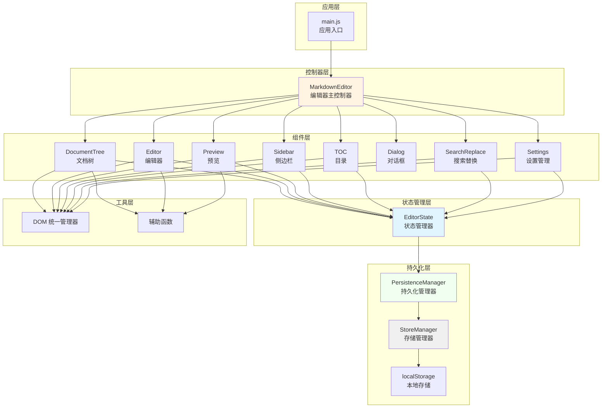

### 架构模式

**1. 观察者模式（Observer Pattern）**

状态管理采用观察者模式，实现状态驱动 UI：

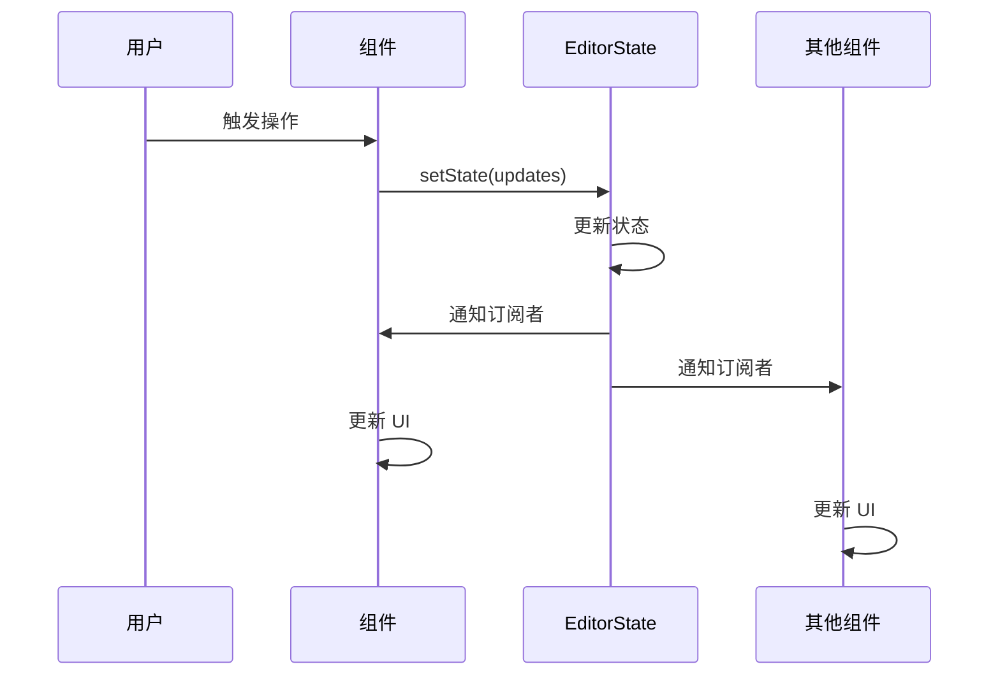

**2. 组件继承模式**

所有 UI 组件继承自 BaseComponent：

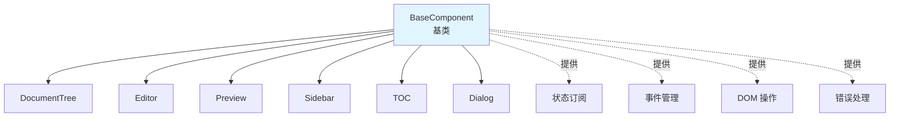

**3. 单向数据流**

数据流动遵循单向流原则：

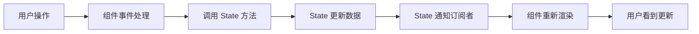

---

## 核心模块

### 1. MarkdownEditor（编辑器主控制器）

**职责**：
- 应用初始化和生命周期管理
- 组件注册和协调
- 全局事件处理
- 布局管理（拖拽调整大小）

**核心代码原型**：

```javascript
export class MarkdownEditor {
    constructor() {
        // 初始化状态、组件容器、拖拽状态等
        // ...
    }

    /**
     * 初始化编辑器
     */
    init() {
        if (this.isInitialized) return;
        // 加载数据、初始化组件、绑定事件
        // ...
        this.isInitialized = true;
    }

    /**
     * 初始化所有组件
     */
    initComponents() {
        // 创建各组件实例并初始化
        // ...
    }
}
```

**配置常量**：

```javascript
static DEBOUNCE_DELAY = {
    UPDATE: 300,   // 内容更新防抖延迟
    SAVE: 1000     // 自动保存防抖延迟
};

static DRAG_CONFIG = {
    MIN_WIDTH: 100,    // 最小面板宽度
    BATCH_SIZE: 10     // 批量处理大小
};

static UI_CONFIG = {
    MESSAGE_DURATION: 2000,      // 消息显示时长
    MERMAID_RENDER_DELAY: 100,   // Mermaid 渲染延迟
    MAX_CONTENT_LENGTH: 1000000  // 最大内容长度
};
```

### 2. EditorState（状态管理器）

**职责**：
- 管理应用全局状态
- 实现观察者模式
- 提供状态订阅机制
- 状态变更通知

**状态结构**：

```javascript
#state = {
    // 文档相关
    documents: [],           // 文档列表（扁平数组）
    currentDocId: null,      // 当前打开的文档 ID

    // 编辑器内容
    content: '',             // 当前编辑器内容

    // 编辑器设置
    editor: {
        fontSize: 14,        // 字体大小
        lineHeight: 1.6,     // 行高
        autoSave: true,      // 自动保存
        insertSpaces: true,  // 插入空格
        tabSize: 4           // Tab 大小
    },

    // 界面设置
    interface: {
        theme: 'light',          // 主题模式
        layout: 'layout-both',   // 布局模式
        leftRatio: 0.5,          // 左右面板比例
        leftSidebarOpen: false,  // 左侧边栏状态
        rightSidebarOpen: false, // 右侧边栏状态
        sections: {
            toc: true,           // 目录区块
            export: true         // 导出区块
        }
    },

    // 导出设置
    export: {
        includeStyle: true,      // 包含样式
        codeHighlight: true,     // 代码高亮
        pdfSize: 'A4',           // PDF 尺寸
        pdfMargin: 'default'     // PDF 边距
    },

    // 同步滚动状态
    syncScrollEnabled: true, // 同步滚动开关

    // 渲染状态
    isRenderingMermaid: false,  // 是否正在渲染 Mermaid
    lastRenderedContent: '',    // 上次渲染的内容
    headings: []                // 标题数据
};
```

**核心方法**：

```javascript
export class EditorState {
    /**
     * 获取状态快照（只读）
     */
    getState() {
        return Object.freeze({ ...this.#state });
    }

    /**
     * 获取单个状态值
     */
    get(key) {
        return this.#state[key];
    }

    /**
     * 批量更新状态
     */
    setState(updates, options = {}) {
        const oldState = { ...this.#state };
        Object.assign(this.#state, updates);
        
        if (!options.silent) {
            this.#notify(oldState, this.#state);
        }
    }

    /**
     * 订阅状态变化
     */
    subscribe(listener) {
        this.#globalListeners.add(listener);
        return () => this.#globalListeners.delete(listener);
    }

    /**
     * 订阅特定状态键的变化
     */
    subscribeTo(keys, listener) {
        const keyArray = Array.isArray(keys) ? keys : [keys];
        keyArray.forEach(key => {
            if (!this.#listeners.has(key)) {
                this.#listeners.set(key, new Set());
            }
            this.#listeners.get(key).add(listener);
        });
        
        return () => {
            keyArray.forEach(key => {
                this.#listeners.get(key)?.delete(listener);
            });
        };
    }

    /**
     * 通知监听器（私有方法）
     */
    #notify(oldState, newState, force = false, changedKeys = []) {
        // 通知全局监听器
        this.#globalListeners.forEach(listener => {
            try {
                listener(newState, oldState);
            } catch (error) {
                console.error('State listener error:', error);
            }
        });

        // 通知特定键的监听器
        changedKeys.forEach(key => {
            const listeners = this.#listeners.get(key);
            if (listeners) {
                listeners.forEach(listener => {
                    try {
                        listener(newState[key], oldState[key], key);
                    } catch (error) {
                        console.error(`State listener for ${key} error:`, error);
                    }
                });
            }
        });
    }
}
```

**文档操作方法**：

```javascript
/**
 * 添加文档
 */
addDocument(doc, parentId = null) {
    const newDoc = { ...doc, parentId };
    const documents = [...this.#state.documents, newDoc];
    this.setState({ documents });
}

/**
 * 更新文档
 */
updateDocument(docId, updates, options = {}) {
    const documents = this.#state.documents.map(doc =>
        doc.id === docId ? { ...doc, ...updates } : doc
    );
    this.setState({ documents }, options);
}

/**
 * 删除文档（递归删除子项）
 */
deleteDocument(docId) {
    const toDelete = new Set([docId]);
    
    // 递归收集所有子项
    let changed = true;
    while (changed) {
        changed = false;
        this.#state.documents.forEach(doc => {
            if (doc.parentId && toDelete.has(doc.parentId) && !toDelete.has(doc.id)) {
                toDelete.add(doc.id);
                changed = true;
            }
        });
    }

    const documents = this.#state.documents.filter(doc => !toDelete.has(doc.id));
    const currentDocId = this.#state.currentDocId === docId ? null : this.#state.currentDocId;
    
    this.setState({ documents, currentDocId });
}

/**
 * 移动文档
 */
moveDocument(docId, targetFolderId) {
    // 防止循环嵌套
    if (targetFolderId) {
        let current = this.#state.documents.find(d => d.id === targetFolderId);
        while (current && current.parentId) {
            if (current.parentId === docId) {
                return false;  // 无效移动
            }
            current = this.#state.documents.find(d => d.id === current.parentId);
        }
    }

    this.updateDocument(docId, {
        parentId: targetFolderId,
        updatedAt: new Date().toISOString()
    });

    return true;
}

/**
 * 设置当前文档
 */
setCurrentDocument(docId) {
    const doc = this.#state.documents.find(d => d.id === docId);
    if (doc) {
        this.setState({
            currentDocId: docId,
            content: doc.content || ''
        });
    }
}

/**
 * 构建文档树
 */
buildTree() {
    const docs = this.#state.documents;
    const docMap = new Map();

    // 创建所有节点的映射
    docs.forEach(doc => {
        docMap.set(doc.id, { ...doc, children: [] });
    });

    // 构建树型结构
    const roots = [];
    docMap.forEach(doc => {
        if (doc.parentId && docMap.has(doc.parentId)) {
            docMap.get(doc.parentId).children.push(doc);
        } else {
            roots.push(doc);
        }
    });

    return roots;
}
```

### 3. StoreManager（存储管理器）

**职责**：
- 管理 localStorage 数据存储
- 提供异步存储队列
- 数据序列化和反序列化
- 错误处理和降级

**核心特性**：

```javascript
export class StoreManager {
    /**
     * 默认 Markdown 内容
     */
    static DEFAULT_CONTENT = `# Markdown 语法指南
...
`;

    /**
     * 存储键配置
     */
    static STORAGE_KEYS = {
        DOCUMENTS: 'markdown_documents',
        CURRENT_DOC: 'markdown_current_doc',
        THEME: 'markdown_theme',
        LAYOUT: 'markdown_layout',
        LEFT_RATIO: 'markdown_left_ratio'
    };

    /**
     * 异步存储队列（私有字段）
     */
    static #pendingOperations = new Map();
    static #isProcessing = false;

    /**
     * 调度存储操作（异步，私有方法）
     */
    static async #scheduleAsync(operation) {
        const id = Date.now() + Math.random();
        
        return new Promise((resolve, reject) => {
            StoreManager.#pendingOperations.set(id, { operation, resolve, reject });
            
            if (!StoreManager.#isProcessing) {
                StoreManager.#processQueue();
            }
        });
    }

    /**
     * 处理操作队列（私有方法）
     */
    static async #processQueue() {
        if (StoreManager.#pendingOperations.size === 0) {
            StoreManager.#isProcessing = false;
            return;
        }

        StoreManager.#isProcessing = true;

        const processNext = async () => {
            const entry = StoreManager.#pendingOperations.entries().next().value;
            if (!entry) {
                StoreManager.#isProcessing = false;
                return;
            }

            const [id, { operation, resolve, reject }] = entry;
            StoreManager.#pendingOperations.delete(id);

            try {
                const result = await operation();
                resolve(result);
            } catch (error) {
                console.error('[StoreManager] Operation failed:', error);
                reject(error);
            }

            // 继续处理下一个
            if (StoreManager.#pendingOperations.size > 0) {
                if (typeof requestIdleCallback !== 'undefined') {
                    requestIdleCallback(() => processNext(), { timeout: 50 });
                } else {
                    setTimeout(() => processNext(), 0);
                }
            } else {
                StoreManager.#isProcessing = false;
            }
        };

        // 使用 requestIdleCallback 或 setTimeout
        if (typeof requestIdleCallback !== 'undefined') {
            requestIdleCallback(() => processNext(), { timeout: 50 });
        } else {
            setTimeout(() => processNext(), 0);
        }
    }
}
```

**存储方法**：

```javascript
/**
 * 保存文档列表
 */
static async saveDocuments(documents) {
    return StoreManager.#scheduleAsync(() => {
        try {
            const data = JSON.stringify(documents);
            localStorage.setItem(StoreManager.STORAGE_KEYS.DOCUMENTS, data);
            return { success: true };
        } catch (error) {
            return { success: false, error: error.message };
        }
    });
}

/**
 * 加载文档列表
 */
static loadDocuments() {
    try {
        const data = localStorage.getItem(StoreManager.STORAGE_KEYS.DOCUMENTS);
        if (data) {
            return JSON.parse(data);
        }
    } catch (error) {
        console.error('[StoreManager] Failed to load documents:', error);
    }
    return null;
}

/**
 * 保存当前文档 ID
 */
static saveCurrentDocId(docId) {
    try {
        localStorage.setItem(StoreManager.STORAGE_KEYS.CURRENT_DOC, docId);
        return { success: true };
    } catch (error) {
        return { success: false, error: error.message };
    }
}

/**
 * 加载当前文档 ID
 */
static loadCurrentDocId() {
    try {
        return localStorage.getItem(StoreManager.STORAGE_KEYS.CURRENT_DOC);
    } catch (error) {
        console.error('[StoreManager] Failed to load current doc:', error);
        return null;
    }
}

/**
 * 保存主题
 */
static saveTheme(theme) {
    try {
        localStorage.setItem(StoreManager.STORAGE_KEYS.THEME, theme);
        return { success: true };
    } catch (error) {
        return { success: false, error: error.message };
    }
}

/**
 * 加载主题
 */
static loadTheme() {
    try {
        return localStorage.getItem(StoreManager.STORAGE_KEYS.THEME) || 'light';
    } catch (error) {
        return 'light';
    }
}

/**
 * 保存设置
 */
static saveSettings(settings) {
    try {
        localStorage.setItem(StoreManager.STORAGE_KEYS.SETTINGS, JSON.stringify(settings));
        return { success: true };
    } catch (error) {
        return { success: false, error: error.message };
    }
}

/**
 * 加载设置
 */
static loadSettings() {
    try {
        const data = localStorage.getItem(StoreManager.STORAGE_KEYS.SETTINGS);
        return data ? JSON.parse(data) : null;
    } catch (error) {
        console.error('[StoreManager] Failed to load settings:', error);
        return null;
    }
}

/**
 * 保存同步滚动状态
 */
static saveSyncScrollEnabled(enabled) {
    try {
        localStorage.setItem(StoreManager.STORAGE_KEYS.SYNC_SCROLL, String(enabled));
        return { success: true };
    } catch (error) {
        return { success: false, error: error.message };
    }
}

/**
 * 加载同步滚动状态
 */
static loadSyncScrollEnabled() {
    try {
        const value = localStorage.getItem(StoreManager.STORAGE_KEYS.SYNC_SCROLL);
        return value === 'true';
    } catch (error) {
        return true;
    }
}
```

### 4. PersistenceManager（持久化管理器）

**职责**：
- 管理状态的自动持久化
- 提供防抖和配置化持久化
- 分离持久化逻辑与状态管理
- 支持立即持久化和延迟持久化

**核心特性**：

```javascript
export class PersistenceManager {
    /**
     * 默认持久化配置
     */
    static DEFAULT_CONFIG = {
        documents: { debounce: 300 },           // 文档列表：300ms 防抖
        currentDocId: { immediate: true },      // 当前文档：立即持久化
        content: { debounce: 1000 },            // 内容：1000ms 防抖
        editor: { debounce: 300 },              // 编辑器设置：300ms 防抖
        interface: { debounce: 300 },           // 界面设置：300ms 防抖
        export: { debounce: 300 },              // 导出设置：300ms 防抖
        syncScrollEnabled: { immediate: true }  // 同步滚动：立即持久化
    };

    /**
     * 持久化处理器映射
     */
    static PERSIST_HANDLERS = {
        documents: (state) => StoreManager.saveDocuments(state.documents),
        currentDocId: (state) => StoreManager.saveCurrentDocId(state.currentDocId),
        syncScrollEnabled: (state) => StoreManager.saveSyncScrollEnabled(state.syncScrollEnabled),
        content: (state) => {
            // 保存当前文档内容到 documents 数组
            if (state.currentDocId && state.documents) {
                const docIndex = state.documents.findIndex(d => d.id === state.currentDocId);
                if (docIndex !== -1) {
                    state.documents[docIndex].content = state.content || '';
                    state.documents[docIndex].updatedAt = new Date().toISOString();
                    StoreManager.saveDocuments(state.documents);
                }
            }
        },
        settings: (state) => StoreManager.saveSettings({
            editor: state.editor,
            interface: state.interface,
            export: state.export
        })
    };
}
```

**使用方式**：

```javascript
// 在 EditorState 中集成
import { PersistenceManager } from './persistence.js';

export class EditorState {
    constructor() {
        // ...
        this.persistence = new PersistenceManager(() => this.getState());
        this.persistence.start();
    }

    setState(updates, options = {}) {
        const oldState = { ...this.#state };
        const changedKeys = this.#applyUpdates(updates);

        if (!options.silent) {
            this.#notify(oldState, this.#state, false, changedKeys);
            // 自动持久化
            this.persistence.schedule(changedKeys);
        }
    }
}
```

**配置化持久化**：

```javascript
// 自定义持久化配置
const persistence = new PersistenceManager(() => state.getState());
persistence.configure({
    documents: { debounce: 500 },    // 自定义防抖时间
    currentDocId: { immediate: true }
});
persistence.start();
```

---

## 组件体系

### BaseComponent（组件基类）

**职责**：
- 提供组件通用功能
- 状态订阅管理
- 事件绑定和管理
- DOM 操作辅助方法（使用 dom.js）
- 错误处理机制
- 消息提示功能

**核心代码**：

```javascript
import { dom } from '../utils/dom.js';

export class BaseComponent {
    constructor(state, containerId) {
        this.state = state;
        this.containerId = containerId;
        this.container = null;
        this.unsubscribe = null;
        this.eventHandlers = new Map();
        this.errorHandlers = new Map();
    }

    /**
     * 初始化组件
     */
    init() {
        try {
            // 使用 dom.js 获取容器
            this.container = dom.getById(this.containerId)?.element;
            if (!this.container) {
                console.warn(`Container not found: ${this.containerId}`);
                return;
            }

            this.subscribe();
            this.bindEvents();
            this.render();
        } catch (error) {
            this.handleError(error, 'init', { containerId: this.containerId });
        }
    }

    /**
     * 销毁组件
     */
    destroy() {
        // 取消状态订阅
        if (this.unsubscribe) {
            this.unsubscribe();
            this.unsubscribe = null;
        }

        // 移除事件监听器
        this.eventHandlers.forEach((handlers, element) => {
            handlers.forEach(({ event, handler, options }) => {
                element.removeEventListener(event, handler, options);
            });
        });
        this.eventHandlers.clear();

        // 清空容器
        if (this.container) {
            this.container.innerHTML = '';
        }
    }

    /**
     * 订阅状态变化（子类实现）
     */
    subscribe() {
        // 子类实现
    }

    /**
     * 绑定事件（子类实现）
     */
    bindEvents() {
        // 子类实现
    }

    /**
     * 渲染组件（子类实现）
     */
    render() {
        // 子类实现
    }

    /**
     * 全局错误处理器
     */
    handleError(error, context = 'unknown', metadata = {}) {
        const errorInfo = {
            component: this.constructor.name,
            context,
            message: error.message,
            stack: error.stack,
            timestamp: new Date().toISOString(),
            ...metadata
        };

        // 控制台输出
        console.error(`[${errorInfo.component}] Error in ${context}:`, error, metadata);

        // 触发错误事件
        window.dispatchEvent(new CustomEvent('md:componentError', {
            detail: errorInfo
        }));

        // 显示用户友好的错误消息
        this.showMessage(`操作失败: ${error.message}`, 'error');

        return errorInfo;
    }

    /**
     * 包装函数以捕获错误
     */
    wrapWithErrorHandler(fn, context) {
        return async (...args) => {
            try {
                return await fn(...args);
            } catch (error) {
                this.handleError(error, context, { args });
                throw error;
            }
        };
    }

    /**
     * 添加事件监听（自动管理清理）
     */
    addEventListener(element, event, handler, options) {
        if (!element) return;

        element.addEventListener(event, handler, options);

        if (!this.eventHandlers.has(element)) {
            this.eventHandlers.set(element, []);
        }
        this.eventHandlers.get(element).push({ event, handler, options });
    }

    /**
     * 创建元素（使用 dom.js）
     */
    createElement(tag, options = {}) {
        const element = document.createElement(tag);

        if (options.className) element.className = options.className;
        if (options.id) element.id = options.id;
        if (options.textContent) element.textContent = options.textContent;
        if (options.innerHTML) element.innerHTML = options.innerHTML;

        if (options.attributes) {
            Object.entries(options.attributes).forEach(([key, value]) => {
                element.setAttribute(key, value);
            });
        }

        if (options.dataset) {
            Object.entries(options.dataset).forEach(([key, value]) => {
                element.dataset[key] = value;
            });
        }

        if (options.style) {
            Object.assign(element.style, options.style);
        }

        if (options.parent) {
            options.parent.appendChild(element);
        }

        return element;
    }

    /**
     * 显示消息
     */
    showMessage(message, type = 'info', duration = 2000) {
        const overlay = dom.status.overlay?.element;
        const messageEl = dom.status.message?.element;

        if (overlay && messageEl) {
            messageEl.textContent = message;
            messageEl.classList.remove('info', 'success', 'warning', 'error');
            messageEl.classList.add(type);
            overlay.classList.add('show');
            messageEl.classList.add('show');

            setTimeout(() => {
                overlay.classList.remove('show');
                messageEl.classList.remove('show');
            }, duration);
        }
    }

    /**
     * 错误处理
     */
    handleError(error, context = 'unknown', metadata = {}) {
        const errorInfo = {
            component: this.constructor.name,
            context,
            message: error.message,
            stack: error.stack,
            timestamp: new Date().toISOString(),
            ...metadata
        };

        console.error(`[${errorInfo.component}] Error in ${context}:`, error, metadata);

        // 触发错误事件
        window.dispatchEvent(new CustomEvent('md:componentError', {
            detail: errorInfo
        }));

        this.showMessage(`操作失败: ${error.message}`, 'error');

        return errorInfo;
    }
}
```

### 组件继承关系

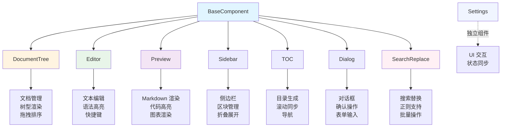

### 组件生命周期

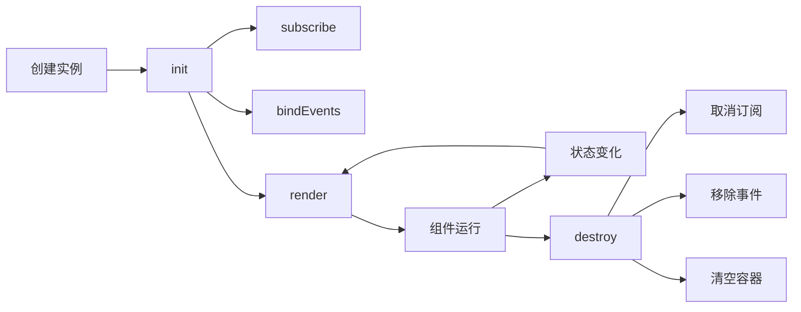

### 主要组件说明

#### SearchReplace（搜索替换组件）

**职责**：
- 提供类似 VSCode 的搜索替换界面
- 支持搜索和替换模式切换
- 支持正则表达式、大小写敏感、全词匹配
- 实时高亮匹配结果
- 批量替换功能

**核心功能**：

```javascript
export class SearchReplace extends BaseComponent {
    constructor(state, containerId) {
        super(state, containerId);
        this.isReplaceMode = false;
        this.currentMatchIndex = -1;
        this.matches = [];
        this.searchTerm = '';
        this.replaceTerm = '';
        this.caseSensitive = false;
        this.regexMode = false;
        this.wholeWord = false;
    }

    /**
     * 执行搜索
     */
    performSearch() {
        const content = this.state.content;
        if (!this.searchTerm || !content) {
            this.matches = [];
            this.updateMatchCount();
            return;
        }

        // 构建正则表达式
        let regex;
        try {
            const flags = this.caseSensitive ? 'g' : 'gi';
            const pattern = this.wholeWord ? `\\b${this.searchTerm}\\b` : this.searchTerm;
            regex = new RegExp(pattern, flags);
        } catch (error) {
            this.showMessage('正则表达式错误', 'error');
            return;
        }

        // 查找所有匹配
        this.matches = [];
        let match;
        while ((match = regex.exec(content)) !== null) {
            this.matches.push({
                index: match.index,
                text: match[0],
                length: match[0].length
            });
        }

        this.currentMatchIndex = this.matches.length > 0 ? 0 : -1;
        this.highlightMatches();
        this.updateMatchCount();
    }

    /**
     * 查找下一个
     */
    findNext() {
        if (this.matches.length === 0) return;
        this.currentMatchIndex = (this.currentMatchIndex + 1) % this.matches.length;
        this.highlightMatches();
    }

    /**
     * 替换当前匹配
     */
    replaceOne() {
        if (this.currentMatchIndex === -1) return;

        const match = this.matches[this.currentMatchIndex];
        const content = this.state.content;
        const before = content.substring(0, match.index);
        const after = content.substring(match.index + match.length);
        const newContent = before + this.replaceTerm + after;

        this.state.setState({ content: newContent });
        this.performSearch();
    }

    /**
     * 替换所有匹配
     */
    replaceAll() {
        if (this.matches.length === 0) return;

        let content = this.state.content;
        let count = 0;

        for (let i = this.matches.length - 1; i >= 0; i--) {
            const match = this.matches[i];
            const before = content.substring(0, match.index);
            const after = content.substring(match.index + match.length);
            content = before + this.replaceTerm + after;
            count++;
        }

        this.state.setState({ content });
        this.performSearch();
        this.showMessage(`已替换 ${count} 处`, 'success');
    }
}
```

#### Settings（设置组件）

**职责**：
- 提供完整的设置界面
- 管理编辑器、界面、导出设置
- 实时预览设置效果
- 与状态管理器集成

**核心功能**：

```javascript
export class Settings {
    constructor(state) {
        this.state = state;
        this.overlay = null;
        this.dialog = null;
        this.currentSection = 'basic';
        this.cachedElements = null;
    }

    /**
     * 初始化设置组件
     */
    init() {
        // 获取 DOM 元素
        this.overlay = dom.get('#md-settings-overlay');
        this.dialog = dom.get('.md-settings-dialog');

        // 缓存 DOM 元素
        this.cacheElements();

        // 绑定事件
        this.bindEvents();

        // 应用已保存的设置
        this.applySettings();
    }

    /**
     * 打开设置对话框
     */
    open() {
        this.overlay?.classList.add('show');
        this.dialog?.classList.add('show');
        this.loadCurrentSettings();
    }

    /**
     * 关闭设置对话框
     */
    close() {
        this.overlay?.classList.remove('show');
        this.dialog?.classList.remove('show');
    }

    /**
     * 应用设置
     */
    applySettings() {
        const settings = this.state.getState();

        // 应用编辑器设置
        this.applyEditorSettings(settings.editor);

        // 应用界面设置
        this.applyInterfaceSettings(settings.interface);

        // 应用导出设置
        this.applyExportSettings(settings.export);
    }

    /**
     * 保存设置
     */
    saveSettings() {
        const settings = this.collectSettings();
        this.state.setState({
            editor: settings.editor,
            interface: settings.interface,
            export: settings.export
        });
        this.close();
        this.showMessage('设置已保存', 'success');
    }
}
```

---

## 状态管理

### 状态驱动 UI

**核心思想**：UI 是状态的函数，状态变化自动触发 UI 更新。

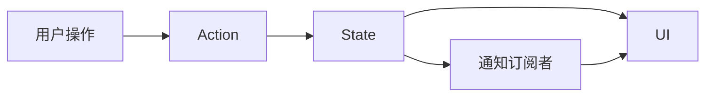

### 状态订阅机制

**1. 全局订阅**

```javascript
// 订阅所有状态变化
const unsubscribe = state.subscribe((newState, oldState) => {
    console.log('State changed:', newState, oldState);
});

// 取消订阅
unsubscribe();
```

**2. 特定键订阅**

```javascript
// 订阅特定状态键
const unsubscribe = state.subscribeTo(['documents', 'currentDocId'], 
    (newValue, oldValue, key) => {
        if (key === 'documents') {
            console.log('Documents changed:', newValue);
        } else if (key === 'currentDocId') {
            console.log('Current doc changed:', newValue);
        }
    }
);

// 取消订阅
unsubscribe();
```

**3. 组件内订阅**

```javascript
class DocumentTree extends BaseComponent {
    subscribe() {
        this.unsubscribe = this.state.subscribeTo(
            ['documents', 'currentDocId'], 
            (newValue, oldValue, key) => {
                if (key === 'currentDocId') {
                    this.updateActiveState(newValue, oldValue);
                } else if (key === 'documents') {
                    const needsFullRender = this.#hasStructuralChanges(newValue, oldValue);
                    if (needsFullRender) {
                        this.render(true);
                    }
                }
            }
        );
    }
}
```

### 状态更新流程

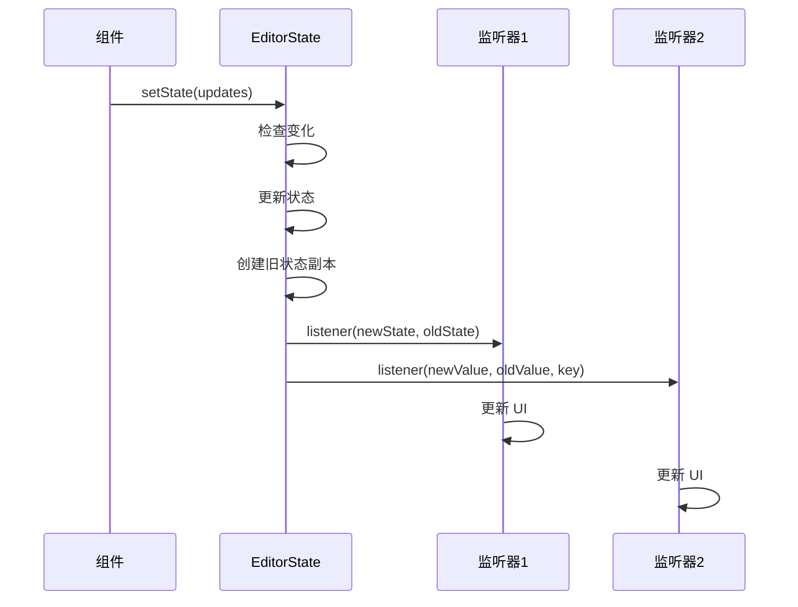

### 静默更新

**用途**：避免触发不必要的 UI 更新。

```javascript
// 静默更新（不触发订阅者）
this.state.updateDocument(docId, {
    name: newName
}, { silent: true });

// 强制更新（即使值相同也触发）
this.state.setState({ content: '...' }, { force: true });
```

---

## 数据持久化

### 持久化架构

项目采用分层持久化架构，将持久化逻辑从状态管理中分离：

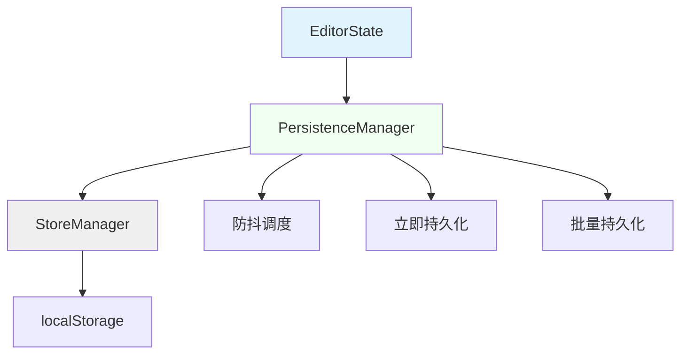

### PersistenceManager 工作流程

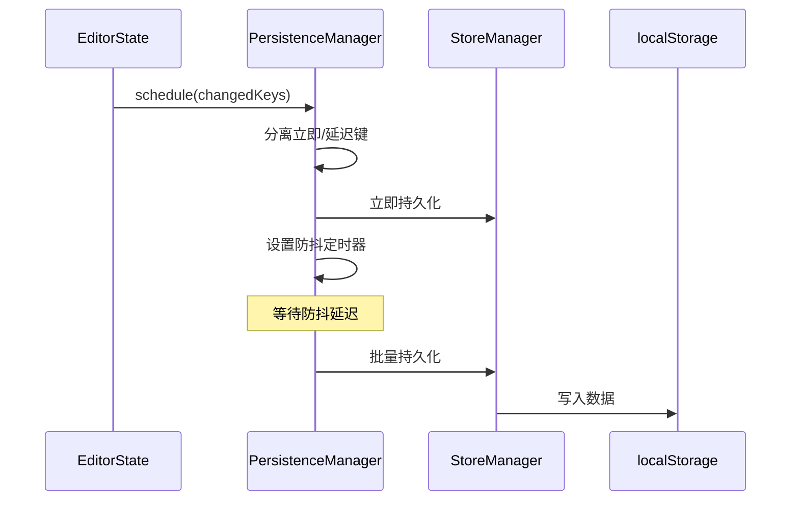

### 持久化配置

**默认配置**：

```javascript
static DEFAULT_CONFIG = {
    documents: { debounce: 300 },           // 文档列表：300ms 防抖
    currentDocId: { immediate: true },      // 当前文档：立即持久化
    content: { debounce: 1000 },            // 内容：1000ms 防抖
    editor: { debounce: 300 },              // 编辑器设置：300ms 防抖
    interface: { debounce: 300 },           // 界面设置：300ms 防抖
    export: { debounce: 300 },              // 导出设置：300ms 防抖
    syncScrollEnabled: { immediate: true }  // 同步滚动：立即持久化
};
```

**自定义配置**：

```javascript
const persistence = new PersistenceManager(() => state.getState());
persistence.configure({
    documents: { debounce: 500 },    // 自定义防抖时间
    currentDocId: { immediate: true }
});
persistence.start();
```

### 持久化策略

**1. 立即持久化**：
- 适用场景：关键状态（如当前文档 ID）
- 特点：状态变化立即保存
- 优点：数据不丢失
- 缺点：频繁写入

**2. 防抖持久化**：
- 适用场景：频繁变化的状态（如内容、设置）
- 特点：延迟保存，合并多次变化
- 优点：减少写入次数，提升性能
- 缺点：极端情况下可能丢失数据

**3. 批量持久化**：
- 适用场景：多个相关状态同时变化
- 特点：合并为一次存储操作
- 优点：减少存储次数
- 实现：自动合并相同处理器的键

### 数据恢复流程

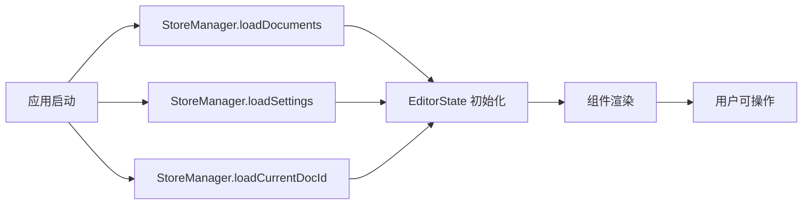

### 错误处理

**存储失败处理**：

```javascript
static async saveDocumentsAsync(documents) {
    try {
        const serialized = JSON.stringify(documents);
        await StoreManager.#scheduleAsync(() => {
            localStorage.setItem(StoreManager.#STORAGE_KEYS.DOCUMENTS, serialized);
        });
        return { success: true };
    } catch (e) {
        const errorMsg = StoreManager.#handleStorageError(e, '保存文档列表失败');
        console.warn(`${errorMsg}:`, e);
        return { success: false, error: errorMsg };
    }
}
```

**数据损坏处理**：

```javascript
static loadDocuments() {
    try {
        const saved = localStorage.getItem(StoreManager.#STORAGE_KEYS.DOCUMENTS);
        if (!saved) return [];

        const documents = JSON.parse(saved);
        // 验证数据格式
        if (!Array.isArray(documents)) {
            console.warn('文档列表格式错误，已重置');
            return [];
        }
        return documents;
    } catch (e) {
        console.warn('加载文档列表失败:', e);
        StoreManager.#clearCorruptedData(StoreManager.#STORAGE_KEYS.DOCUMENTS);
        return [];
    }
}
```

---

## 数据流

### 单向数据流

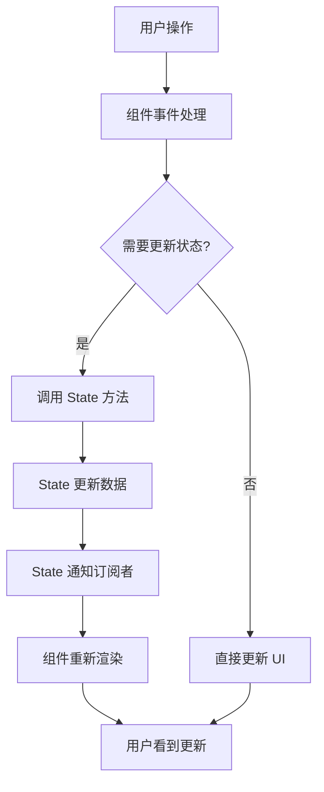

### 文档编辑流程

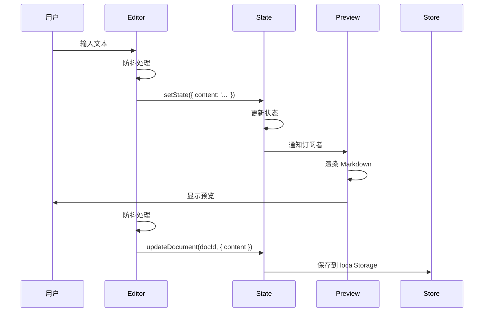

### 文档管理流程


---

## DOM 管理

### DOM 统一管理器（dom.js）

**设计理念**：
- 集中管理所有 DOM 元素引用
- 提供统一的访问接口
- 内置缓存机制，减少 DOM 查询
- 支持链式调用和批量操作

**核心架构**：

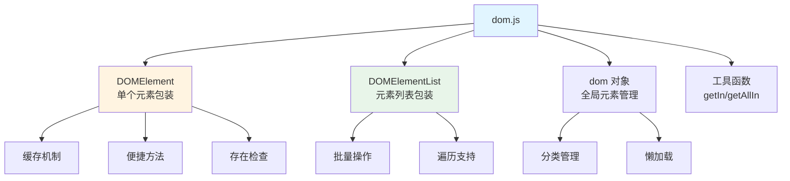

**DOMElement 类**：

```javascript
class DOMElement {
    constructor(selector, getter = null) {
        this.selector = selector;
        this.getter = getter;
        this._element = null;
    }

    get element() {
        if (!this._element) {
            this._element = this.getter ? this.getter() : document.querySelector(this.selector);
        }
        return this._element;
    }

    exists() {
        return this.element !== null;
    }

    show() {
        if (this.exists()) {
            this.element.classList.remove('hidden');
            this.element.classList.add('visible');
        }
    }

    hide() {
        if (this.exists()) {
            this.element.classList.remove('visible');
            this.element.classList.add('hidden');
        }
    }

    toggle() {
        if (this.exists()) {
            this.element.classList.toggle('visible');
            this.element.classList.toggle('hidden');
        }
    }

    addClass(...classNames) {
        if (this.exists()) {
            this.element.classList.add(...classNames);
        }
    }

    removeClass(...classNames) {
        if (this.exists()) {
            this.element.classList.remove(...classNames);
        }
    }

    hasClass(className) {
        return this.exists() && this.element.classList.contains(className);
    }

    setAttribute(name, value) {
        if (this.exists()) {
            this.element.setAttribute(name, value);
        }
    }

    getAttribute(name) {
        return this.exists() ? this.element.getAttribute(name) : null;
    }

    setProperty(property, value) {
        if (this.exists()) {
            this.element[property] = value;
        }
    }

    getProperty(property) {
        return this.exists() ? this.element[property] : null;
    }

    on(event, handler, options) {
        if (this.exists()) {
            this.element.addEventListener(event, handler, options);
        }
        return this;
    }

    off(event, handler, options) {
        if (this.exists()) {
            this.element.removeEventListener(event, handler, options);
        }
        return this;
    }

    html(content) {
        if (this.exists()) {
            if (content !== undefined) {
                this.element.innerHTML = content;
                return this;
            }
            return this.element.innerHTML;
        }
        return null;
    }

    text(content) {
        if (this.exists()) {
            if (content !== undefined) {
                this.element.textContent = content;
                return this;
            }
            return this.element.textContent;
        }
        return null;
    }

    val(value) {
        if (this.exists()) {
            if (value !== undefined) {
                this.element.value = value;
                return this;
            }
            return this.element.value;
        }
        return null;
    }

    focus() {
        if (this.exists()) {
            this.element.focus();
        }
        return this;
    }

    blur() {
        if (this.exists()) {
            this.element.blur();
        }
        return this;
    }
}
```

**dom 全局对象**：

```javascript
export const dom = {
    // 应用容器
    app: {
        container: new DOMElement('#app')
    },

    // 编辑器
    editor: {
        element: new DOMElement('#markdown-editor'),
        textarea: new DOMElement('#editor-textarea')
    },

    // 预览
    preview: {
        wrapper: new DOMElement('.markdown-preview-pane'),
        element: new DOMElement('#markdown-preview'),
        content: new DOMElement('#preview-content')
    },

    // 侧边栏
    sidebar: {
        left: new DOMElement('.md-sidebar-left'),
        right: new DOMElement('.md-sidebar-right'),
        toggle: new DOMElement('#sidebar-toggle')
    },

    // 按钮
    buttons: {
        newDoc: new DOMElement('#md-new-doc-btn'),
        settings: new DOMElement('#md-settings-btn'),
        search: new DOMElement('#md-search-btn')
    },

    // 状态
    status: {
        overlay: new DOMElement('#status-overlay'),
        message: new DOMElement('#status-message')
    },

    // 工具函数
    getById(id) {
        return new DOMElement(`#${id}`, () => document.getElementById(id));
    },

    get(selector) {
        return new DOMElement(selector);
    },

    getAll(selector) {
        return new DOMElementList(selector);
    },

    getIn(container, selector) {
        return container?.querySelector(selector) || null;
    },

    getAllIn(container, selector) {
        return container ? Array.from(container.querySelectorAll(selector)) : [];
    }
};
```

**使用示例**：

```javascript
import { dom } from './utils/dom.js';

// 获取全局元素
const editor = dom.editor.element;
const preview = dom.preview.content;

// 检查元素是否存在
if (dom.sidebar.left.exists()) {
    dom.sidebar.left.toggle();
}

// 链式调用
dom.editor.element
    .addClass('active')
    .focus()
    .on('input', handleInput);

// 批量操作
dom.buttons.all.forEach(btn => btn.classList.add('active'));

// 在组件内查询
class MyComponent extends BaseComponent {
    render() {
        const items = dom.getAllIn(this.container, '.item');
        items.forEach(item => {
            // 处理每个项
        });
    }
}
```

### DOM 缓存策略

**组件级缓存**：

```javascript
class DocumentTree extends BaseComponent {
    constructor(state, containerId) {
        super(state, containerId);
        this.#domCache = new Map();  // docId -> Element
    }

    #getCachedDocItem(docId) {
        if (!this.#domCache.has(docId)) {
            const item = this.container?.querySelector(`[data-doc-id="${docId}"]`);
            this.#domCache.set(docId, item);
        }
        return this.#domCache.get(docId);
    }

    #clearDomCache() {
        this.#domCache.clear();
    }
}
```

**使用场景**：
```javascript
updateActiveState(newDocId, oldDocId) {
    // 使用缓存获取元素，减少 DOM 查询
    if (oldDocId) {
        const oldItem = this.#getCachedDocItem(oldDocId);
        if (oldItem) {
            oldItem.classList.remove('active');
        }
    }

    if (newDocId && newDocId !== oldDocId) {
        const newItem = this.#getCachedDocItem(newDocId);
        if (newItem) {
            newItem.classList.add('active');
        }
    }
}
```

---

## 构建与部署

本项目使用 Vite 5.0 作为构建工具，提供快速的开发体验和优化的生产构建。完整的构建和部署指南请参考：[**构建与部署指南**](build.md)

### 快速开始

**开发环境**：

```bash
npm run dev
```

**生产构建**：

```bash
npm run build
```

**预览构建**：

```bash
npm run preview
```

---

## 性能优化

### 1. 防抖与节流

**防抖（Debounce）**：

```javascript
import { debounce } from './utils/helpers.js';

class Editor extends BaseComponent {
    bindEvents() {
        // 防抖处理输入事件
        const debouncedInput = debounce((e) => {
            this.handleInput(e);
        }, 300);

        this.bindEvent(this.textarea, 'input', debouncedInput);
    }
}
```

**节流（Throttle）**：

```javascript
import { throttle } from './utils/helpers.js';

class Preview extends BaseComponent {
    bindEvents() {
        // 节流处理滚动事件
        const throttledScroll = throttle((e) => {
            this.handleScroll(e);
        }, 100);

        this.bindEvent(this.element, 'scroll', throttledScroll);
    }
}
```

### 2. 增量渲染

**结构变化检测**：

```javascript
class DocumentTree extends BaseComponent {
    #hasStructuralChanges(newValue, oldValue) {
        if (newValue.length !== oldValue.length) return true;

        const oldMap = new Map(oldValue.map(d => [d.id, d]));
        
        for (const doc of newValue) {
            const old = oldMap.get(doc.id);
            if (!old || old.parentId !== doc.parentId || old.name !== doc.name) {
                return true;
            }
        }

        return false;
    }

    subscribe() {
        this.unsubscribe = this.state.subscribeTo(
            ['documents', 'currentDocId'], 
            (newValue, oldValue, key) => {
                if (key === 'currentDocId') {
                    this.updateActiveState(newValue, oldValue);
                } else if (key === 'documents') {
                    const needsFullRender = this.#hasStructuralChanges(newValue, oldValue);
                    if (needsFullRender) {
                        this.render(true);
                    }
                }
            }
        );
    }
}
```

### 3. DOM 缓存

**缓存机制**：

```javascript
class DocumentTree extends BaseComponent {
    #domCache = new Map();

    #getCachedDocItem(docId) {
        if (!this.#domCache.has(docId)) {
            const item = this.container?.querySelector(`[data-doc-id="${docId}"]`);
            this.#domCache.set(docId, item);
        }
        return this.#domCache.get(docId);
    }

    updateActiveState(newDocId, oldDocId) {
        if (oldDocId) {
            const oldItem = this.#getCachedDocItem(oldDocId);
            if (oldItem) {
                oldItem.classList.remove('active');
            }
        }

        if (newDocId && newDocId !== oldDocId) {
            const newItem = this.#getCachedDocItem(newDocId);
            if (newItem) {
                newItem.classList.add('active');
            }
        }
    }
}
```

### 4. RAF 批量更新

**批量更新**：

```javascript
class DocumentTree extends BaseComponent {
    #pendingUpdates = new Map();

    setFolderExpanded(folderId, expanded) {
        // 更新状态
        if (expanded) {
            this.expandedFolders.add(folderId);
        } else {
            this.expandedFolders.delete(folderId);
        }

        // 批量更新 UI
        if (!this.#pendingUpdates.has(folderId)) {
            this.#pendingUpdates.set(folderId, expanded);
            requestAnimationFrame(() => {
                this.#updateFolderUI(folderId, this.#pendingUpdates.get(folderId));
                this.#pendingUpdates.delete(folderId);
            });
        }
    }
}
```

### 5. 异步存储队列

**队列处理原型**：

```javascript
class StoreManager {
    static #pendingOperations = new Map();
    static #isProcessing = false;

    static async #scheduleAsync(operation) {
        const id = Date.now() + Math.random();
        
        return new Promise((resolve, reject) => {
            StoreManager.#pendingOperations.set(id, { operation, resolve, reject });
            
            if (!StoreManager.#isProcessing) {
                StoreManager.#processQueue();
            }
        });
    }

    static async #processQueue() {
        if (StoreManager.#pendingOperations.size === 0) {
            StoreManager.#isProcessing = false;
            return;
        }

        StoreManager.#isProcessing = true;

        const processNext = async () => {
            const entry = StoreManager.#pendingOperations.entries().next().value;
            if (!entry) {
                StoreManager.#isProcessing = false;
                return;
            }

            const [id, { operation, resolve, reject }] = entry;
            StoreManager.#pendingOperations.delete(id);

            try {
                const result = await operation();
                resolve(result);
            } catch (error) {
                console.error('[StoreManager] Operation failed:', error);
                reject(error);
            }

            // 继续处理下一个
            if (StoreManager.#pendingOperations.size > 0) {
                if (typeof requestIdleCallback !== 'undefined') {
                    requestIdleCallback(() => processNext(), { timeout: 50 });
                } else {
                    setTimeout(() => processNext(), 0);
                }
            } else {
                StoreManager.#isProcessing = false;
            }
        };

        // 使用 requestIdleCallback 或 setTimeout
        if (typeof requestIdleCallback !== 'undefined') {
            requestIdleCallback(() => processNext(), { timeout: 50 });
        } else {
            setTimeout(() => processNext(), 0);
        }
    }
}
```

### 6. 代码分割

**手动分块**：

```javascript
// vite.config.js
manualChunks: {
    'markdown-vendor': ['marked', 'dompurify'],
    'prism-vendor': ['prismjs'],
    'mermaid-vendor': ['mermaid']
}
```

**优势**：
- 减少主包体积
- 按需加载
- 优化缓存

### 7. 懒加载

**动态导入**：

```javascript
// 按需加载 Mermaid
async renderMermaidCharts() {
    if (!this.mermaidLoaded) {
        const mermaid = await import('mermaid');
        mermaid.initialize({ theme: this.currentTheme });
        this.mermaidLoaded = true;
    }
    // 渲染图表
}
```

### 性能指标

| 指标 | 目标值 | 说明 |
|------|--------|------|
| 首屏加载 | <2s | 从请求到页面可交互 |
| 渲染延迟 | <10ms | 增量渲染优化 |
| 拖拽响应 | <16ms | 60fps 流畅体验 |
| 内存占用 | <50MB | 运行时内存 |
| 包体积 | <500KB | Gzip 后主包 |

---

## 总结

### 架构优势

1. **状态驱动 UI**：
   - 状态与 UI 完全解耦
   - 自动同步更新
   - 易于调试和维护

2. **组件化设计**：
   - 高度模块化
   - 职责清晰
   - 可复用性强

3. **观察者模式**：
   - 松耦合
   - 易扩展
   - 支持多订阅者

4. **性能优化**：
   - 增量渲染
   - DOM 缓存
   - 批量更新
   - 代码分割

5. **开发体验**：
   - ESM 模块
   - JSDoc 文档
   - 类型提示
   - 热更新

### 技术亮点

- **纯前端实现**：无后端依赖，可离线使用
- **自动持久化**：集成 PersistenceManager，状态自动保存
- **DOM 统一管理**：dom.js 提供集中式 DOM 访问
- **实时预览**：Markdown 到 HTML 的实时转换
- **扩展功能**：数学公式、流程图、代码高亮
- **搜索替换**：类似 VSCode 的搜索替换界面
- **设置管理**：完整的编辑器和界面设置系统
- **错误处理**：组件级错误捕获和用户友好提示
- **响应式设计**：支持多种布局模式
- **PWA 支持**：可安装为桌面应用
- **测试覆盖**：Vitest 单元测试框架

### 未来优化方向

1. **性能优化**：
   - 虚拟滚动（大文档支持）
   - Web Worker（后台渲染）
   - IndexedDB（大数据存储）

2. **功能增强**：
   - 协同编辑
   - 版本历史
   - 云同步
   - 插件系统

3. **开发体验**：
   - TypeScript 迁移
   - 单元测试
   - E2E 测试
   - CI/CD

4. **用户体验**：
   - 快捷键自定义
   - 主题自定义
   - 导出增强
   - 无障碍支持

---

**文档版本**：2.0.0  
**最后更新**：2026-01-27  
**维护者**：Markdown Editor Team

### 更新日志

**v2.0.0** (2026-01-27)
- 新增 SearchReplace 组件（搜索替换功能）
- 新增 Settings 组件（设置管理）
- 新增 PersistenceManager（持久化管理器）
- StoreManager 增加异步存储队列
- dom.js 提供 DOM 统一管理接口
- BaseComponent 增加错误处理功能
- 状态结构重构：editor、interface、export 分离
- 集成 Vitest 测试框架
- 更新架构文档

**v1.0.0** (2026-01-24)
- 初始版本
- 核心编辑器功能
- 文档管理
- 实时预览
