# Markdown 编辑器架构设计文档

## 📋 目录

- [概述](#概述)
- [技术栈](#技术栈)
- [架构设计](#架构设计)
- [核心模块](#核心模块)
- [组件体系](#组件体系)
- [状态管理](#状态管理)
- [数据流](#数据流)
- [DOM 管理](#dom-管理)
- [构建与部署](#构建与部署)
- [性能优化](#性能优化)

---

## 概述

本项目是一个独立的 Markdown 编辑器，采用现代化的前端架构设计，实现了状态驱动 UI、组件化开发、模块化管理等核心特性。编辑器支持实时预览、语法高亮、数学公式、流程图、文档管理等高级功能。

### 核心特性

1. **状态驱动 UI**：采用观察者模式，实现状态与 UI 的自动同步
2. **组件化架构**：基于 BaseComponent 的组件继承体系
3. **模块化设计**：ESM 模块系统，清晰的职责分离
4. **本地存储**：基于 localStorage 的数据持久化
5. **实时预览**：Markdown 到 HTML 的实时转换
6. **语法高亮**：支持多种编程语言的代码高亮
7. **扩展功能**：数学公式（KaTeX）、流程图（Mermaid）

### 项目结构

```
markdown-editor/
├── src/
│   ├── main.js                 # 应用入口
│   ├── components/             # UI 组件
│   │   ├── BaseComponent.js   # 组件基类
│   │   ├── DocumentList.js    # 文档列表
│   │   ├── Editor.js          # 编辑器
│   │   ├── Preview.js         # 预览
│   │   ├── Sidebar.js         # 侧边栏
│   │   ├── TOC.js             # 目录
│   │   └── Dialog.js          # 对话框
│   ├── modules/               # 核心模块
│   │   ├── markdown.js        # 编辑器主控制器
│   │   ├── state.js           # 状态管理器
│   │   └── store.js           # 存储管理器
│   ├── utils/                 # 工具函数
│   │   ├── dom.js             # DOM 管理
│   │   └── helpers.js         # 辅助函数
│   └── styles/                # 样式文件
│       └── markdown.css       # 主样式
├── public/                    # 静态资源
│   └── manifest.json         # PWA 配置
├── docs/                      # 文档
├── vite.config.js            # Vite 配置
└── package.json              # 项目配置
```

---

## 技术栈

### 构建工具

**Vite 5.0**
- 快速的冷启动
- 即时的热模块替换（HMR）
- 基于 Rollup 的优化构建
- 原生 ESM 支持

### 核心依赖

| 库名 | 版本 | 用途 |
|------|------|------|
| **marked** | ^12.0.2 | Markdown 解析器 |
| **dompurify** | ^3.1.7 | XSS 防护 |
| **prismjs** | ^1.29.0 | 代码语法高亮 |
| **mermaid** | ^10.9.0 | 流程图/时序图渲染 |
| **katex** | ^0.16.27 | 数学公式渲染 |
| **@vscode/codicons** | ^0.0.44 | VS Code 图标库 |

### 开发依赖

| 库名 | 版本 | 用途 |
|------|------|------|
| **terser** | ^5.46.0 | 代码压缩 |
| **vite** | ^5.0.0 | 构建工具 |

---

## 架构设计

### 整体架构图

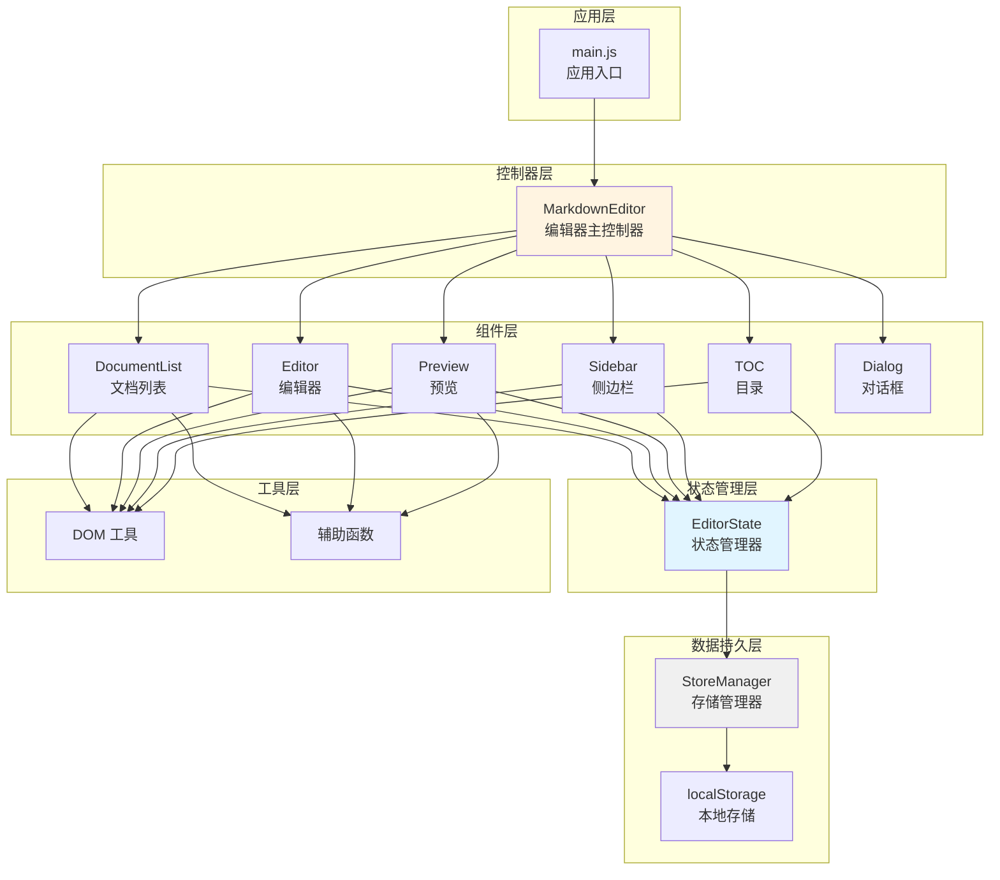

### 架构模式

**1. 观察者模式（Observer Pattern）**

状态管理采用观察者模式，实现状态驱动 UI：

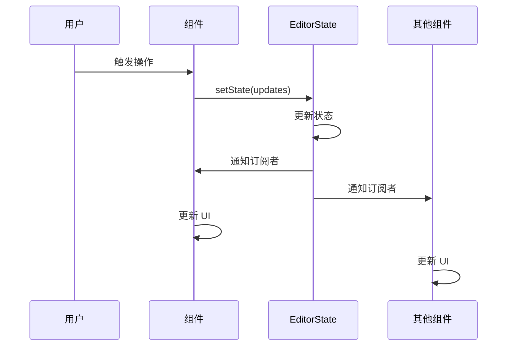

**2. 组件继承模式**

所有 UI 组件继承自 BaseComponent：

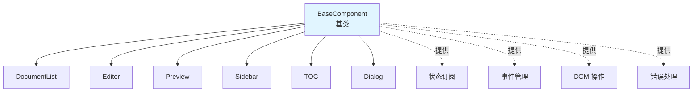

**3. 单向数据流**

数据流动遵循单向流原则：

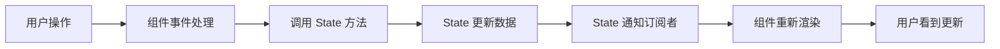

---

## 核心模块

### 1. MarkdownEditor（编辑器主控制器）

**职责**：
- 应用初始化和生命周期管理
- 组件注册和协调
- 全局事件处理
- 布局管理（拖拽调整大小）

**核心代码**：

```javascript
export class MarkdownEditor {
    constructor() {
        this.isInitialized = false;
        this.state = new EditorState();
        this.components = {};
        this.isDragging = false;
        this.syncScrollEnabled = true;
    }

    /**
     * 初始化编辑器
     */
    init() {
        if (this.isInitialized) return;

        // 加载保存的数据
        this.loadSavedData();

        // 初始化组件
        this.initComponents();

        // 绑定全局事件
        this.bindGlobalEvents();

        this.isInitialized = true;
    }

    /**
     * 初始化所有组件
     */
    initComponents() {
        this.components.editor = new Editor(this.state, 'markdown-editor');
        this.components.preview = new Preview(this.state, 'markdown-preview');
        this.components.documentList = new DocumentList(this.state, 'document-list');
        this.components.sidebar = new Sidebar(this.state, 'sidebar');
        this.components.toc = new TOC(this.state, 'toc');

        // 初始化所有组件
        Object.values(this.components).forEach(component => {
            component.init();
        });
    }
}
```

**配置常量**：

```javascript
static DEBOUNCE_DELAY = {
    UPDATE: 300,   // 内容更新防抖延迟
    SAVE: 1000     // 自动保存防抖延迟
};

static DRAG_CONFIG = {
    MIN_WIDTH: 100,    // 最小面板宽度
    BATCH_SIZE: 10     // 批量处理大小
};

static UI_CONFIG = {
    MESSAGE_DURATION: 2000,      // 消息显示时长
    MERMAID_RENDER_DELAY: 100,   // Mermaid 渲染延迟
    MAX_CONTENT_LENGTH: 1000000  // 最大内容长度
};
```

### 2. EditorState（状态管理器）

**职责**：
- 管理应用全局状态
- 实现观察者模式
- 提供状态订阅机制
- 状态变更通知

**状态结构**：

```javascript
#state = {
    // 文档相关
    documents: [],           // 文档列表（扁平数组）
    currentDocId: null,      // 当前打开的文档 ID

    // 编辑器内容
    content: '',             // 当前编辑器内容

    // UI 状态
    theme: 'light',          // 主题模式
    layout: 'layout-both',   // 布局模式
    leftSidebarOpen: false,  // 左侧边栏状态
    rightSidebarOpen: false, // 右侧边栏状态

    // 侧边栏区块状态
    sections: {
        toc: true,           // 目录区块
        export: true         // 导出区块
    },

    // 布局状态
    leftRatio: 0.5,          // 左右面板比例

    // 渲染状态
    isRenderingMermaid: false,  // 是否正在渲染 Mermaid
    lastRenderedContent: '',    // 上次渲染的内容
    headings: []                // 标题数据
};
```

**核心方法**：

```javascript
export class EditorState {
    /**
     * 获取状态快照（只读）
     */
    getState() {
        return Object.freeze({ ...this.#state });
    }

    /**
     * 获取单个状态值
     */
    get(key) {
        return this.#state[key];
    }

    /**
     * 批量更新状态
     */
    setState(updates, options = {}) {
        const oldState = { ...this.#state };
        Object.assign(this.#state, updates);
        
        if (!options.silent) {
            this.#notify(oldState, this.#state);
        }
    }

    /**
     * 订阅状态变化
     */
    subscribe(listener) {
        this.#globalListeners.add(listener);
        return () => this.#globalListeners.delete(listener);
    }

    /**
     * 订阅特定状态键的变化
     */
    subscribeTo(keys, listener) {
        const keyArray = Array.isArray(keys) ? keys : [keys];
        keyArray.forEach(key => {
            if (!this.#listeners.has(key)) {
                this.#listeners.set(key, new Set());
            }
            this.#listeners.get(key).add(listener);
        });
        
        return () => {
            keyArray.forEach(key => {
                this.#listeners.get(key)?.delete(listener);
            });
        };
    }

    /**
     * 通知监听器
     */
    #notify(oldState, newState, force = false, changedKeys = []) {
        // 通知全局监听器
        this.#globalListeners.forEach(listener => {
            try {
                listener(newState, oldState);
            } catch (error) {
                console.error('State listener error:', error);
            }
        });

        // 通知特定键的监听器
        changedKeys.forEach(key => {
            const listeners = this.#listeners.get(key);
            if (listeners) {
                listeners.forEach(listener => {
                    try {
                        listener(newState[key], oldState[key], key);
                    } catch (error) {
                        console.error(`State listener for ${key} error:`, error);
                    }
                });
            }
        });
    }
}
```

**文档操作方法**：

```javascript
/**
 * 添加文档
 */
addDocument(doc, parentId = null) {
    const newDoc = { ...doc, parentId };
    const documents = [...this.#state.documents, newDoc];
    this.setState({ documents });
}

/**
 * 更新文档
 */
updateDocument(docId, updates, options = {}) {
    const documents = this.#state.documents.map(doc =>
        doc.id === docId ? { ...doc, ...updates } : doc
    );
    this.setState({ documents }, options);
}

/**
 * 删除文档（递归删除子项）
 */
deleteDocument(docId) {
    const toDelete = new Set([docId]);
    
    // 递归收集所有子项
    let changed = true;
    while (changed) {
        changed = false;
        this.#state.documents.forEach(doc => {
            if (doc.parentId && toDelete.has(doc.parentId) && !toDelete.has(doc.id)) {
                toDelete.add(doc.id);
                changed = true;
            }
        });
    }

    const documents = this.#state.documents.filter(doc => !toDelete.has(doc.id));
    const currentDocId = this.#state.currentDocId === docId ? null : this.#state.currentDocId;
    
    this.setState({ documents, currentDocId });
}

/**
 * 移动文档
 */
moveDocument(docId, targetFolderId) {
    // 防止循环嵌套
    if (targetFolderId) {
        let current = this.#state.documents.find(d => d.id === targetFolderId);
        while (current && current.parentId) {
            if (current.parentId === docId) {
                return false;  // 无效移动
            }
            current = this.#state.documents.find(d => d.id === current.parentId);
        }
    }

    this.updateDocument(docId, {
        parentId: targetFolderId,
        updatedAt: new Date().toISOString()
    });

    return true;
}

/**
 * 设置当前文档
 */
setCurrentDocument(docId) {
    const doc = this.#state.documents.find(d => d.id === docId);
    if (doc) {
        this.setState({
            currentDocId: docId,
            content: doc.content || ''
        });
    }
}

/**
 * 构建文档树
 */
buildTree() {
    const docs = this.#state.documents;
    const docMap = new Map();

    // 创建所有节点的映射
    docs.forEach(doc => {
        docMap.set(doc.id, { ...doc, children: [] });
    });

    // 构建树型结构
    const roots = [];
    docMap.forEach(doc => {
        if (doc.parentId && docMap.has(doc.parentId)) {
            docMap.get(doc.parentId).children.push(doc);
        } else {
            roots.push(doc);
        }
    });

    return roots;
}
```

### 3. StoreManager（存储管理器）

**职责**：
- 管理 localStorage 数据存储
- 提供异步存储队列
- 数据序列化和反序列化
- 错误处理和降级

**核心特性**：

```javascript
export class StoreManager {
    /**
     * 默认 Markdown 内容
     */
    static DEFAULT_CONTENT = `# Markdown 语法指南
...
`;

    /**
     * 存储键配置
     */
    static STORAGE_KEYS = {
        DOCUMENTS: 'markdown_documents',
        CURRENT_DOC: 'markdown_current_doc',
        THEME: 'markdown_theme',
        LAYOUT: 'markdown_layout',
        LEFT_RATIO: 'markdown_left_ratio'
    };

    /**
     * 异步存储队列
     */
    static #pendingOperations = new Map();
    static #isProcessing = false;

    /**
     * 调度存储操作（异步）
     */
    static async #scheduleAsync(operation) {
        const id = Date.now() + Math.random();
        
        return new Promise((resolve, reject) => {
            StoreManager.#pendingOperations.set(id, { operation, resolve, reject });
            
            if (!StoreManager.#isProcessing) {
                StoreManager.#processQueue();
            }
        });
    }

    /**
     * 处理操作队列
     */
    static async #processQueue() {
        if (StoreManager.#pendingOperations.size === 0) {
            StoreManager.#isProcessing = false;
            return;
        }

        StoreManager.#isProcessing = true;

        const processNext = async () => {
            const entry = StoreManager.#pendingOperations.entries().next().value;
            if (!entry) {
                StoreManager.#isProcessing = false;
                return;
            }

            const [id, { operation, resolve, reject }] = entry;
            StoreManager.#pendingOperations.delete(id);

            try {
                const result = await operation();
                resolve(result);
            } catch (error) {
                console.error('[StoreManager] Operation failed:', error);
                reject(error);
            }

            // 继续处理下一个
            if (StoreManager.#pendingOperations.size > 0) {
                if (typeof requestIdleCallback !== 'undefined') {
                    requestIdleCallback(() => processNext(), { timeout: 50 });
                } else {
                    setTimeout(() => processNext(), 0);
                }
            } else {
                StoreManager.#isProcessing = false;
            }
        };

        // 使用 requestIdleCallback 或 setTimeout
        if (typeof requestIdleCallback !== 'undefined') {
            requestIdleCallback(() => processNext(), { timeout: 50 });
        } else {
            setTimeout(() => processNext(), 0);
        }
    }
}
```

**存储方法**：

```javascript
/**
 * 保存文档列表
 */
static async saveDocuments(documents) {
    return StoreManager.#scheduleAsync(() => {
        try {
            const data = JSON.stringify(documents);
            localStorage.setItem(StoreManager.STORAGE_KEYS.DOCUMENTS, data);
            return { success: true };
        } catch (error) {
            return { success: false, error: error.message };
        }
    });
}

/**
 * 加载文档列表
 */
static loadDocuments() {
    try {
        const data = localStorage.getItem(StoreManager.STORAGE_KEYS.DOCUMENTS);
        if (data) {
            return JSON.parse(data);
        }
    } catch (error) {
        console.error('[StoreManager] Failed to load documents:', error);
    }
    return null;
}

/**
 * 保存当前文档 ID
 */
static saveCurrentDocId(docId) {
    try {
        localStorage.setItem(StoreManager.STORAGE_KEYS.CURRENT_DOC, docId);
        return { success: true };
    } catch (error) {
        return { success: false, error: error.message };
    }
}

/**
 * 加载当前文档 ID
 */
static loadCurrentDocId() {
    try {
        return localStorage.getItem(StoreManager.STORAGE_KEYS.CURRENT_DOC);
    } catch (error) {
        console.error('[StoreManager] Failed to load current doc:', error);
        return null;
    }
}

/**
 * 保存主题
 */
static saveTheme(theme) {
    try {
        localStorage.setItem(StoreManager.STORAGE_KEYS.THEME, theme);
        return { success: true };
    } catch (error) {
        return { success: false, error: error.message };
    }
}

/**
 * 加载主题
 */
static loadTheme() {
    try {
        return localStorage.getItem(StoreManager.STORAGE_KEYS.THEME) || 'light';
    } catch (error) {
        return 'light';
    }
}
```

---

## 组件体系

### BaseComponent（组件基类）

**职责**：
- 提供组件通用功能
- 状态订阅管理
- 事件绑定和管理
- DOM 操作辅助方法
- 错误处理机制

**核心代码**：

```javascript
export class BaseComponent {
    constructor(state, containerId) {
        this.state = state;
        this.containerId = containerId;
        this.container = null;
        this.unsubscribe = null;
        this.eventHandlers = new Map();
        this.errorHandlers = new Map();
    }

    /**
     * 初始化组件
     */
    init() {
        this.container = document.getElementById(this.containerId);
        if (!this.container) {
            throw new Error(`Container not found: ${this.containerId}`);
        }

        this.subscribe();
        this.bindEvents();
        this.render();
    }

    /**
     * 销毁组件
     */
    destroy() {
        // 取消状态订阅
        if (this.unsubscribe) {
            this.unsubscribe();
            this.unsubscribe = null;
        }

        // 移除事件监听器
        this.eventHandlers.forEach((handlers, element) => {
            handlers.forEach(({ event, handler, options }) => {
                element.removeEventListener(event, handler, options);
            });
        });
        this.eventHandlers.clear();

        // 清空容器
        if (this.container) {
            this.container.innerHTML = '';
        }
    }

    /**
     * 订阅状态变化（子类实现）
     */
    subscribe() {
        // 子类实现
    }

    /**
     * 绑定事件（子类实现）
     */
    bindEvents() {
        // 子类实现
    }

    /**
     * 渲染组件（子类实现）
     */
    render() {
        // 子类实现
    }

    /**
     * 创建元素
     */
    createElement(tag, options = {}) {
        const element = document.createElement(tag);

        if (options.className) {
            element.className = options.className;
        }

        if (options.id) {
            element.id = options.id;
        }

        if (options.textContent) {
            element.textContent = options.textContent;
        }

        if (options.innerHTML) {
            element.innerHTML = options.innerHTML;
        }

        if (options.attributes) {
            Object.entries(options.attributes).forEach(([key, value]) => {
                element.setAttribute(key, value);
            });
        }

        if (options.dataset) {
            Object.entries(options.dataset).forEach(([key, value]) => {
                element.dataset[key] = value;
            });
        }

        if (options.style) {
            Object.assign(element.style, options.style);
        }

        if (options.parent) {
            options.parent.appendChild(element);
        }

        return element;
    }

    /**
     * 创建文档片段
     */
    createFragment() {
        return document.createDocumentFragment();
    }

    /**
     * 绑定事件（带管理）
     */
    bindEvent(element, event, handler, options = {}) {
        element.addEventListener(event, handler, options);

        if (!this.eventHandlers.has(element)) {
            this.eventHandlers.set(element, []);
        }
        this.eventHandlers.get(element).push({ event, handler, options });
    }

    /**
     * 显示消息
     */
    showMessage(message, type = 'info', duration = 2000) {
        // 触发全局消息事件
        window.dispatchEvent(new CustomEvent('md:showMessage', {
            detail: { message, type, duration }
        }));
    }

    /**
     * 错误处理
     */
    handleError(error, context = 'unknown', metadata = {}) {
        const errorInfo = {
            component: this.constructor.name,
            context,
            message: error.message,
            stack: error.stack,
            timestamp: new Date().toISOString(),
            ...metadata
        };

        console.error(`[${errorInfo.component}] Error in ${context}:`, error, metadata);

        // 触发错误事件
        window.dispatchEvent(new CustomEvent('md:componentError', {
            detail: errorInfo
        }));

        this.showMessage(`操作失败: ${error.message}`, 'error');

        return errorInfo;
    }
}
```

### 组件继承关系

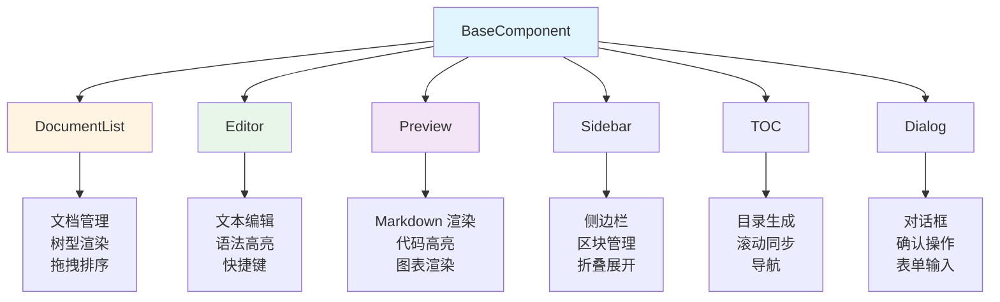

### 组件生命周期

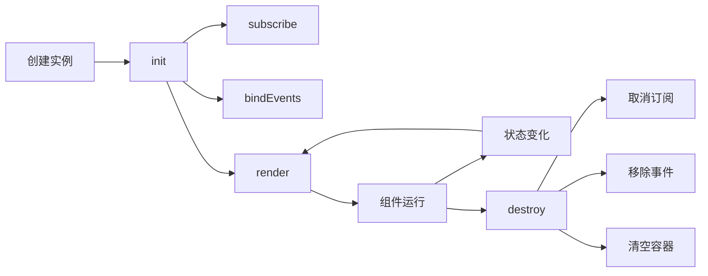

---

## 状态管理

### 状态驱动 UI

**核心思想**：UI 是状态的函数，状态变化自动触发 UI 更新。

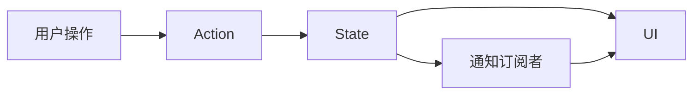

### 状态订阅机制

**1. 全局订阅**

```javascript
// 订阅所有状态变化
const unsubscribe = state.subscribe((newState, oldState) => {
    console.log('State changed:', newState, oldState);
});

// 取消订阅
unsubscribe();
```

**2. 特定键订阅**

```javascript
// 订阅特定状态键
const unsubscribe = state.subscribeTo(['documents', 'currentDocId'], 
    (newValue, oldValue, key) => {
        if (key === 'documents') {
            console.log('Documents changed:', newValue);
        } else if (key === 'currentDocId') {
            console.log('Current doc changed:', newValue);
        }
    }
);

// 取消订阅
unsubscribe();
```

**3. 组件内订阅**

```javascript
class DocumentList extends BaseComponent {
    subscribe() {
        this.unsubscribe = this.state.subscribeTo(
            ['documents', 'currentDocId'], 
            (newValue, oldValue, key) => {
                if (key === 'currentDocId') {
                    this.updateActiveState(newValue, oldValue);
                } else if (key === 'documents') {
                    const needsFullRender = this.#hasStructuralChanges(newValue, oldValue);
                    if (needsFullRender) {
                        this.render(true);
                    }
                }
            }
        );
    }
}
```

### 状态更新流程

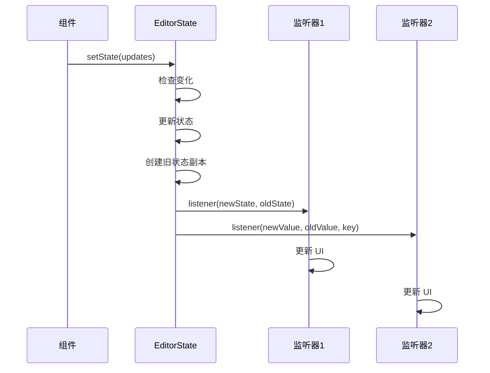

### 静默更新

**用途**：避免触发不必要的 UI 更新。

```javascript
// 静默更新（不触发订阅者）
this.state.updateDocument(docId, {
    name: newName
}, { silent: true });

// 强制更新（即使值相同也触发）
this.state.setState({ content: '...' }, { force: true });
```

---

## 数据流

### 单向数据流

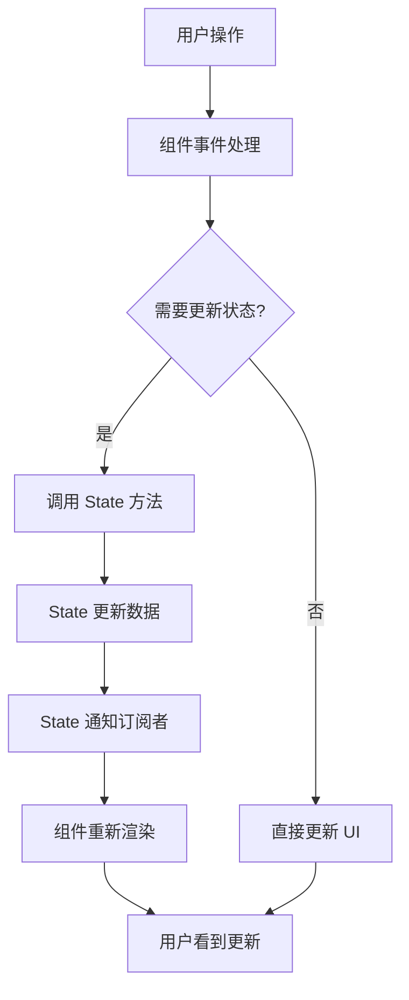

### 文档编辑流程

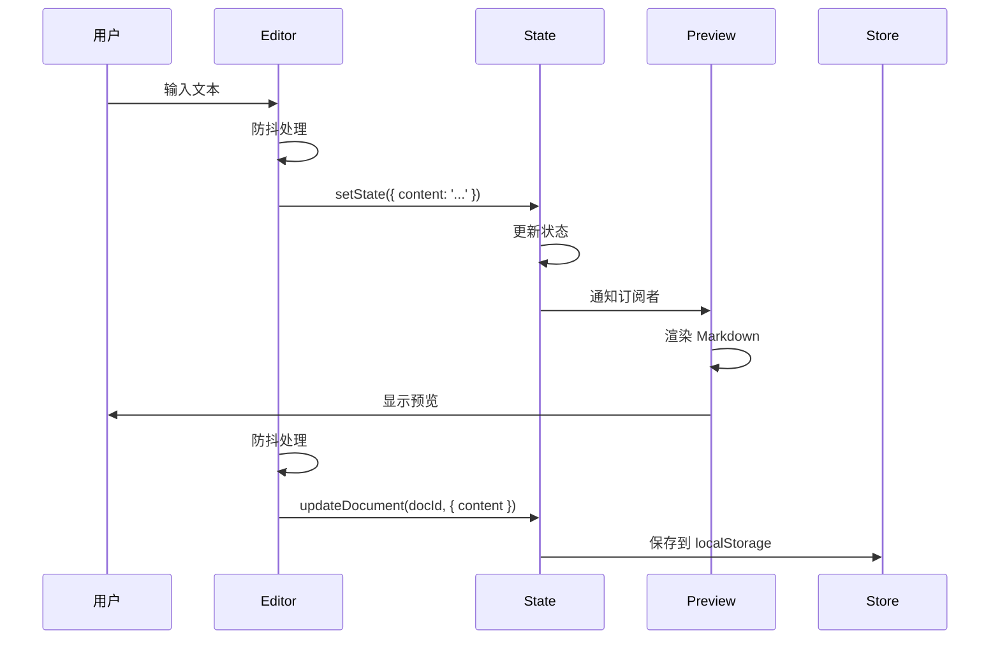

### 文档管理流程

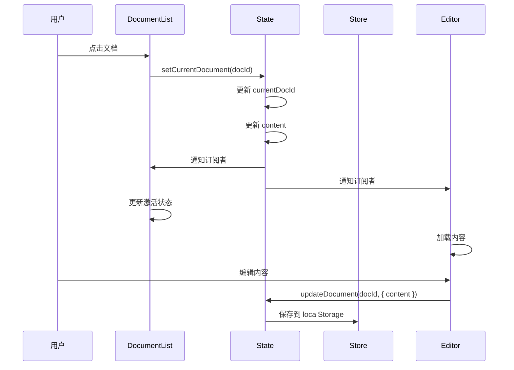

---

## DOM 管理

### DOM 统一管理器

**设计理念**：集中管理所有 DOM 元素引用，提供统一的访问接口。

**核心代码**：

```javascript
/**
 * DOM 元素包装类
 */
class DOMElement {
    constructor(selector, getter = null) {
        this.selector = selector;
        this.getter = getter;
        this._element = null;
    }

    get element() {
        if (!this._element) {
            this._element = this.getter ? this.getter() : document.querySelector(this.selector);
        }
        return this._element;
    }

    exists() {
        return this.element !== null;
    }

    show() {
        if (this.exists()) {
            this.element.classList.remove('hidden');
            this.element.classList.add('visible');
        }
    }

    hide() {
        if (this.exists()) {
            this.element.classList.remove('visible');
            this.element.classList.add('hidden');
        }
    }

    toggle() {
        if (this.exists()) {
            this.element.classList.toggle('visible');
            this.element.classList.toggle('hidden');
        }
    }

    addClass(...classNames) {
        if (this.exists()) {
            this.element.classList.add(...classNames);
        }
    }

    removeClass(...classNames) {
        if (this.exists()) {
            this.element.classList.remove(...classNames);
        }
    }
}

/**
 * DOM 元素列表包装类
 */
class DOMElementList {
    constructor(selector) {
        this.selector = selector;
        this._elements = null;
    }

    get elements() {
        if (!this._elements) {
            this._elements = Array.from(document.querySelectorAll(this.selector));
        }
        return this._elements;
    }

    get length() {
        return this.elements.length;
    }

    forEach(callback) {
        this.elements.forEach(callback);
    }

    addClass(...classNames) {
        this.elements.forEach(el => el.classList.add(...classNames));
    }

    removeClass(...classNames) {
        this.elements.forEach(el => el.classList.remove(...classNames));
    }
}

/**
 * DOM 统一管理器
 */
export const dom = {
    // 应用容器
    app: {
        container: new DOMElement('#app')
    },

    // 编辑器
    editor: {
        element: new DOMElement('#markdown-editor'),
        textarea: new DOMElement('#editor-textarea')
    },

    // 预览
    preview: {
        element: new DOMElement('#markdown-preview'),
        content: new DOMElement('#preview-content')
    },

    // 侧边栏
    sidebar: {
        left: new DOMElement('#sidebar-left'),
        right: new DOMElement('#sidebar-right'),
        toggle: new DOMElement('#sidebar-toggle')
    },

    // 按钮
    buttons: {
        all: new DOMElementList('.md-btn')
    },

    // 状态
    status: {
        overlay: new DOMElement('#status-overlay'),
        message: new DOMElement('#status-message')
    }
};

/**
 * 在指定容器内查询元素
 */
export function getIn(container, selector) {
    return container?.querySelector(selector) || null;
}

/**
 * 在指定容器内查询所有元素
 */
export function getAllIn(container, selector) {
    return container ? Array.from(container.querySelectorAll(selector)) : [];
}
```

### 使用示例

```javascript
import { dom, getIn, getAllIn } from './utils/dom.js';

// 获取全局元素
const editor = dom.editor.element;
const preview = dom.preview.content;

// 检查元素是否存在
if (dom.sidebar.left.exists()) {
    dom.sidebar.left.toggle();
}

// 批量操作
dom.buttons.all.forEach(btn => btn.classList.add('active'));

// 在组件内查询
class MyComponent extends BaseComponent {
    render() {
        const items = getAllIn(this.container, '.item');
        items.forEach(item => {
            // 处理每个项
        });
    }
}
```

### DOM 缓存策略

**组件级缓存**：

```javascript
class DocumentList extends BaseComponent {
    constructor(state, containerId) {
        super(state, containerId);
        this.#domCache = new Map();  // docId -> Element
    }

    #getCachedDocItem(docId) {
        if (!this.#domCache.has(docId)) {
            const item = this.container?.querySelector(`[data-doc-id="${docId}"]`);
            this.#domCache.set(docId, item);
        }
        return this.#domCache.get(docId);
    }

    #clearDomCache() {
        this.#domCache.clear();
    }
}
```

---

## 构建与部署

本项目使用 Vite 5.0 作为构建工具，提供快速的开发体验和优化的生产构建。完整的构建和部署指南请参考：[**构建与部署指南**](build.md)

### 快速开始

**开发环境**：

```bash
npm run dev
```

**生产构建**：

```bash
npm run build
```

**预览构建**：

```bash
npm run preview
```

---

## 性能优化

### 1. 防抖与节流

**防抖（Debounce）**：

```javascript
import { debounce } from './utils/helpers.js';

class Editor extends BaseComponent {
    bindEvents() {
        // 防抖处理输入事件
        const debouncedInput = debounce((e) => {
            this.handleInput(e);
        }, 300);

        this.bindEvent(this.textarea, 'input', debouncedInput);
    }
}
```

**节流（Throttle）**：

```javascript
import { throttle } from './utils/helpers.js';

class Preview extends BaseComponent {
    bindEvents() {
        // 节流处理滚动事件
        const throttledScroll = throttle((e) => {
            this.handleScroll(e);
        }, 100);

        this.bindEvent(this.element, 'scroll', throttledScroll);
    }
}
```

### 2. 增量渲染

**结构变化检测**：

```javascript
class DocumentList extends BaseComponent {
    #hasStructuralChanges(newValue, oldValue) {
        if (newValue.length !== oldValue.length) return true;

        const oldMap = new Map(oldValue.map(d => [d.id, d]));
        
        for (const doc of newValue) {
            const old = oldMap.get(doc.id);
            if (!old || old.parentId !== doc.parentId || old.name !== doc.name) {
                return true;
            }
        }

        return false;
    }

    subscribe() {
        this.unsubscribe = this.state.subscribeTo(
            ['documents', 'currentDocId'], 
            (newValue, oldValue, key) => {
                if (key === 'currentDocId') {
                    this.updateActiveState(newValue, oldValue);
                } else if (key === 'documents') {
                    const needsFullRender = this.#hasStructuralChanges(newValue, oldValue);
                    if (needsFullRender) {
                        this.render(true);
                    }
                }
            }
        );
    }
}
```

### 3. DOM 缓存

**缓存机制**：

```javascript
class DocumentList extends BaseComponent {
    #domCache = new Map();

    #getCachedDocItem(docId) {
        if (!this.#domCache.has(docId)) {
            const item = this.container?.querySelector(`[data-doc-id="${docId}"]`);
            this.#domCache.set(docId, item);
        }
        return this.#domCache.get(docId);
    }

    updateActiveState(newDocId, oldDocId) {
        if (oldDocId) {
            const oldItem = this.#getCachedDocItem(oldDocId);
            if (oldItem) {
                oldItem.classList.remove('active');
            }
        }

        if (newDocId) {
            const newItem = this.#getCachedDocItem(newDocId);
            if (newItem) {
                newItem.classList.add('active');
            }
        }
    }
}
```

### 4. RAF 批量更新

**批量更新**：

```javascript
class DocumentList extends BaseComponent {
    #pendingUpdates = new Map();

    setFolderExpanded(folderId, expanded) {
        // 更新状态
        if (expanded) {
            this.expandedFolders.add(folderId);
        } else {
            this.expandedFolders.delete(folderId);
        }

        // 批量更新 UI
        if (!this.#pendingUpdates.has(folderId)) {
            this.#pendingUpdates.set(folderId, expanded);
            requestAnimationFrame(() => {
                this.#updateFolderUI(folderId, this.#pendingUpdates.get(folderId));
                this.#pendingUpdates.delete(folderId);
            });
        }
    }
}
```

### 5. 异步存储队列

**队列处理**：

```javascript
class StoreManager {
    static #pendingOperations = new Map();
    static #isProcessing = false;

    static async #scheduleAsync(operation) {
        const id = Date.now() + Math.random();
        
        return new Promise((resolve, reject) => {
            StoreManager.#pendingOperations.set(id, { operation, resolve, reject });
            
            if (!StoreManager.#isProcessing) {
                StoreManager.#processQueue();
            }
        });
    }

    static async #processQueue() {
        if (StoreManager.#pendingOperations.size === 0) {
            StoreManager.#isProcessing = false;
            return;
        }

        StoreManager.#isProcessing = true;

        const processNext = async () => {
            const entry = StoreManager.#pendingOperations.entries().next().value;
            if (!entry) {
                StoreManager.#isProcessing = false;
                return;
            }

            const [id, { operation, resolve, reject }] = entry;
            StoreManager.#pendingOperations.delete(id);

            try {
                const result = await operation();
                resolve(result);
            } catch (error) {
                reject(error);
            }

            // 继续处理下一个
            if (StoreManager.#pendingOperations.size > 0) {
                if (typeof requestIdleCallback !== 'undefined') {
                    requestIdleCallback(() => processNext(), { timeout: 50 });
                } else {
                    setTimeout(() => processNext(), 0);
                }
            } else {
                StoreManager.#isProcessing = false;
            }
        };

        // 使用 requestIdleCallback 或 setTimeout
        if (typeof requestIdleCallback !== 'undefined') {
            requestIdleCallback(() => processNext(), { timeout: 50 });
        } else {
            setTimeout(() => processNext(), 0);
        }
    }
}
```

### 6. 代码分割

**手动分块**：

```javascript
// vite.config.js
manualChunks: {
    'markdown-vendor': ['marked', 'dompurify'],
    'prism-vendor': ['prismjs'],
    'mermaid-vendor': ['mermaid']
}
```

**优势**：
- 减少主包体积
- 按需加载
- 优化缓存

### 7. 懒加载

**动态导入**：

```javascript
// 按需加载 Mermaid
async renderMermaidCharts() {
    if (!this.mermaidLoaded) {
        const mermaid = await import('mermaid');
        mermaid.initialize({ theme: this.currentTheme });
        this.mermaidLoaded = true;
    }
    // 渲染图表
}
```

### 性能指标

| 指标 | 目标值 | 说明 |
|------|--------|------|
| 首屏加载 | <2s | 从请求到页面可交互 |
| 渲染延迟 | <10ms | 增量渲染优化 |
| 拖拽响应 | <16ms | 60fps 流畅体验 |
| 内存占用 | <50MB | 运行时内存 |
| 包体积 | <500KB | Gzip 后主包 |

---

## 总结

### 架构优势

1. **状态驱动 UI**：
   - 状态与 UI 完全解耦
   - 自动同步更新
   - 易于调试和维护

2. **组件化设计**：
   - 高度模块化
   - 职责清晰
   - 可复用性强

3. **观察者模式**：
   - 松耦合
   - 易扩展
   - 支持多订阅者

4. **性能优化**：
   - 增量渲染
   - DOM 缓存
   - 批量更新
   - 代码分割

5. **开发体验**：
   - ESM 模块
   - JSDoc 文档
   - 类型提示
   - 热更新

### 技术亮点

- **纯前端实现**：无后端依赖，可离线使用
- **本地存储**：基于 localStorage 的数据持久化
- **实时预览**：Markdown 到 HTML 的实时转换
- **扩展功能**：数学公式、流程图、代码高亮
- **响应式设计**：支持多种布局模式
- **PWA 支持**：可安装为桌面应用

### 未来优化方向

1. **性能优化**：
   - 虚拟滚动（大文档支持）
   - Web Worker（后台渲染）
   - IndexedDB（大数据存储）

2. **功能增强**：
   - 协同编辑
   - 版本历史
   - 云同步
   - 插件系统

3. **开发体验**：
   - TypeScript 迁移
   - 单元测试
   - E2E 测试
   - CI/CD

4. **用户体验**：
   - 快捷键自定义
   - 主题自定义
   - 导出增强
   - 无障碍支持

---

**文档版本**：1.0.0  
**最后更新**：2026-01-24  
**维护者**：Markdown Editor Team
