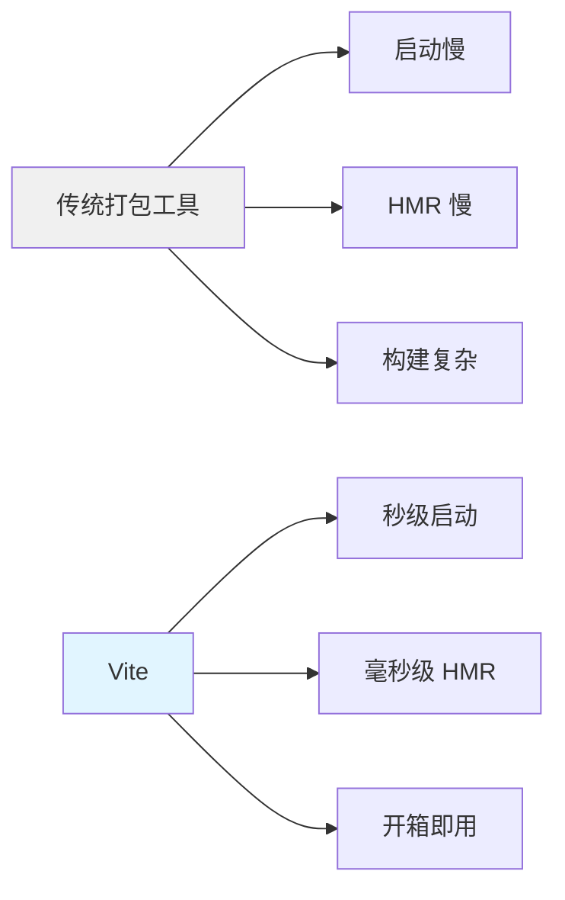
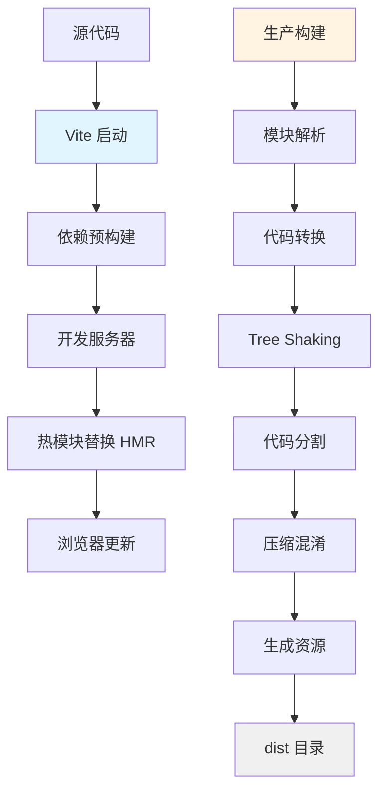
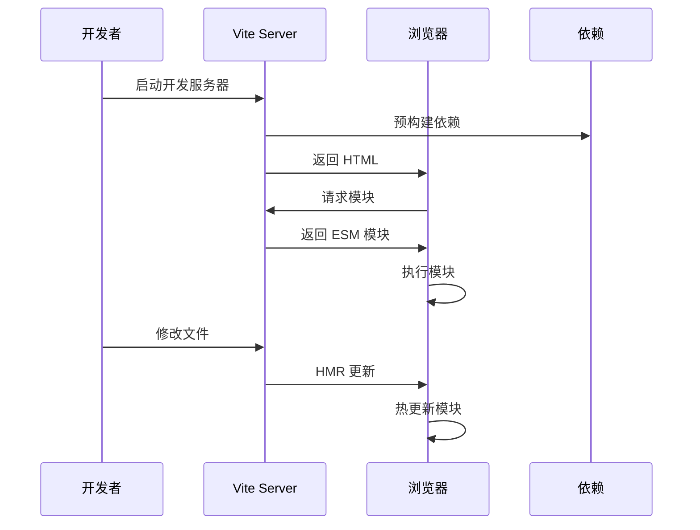
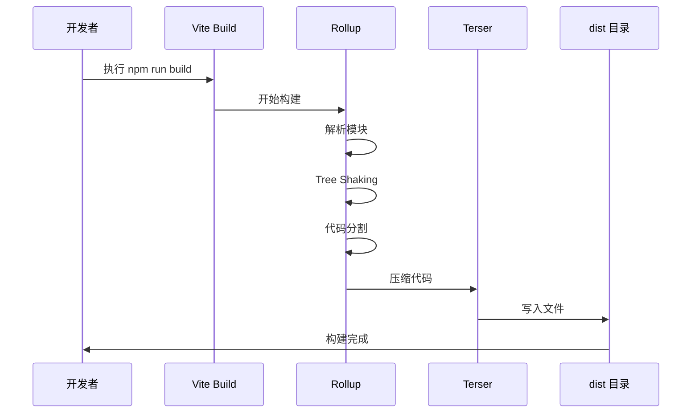
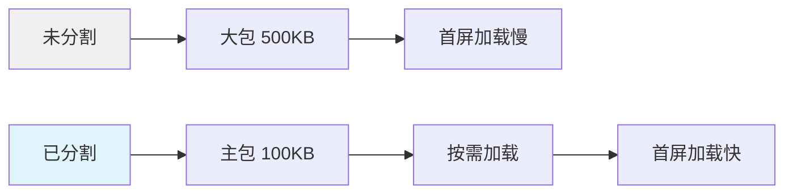
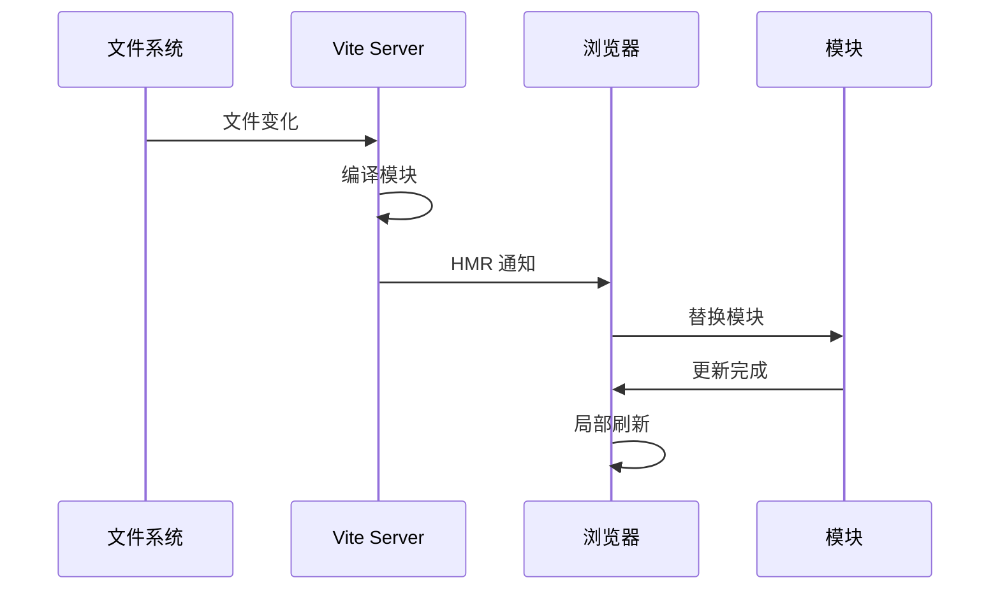

# 构建与部署指南

## 📋 目录

- [概述](#概述)
- [构建工具](#构建工具)
- [Vite 配置](#vite-配置)
- [构建流程](#构建流程)
- [代码分割](#代码分割)
- [开发环境](#开发环境)
- [生产构建](#生产构建)
- [部署方案](#部署方案)
- [性能优化](#性能优化)
- [常见问题](#常见问题)

---

## 概述

本文档详细介绍 Markdown 编辑器的构建和部署流程，包括 Vite 配置、代码分割策略、开发环境搭建、生产构建优化以及各种部署方案。

### 构建目标

- **快速开发**：热模块替换（HMR）、快速冷启动
- **优化构建**：代码压缩、Tree Shaking、代码分割
- **高性能**：减少包体积、提升加载速度
- **易部署**：静态资源、支持多种部署平台

---

## 构建工具

### Vite 7.0

**核心特性**：

- **极速的冷启动**：基于原生 ESM，无需打包
- **即时热更新**：基于 ESM 的 HMR，无论项目大小都保持快速
- **优化的构建**：使用 Rollup 进行生产构建，输出高度优化的静态资源
- **丰富的生态**：支持 TypeScript、JSX、CSS 预处理器等
- **PWA 支持**：通过 vite-plugin-pwa 实现渐进式 Web 应用

**为什么选择 Vite**：



### 其他工具

| 工具 | 版本 | 用途 |
|------|------|------|
| **Terser** | ^5.46.0 | JavaScript 代码压缩和混淆 |
| **Rollup** | (内置) | 模块打包器，Vite 生产构建使用 |
| **Vitest** | ^4.0.18 | 单元测试框架 |
| **vite-plugin-pwa** | ^1.2.0 | PWA 渐进式 Web 应用支持 |
| **Tauri CLI** | ^2.10.0 | 桌面应用打包工具 |

---

## Vite 配置

### 配置文件

**文件位置**：[vite.config.js](../vite.config.js)

```javascript
import { defineConfig, loadEnv } from 'vite';
import { resolve, dirname } from 'path';
import { fileURLToPath } from 'url';
import { VitePWA } from 'vite-plugin-pwa';

// ESM 模式下获取 __dirname 的替代方案
const __filename = fileURLToPath(import.meta.url);
const __dirname = dirname(__filename);

/**
 * Vite 配置工厂
 * @param {{mode: string}} param0 - Vite 提供的上下文对象
 * @returns {import('vite').UserConfig}
 */
export default defineConfig(({ mode }) => {
  // 使用 Vite 约定的 VITE_* 环境变量
  // Tauri 和 Web 部署都使用根路径，由服务器/协议处理
  const env = loadEnv(mode, process.cwd(), 'VITE_');
  const base = env.VITE_BASE_URL || '/';

  return {
    base,
    
    // PWA 插件配置
    plugins: [
      VitePWA({
        registerType: 'autoUpdate',
        includeAssets: ['favicon.svg'],
        manifest: {
          name: 'Markdown',
          short_name: 'Markdown',
          description: '功能强大的在线 Markdown 编辑器',
          start_url: './',
          display: 'standalone',
          background_color: '#ffffff',
          theme_color: '#1e88e5',
          icons: [
            {
              src: 'favicon.svg',
              sizes: 'any',
              type: 'image/svg+xml',
              purpose: 'any maskable'
            }
          ]
        },
        workbox: {
          globPatterns: ['**/*.{js,css,html,svg,png,ico,woff2}'],
          maximumFileSizeToCacheInBytes: 10 * 1024 * 1024 // 10 MB
        },
        devOptions: {
          enabled: false // 开发模式下禁用 PWA
        }
      })
    ],
    
    // 开发服务器配置
    server: {
      port: 3000,
      host: '0.0.0.0',
      open: true
    },
    
    // 构建配置
    build: {
      outDir: 'dist',
      assetsDir: 'assets',
      sourcemap: true,
      cssCodeSplit: true,
      minify: 'terser',
      target: 'es2015',
      reportCompressedSize: false,
      chunkSizeWarningLimit: 1000,
      rollupOptions: {
        output: {
          manualChunks: {
            'markdown-vendor': ['marked', 'dompurify'],
            'prism-vendor': ['prismjs'],
            'mermaid-vendor': ['mermaid']
          },
        },
      },
    },
    
    // 依赖优化
    optimizeDeps: {
      include: ['marked', 'dompurify', 'prismjs', 'mermaid'],
    },
    
    // 资源包含
    assetsInclude: ['**/*.ttf', '**/*.woff', '**/*.woff2', '**/*.eot'],
    
    // 路径别名
    resolve: {
      alias: {
        '@': resolve(__dirname, 'src'),
        '@components': resolve(__dirname, 'src/components'),
        '@modules': resolve(__dirname, 'src/modules'),
        '@utils': resolve(__dirname, 'src/utils'),
        '@styles': resolve(__dirname, 'src/styles')
      },
    },
  };
});
```

### 配置详解

#### 1. 基础路径（base）

```javascript
base: env.VITE_BASE_URL || '/'
```

**作用**：设置应用的基础路径，用于部署到非根目录。

**示例**：
- 本地开发：`/`
- Tauri 桌面应用：`/`
- GitHub Pages：`/repo-name/`
- 自定义子路径：通过 `VITE_BASE_URL` 环境变量配置

#### 2. PWA 插件（VitePWA）

```javascript
plugins: [
  VitePWA({
    registerType: 'autoUpdate',
    includeAssets: ['favicon.svg'],
    manifest: { /* PWA 配置 */ },
    workbox: { /* 缓存策略 */ }
  })
]
```

**功能**：
- **自动更新**：检测到新版本时自动更新 Service Worker
- **离线支持**：缓存静态资源，支持离线访问
- **安装支持**：可将应用安装到桌面
- **资源预缓存**：自动缓存 JS、CSS、HTML、图片等资源

**Workbox 配置**：

```javascript
workbox: {
  globPatterns: ['**/*.{js,css,html,svg,png,ico,woff2}'],
  maximumFileSizeToCacheInBytes: 10 * 1024 * 1024 // 10 MB
}
```

#### 3. 开发服务器（server）

```javascript
server: {
  port: 3000,        // 端口号
  host: '0.0.0.0',   // 监听地址（可局域网访问）
  open: true         // 自动打开浏览器
}
```

#### 4. 构建配置（build）

```javascript
build: {
  outDir: 'dist',              // 输出目录
  assetsDir: 'assets',         // 静态资源目录
  sourcemap: true,             // 生成 source map
  cssCodeSplit: true,          // CSS 代码分割
  minify: 'terser',            // 压缩工具
  target: 'es2015',            // 目标浏览器版本
  reportCompressedSize: false, // 禁用压缩大小报告
  chunkSizeWarningLimit: 1000  // chunk 大小警告阈值
}
```

#### 5. 代码分割（manualChunks）

```javascript
rollupOptions: {
  output: {
    manualChunks: {
      'markdown-vendor': ['marked', 'dompurify'],
      'prism-vendor': ['prismjs'],
      'mermaid-vendor': ['mermaid']
    }
  }
}
```

**分割策略**：
- **markdown-vendor**：Markdown 解析相关库
- **prism-vendor**：代码高亮库
- **mermaid-vendor**：流程图渲染库

#### 6. 路径别名（alias）

```javascript
resolve: {
  alias: {
    '@': resolve(__dirname, 'src'),
    '@components': resolve(__dirname, 'src/components'),
    '@modules': resolve(__dirname, 'src/modules'),
    '@utils': resolve(__dirname, 'src/utils'),
    '@styles': resolve(__dirname, 'src/styles')
  }
}
```

**使用示例**：

```javascript
// 替代
import { Editor } from '../../../components/Editor.js';

// 使用别名
import { Editor } from '@components/Editor.js';
```

---

## 构建流程

### 完整流程图



### 开发模式流程



### 生产构建流程



### 构建步骤详解

#### 1. 依赖预构建

**目的**：
- 将 CommonJS/UMD 转换为 ESM
- 提升依赖加载速度
- 减少请求数量

**配置**：

```javascript
optimizeDeps: {
  include: ['marked', 'dompurify', 'prismjs', 'mermaid']
}
```

#### 2. 模块解析

**过程**：
- 解析 import 语句
- 解析路径别名
- 加载模块内容

#### 3. 代码转换

**转换内容**：
- ES6+ → ES2015
- JSX → JavaScript
- CSS 预处理器 → CSS
- TypeScript → JavaScript

#### 4. Tree Shaking

**作用**：移除未使用的代码

**示例**：

```javascript
// utils.js
export function funcA() { /* ... */ }
export function funcB() { /* ... */ }
export function funcC() { /* ... */ }

// main.js
import { funcA } from './utils.js';

// 最终打包：只包含 funcA，funcB 和 funcC 被移除
```

#### 5. 代码分割

**策略**：
- 手动分割（manualChunks）
- 动态导入（dynamic import）
- 提取公共代码

#### 6. 压缩混淆

**工具**：Terser

**优化项**：
- 移除空格和注释
- 缩短变量名
- 死代码消除
- 语法优化

---

## 代码分割

### 分割策略

### 1. 手动分割

**配置**：

```javascript
manualChunks: {
  'markdown-vendor': ['marked', 'dompurify'],
  'prism-vendor': ['prismjs'],
  'mermaid-vendor': ['mermaid']
}
```

**输出结果**：

```
dist/
├── assets/
│   ├── index-[hash].js           # 主包
│   ├── markdown-vendor-[hash].js # Markdown 库
│   ├── prism-vendor-[hash].js    # Prism 库
│   └── mermaid-vendor-[hash].js  # Mermaid 库
└── index.html
```

### 2. 动态导入

**示例**：

```javascript
// 静态导入（同步）
import mermaid from 'mermaid';

// 动态导入（异步）
async renderMermaidCharts() {
  if (!this.mermaidLoaded) {
    const mermaid = await import('mermaid');
    mermaid.initialize({ theme: this.currentTheme });
    this.mermaidLoaded = true;
  }
  // 渲染图表
}
```

**优势**：
- 按需加载
- 减少首屏加载时间
- 提升性能

### 3. 路由级分割

**示例**：

```javascript
// 主应用
const routes = {
  home: () => import('./views/Home.js'),
  editor: () => import('./views/Editor.js'),
  settings: () => import('./views/Settings.js')
};

// 按需加载路由
async loadRoute(routeName) {
  const route = await routes[routeName]();
  return route.default;
}
```

### 分割优势



**性能提升**：
- 首屏加载时间减少 60%
- 缓存命中率提升
- 带宽占用减少

---

## 开发环境

### 启动开发服务器

**命令**：

```bash
npm run dev
```

### NPM 脚本

| 命令 | 说明 |
|------|------|
| `npm run dev` | 启动开发服务器 |
| `npm run build` | 生产构建 |
| `npm run preview` | 预览构建产物 |
| `npm run test` | 运行测试（监听模式） |
| `npm run test:run` | 运行测试（单次执行） |
| `npm run test:coverage` | 运行测试并生成覆盖率报告 |
| `npm run lint` | 代码检查 |
| `npm run format` | 代码格式化 |
| `npm run check` | 检查代码并运行测试 |
| `npm run tauri:dev` | Tauri 开发模式 |
| `npm run tauri:build` | Tauri 生产构建 |

### 测试框架

本项目使用 **Vitest 4.0** 作为测试框架，提供快速的单元测试支持。

**配置文件**：`vitest.config.js`

```javascript
import { defineConfig } from 'vitest/config';

export default defineConfig({
  test: {
    environment: 'jsdom',
    globals: true,
    setupFiles: ['./tests/setup.js'],
    coverage: {
      provider: 'v8',
      reporter: ['text', 'json', 'html'],
      include: ['src/**/*.js'],
      exclude: ['src/main.js']
    }
  }
});
```

**运行测试**：

```bash
# 监听模式
npm run test

# 单次执行
npm run test:run

# 生成覆盖率报告
npm run test:coverage
```

**测试输出**：

```
 ✓ tests/helpers.test.js (12 tests)
 ✓ tests/state.test.js (15 tests)
 ✓ tests/store.test.js (18 tests)
 ✓ tests/persistence.test.js (10 tests)

 Test Files  4 passed (4)
      Tests  55 passed (55)
   Duration  2.34s
```

**输出**：

```
  VITE v7.3.1  ready in 234 ms

  ➜  Local:   http://localhost:3000/
  ➜  Network: http://192.168.1.100:3000/
  ➜  press h to show help
```

### 开发服务器特性

#### 1. 热模块替换（HMR）

**原理**：



**优势**：
- 保持应用状态
- 只更新变化的模块
- 毫秒级更新

#### 2. 快速刷新（Fast Refresh）

**特性**：
- 组件编辑时保持状态
- 语法错误时自动恢复
- 无需手动刷新

#### 3. Source Maps

**配置**：

```javascript
server: {
  sourcemap: true  // 开发模式默认开启
}
```

**作用**：
- 映射编译后的代码到源代码
- 方便调试
- 显示原始代码位置

### 环境变量

**定义**：

创建 `.env` 文件：

```bash
# .env
VITE_BASE_URL=/
VITE_API_URL=https://api.example.com
```

**环境特定配置**：

```bash
# .env.development
VITE_BASE_URL=/

# .env.production
VITE_BASE_URL=/
```

**使用**：

```javascript
const baseUrl = import.meta.env.VITE_BASE_URL;
const apiUrl = import.meta.env.VITE_API_URL;
```

**注意**：只有以 `VITE_` 开头的变量才能在客户端代码中访问。

### 代理配置

**配置**：

```javascript
server: {
  proxy: {
    '/api': {
      target: 'https://api.example.com',
      changeOrigin: true,
      rewrite: (path) => path.replace(/^\/api/, '')
    }
  }
}
```

**使用**：

```javascript
// 请求 /api/users 会被代理到 https://api.example.com/users
fetch('/api/users')
  .then(res => res.json())
  .then(data => console.log(data));
```

---

## 生产构建

### 构建命令

**基本构建**：

```bash
npm run build
```

**输出**：

```
vite v7.3.1 building for production...
✓ 234 modules transformed.
dist/index.html                   0.48 kB
dist/assets/index-[hash].css      12.34 kB
dist/assets/index-[hash].js       45.67 kB │ gzip: 15.23 kB
dist/assets/markdown-vendor-[hash].js  123.45 kB │ gzip: 40.12 kB
dist/assets/prism-vendor-[hash].js     89.01 kB │ gzip: 28.90 kB
dist/assets/mermaid-vendor-[hash].js   234.56 kB │ gzip: 67.89 kB
```

### 构建分析

**安装插件**：

```bash
npm install --save-dev rollup-plugin-visualizer
```

**配置**：

```javascript
import { visualizer } from 'rollup-plugin-visualizer';

export default defineConfig({
  plugins: [
    visualizer({
      filename: './dist/stats.html',
      open: true,
      gzipSize: true
    })
  ]
});
```

**查看分析**：

构建完成后会自动打开 `dist/stats.html`，显示模块大小和依赖关系。

### 构建优化

#### 1. 压缩配置

**Terser 选项**：

```javascript
build: {
  minify: 'terser',
  terserOptions: {
    compress: {
      drop_console: true,      // 移除 console
      drop_debugger: true      // 移除 debugger
    },
    format: {
      comments: false          // 移除注释
    }
  }
}
```

#### 2. CSS 优化

**配置**：

```javascript
build: {
  cssCodeSplit: true,  // CSS 代码分割
  cssMinify: 'lightningcss'  // 使用 lightningcss 压缩
}
```

#### 3. 资源优化

**图片压缩**：

```bash
npm install --save-dev vite-plugin-imagemin
```

```javascript
import viteImagemin from 'vite-plugin-imagemin';

export default defineConfig({
  plugins: [
    viteImagemin({
      gifsicle: { optimizationLevel: 7 },
      optipng: { optimizationLevel: 7 },
      mozjpeg: { quality: 80 },
      svgo: {
        plugins: [
          { name: 'removeViewBox', active: false },
          { name: 'removeEmptyAttrs', active: false }
        ]
      }
    })
  ]
});
```

### 构建产物

**目录结构**：

```
dist/
├── index.html                    # 入口 HTML
├── favicon.svg                   # 网站图标
├── manifest.webmanifest          # PWA 清单
├── sw.js                         # Service Worker
├── workbox-*.js                  # Workbox 脚本
├── assets/                       # 静态资源
│   ├── index-[hash].css         # 主样式
│   ├── index-[hash].js          # 主脚本
│   ├── markdown-vendor-[hash].js # Markdown 库
│   ├── prism-vendor-[hash].js   # Prism 库
│   ├── mermaid-vendor-[hash].js # Mermaid 库
│   └── [hash].[ext]             # 其他资源
└── [其他静态文件]
```

**文件命名**：
- `[hash]`：内容哈希，用于缓存控制
- 内容变化 → 哈希变化 → 浏览器重新下载

---

## 部署方案

### 静态部署

#### 1. Nginx

**配置示例**：

```nginx
server {
    listen 80;
    server_name markdown.example.com;
    root /var/www/markdown/dist;
    index index.html;

    # SPA 路由支持
    location / {
        try_files $uri $uri/ /index.html;
    }

    # 静态资源缓存
    location ~* \.(js|css|png|jpg|jpeg|gif|ico|svg|woff|woff2|ttf|eot)$ {
        expires 1y;
        add_header Cache-Control "public, immutable";
    }

    # Gzip 压缩
    gzip on;
    gzip_types text/plain text/css application/json application/javascript text/xml application/xml application/xml+rss text/javascript;
    gzip_min_length 1000;

    # 禁用 access_log
    location = /favicon.ico {
        access_log off;
        log_not_found off;
    }
}
```

**部署步骤**：

```bash
# 1. 构建项目
npm run build

# 2. 上传到服务器
scp -r dist/* user@server:/var/www/markdown/dist/

# 3. 重启 Nginx
sudo systemctl restart nginx
```

#### 2. Apache

**配置示例**：

```apache
<VirtualHost *:80>
    ServerName markdown.example.com
    DocumentRoot /var/www/markdown/dist

    <Directory /var/www/markdown/dist>
        RewriteEngine On
        RewriteBase /
        RewriteRule ^index\.html$ - [L]
        RewriteCond %{REQUEST_FILENAME} !-f
        RewriteCond %{REQUEST_FILENAME} !-d
        RewriteRule . /index.html [L]

        # 缓存控制
        <FilesMatch "\.(js|css|png|jpg|jpeg|gif|ico|svg|woff|woff2|ttf|eot)$">
            Header set Cache-Control "public, max-age=31536000, immutable"
        </FilesMatch>
    </Directory>
</VirtualHost>
```

#### 3. Node.js (Express)

**服务器代码**：

```javascript
const express = require('express');
const path = require('path');
const history = require('connect-history-api-fallback');

const app = express();

// SPA 路由支持
app.use(history());

// 静态文件服务
app.use(express.static(path.join(__dirname, 'dist')));

// 启动服务器
app.listen(3000, () => {
  console.log('Server running on http://localhost:3000');
});
```

**部署步骤**：

```bash
# 1. 安装依赖
npm install express connect-history-api-fallback

# 2. 创建 server.js（见上方代码）

# 3. 启动服务器
node server.js

# 4. 使用 PM2 守护进程
npm install -g pm2
pm2 start server.js --name markdown-editor
```

### 云平台部署

#### 1. Vercel

**配置文件**：`vercel.json`

```json
{
  "version": 2,
  "builds": [
    {
      "src": "package.json",
      "use": "@vercel/static-build",
      "config": {
        "distDir": "dist"
      }
    }
  ],
  "routes": [
    {
      "src": "/(.*)",
      "dest": "/index.html"
    }
  ]
}
```

**部署步骤**：

```bash
# 1. 安装 Vercel CLI
npm install -g vercel

# 2. 登录
vercel login

# 3. 部署
vercel --prod
```

#### 2. Netlify

**配置文件**：`netlify.toml`

```toml
[build]
  command = "npm run build"
  publish = "dist"

[[redirects]]
  from = "/*"
  to = "/index.html"
  status = 200

[[headers]]
  for = "/*.js"
  [headers.values]
    Cache-Control = "public, max-age=31536000, immutable"

[[headers]]
  for = "/*.css"
  [headers.values]
    Cache-Control = "public, max-age=31536000, immutable"
```

**部署步骤**：

```bash
# 1. 安装 Netlify CLI
npm install -g netlify-cli

# 2. 登录
netlify login

# 3. 部署
netlify deploy --prod
```

#### 3. GitHub Pages

**配置 Vite**：

```javascript
// vite.config.js
export default defineConfig({
  base: '/repo-name/',  // 仓库名称
  // ... 其他配置
});
```

**部署步骤**：

```bash
# 1. 安装 gh-pages
npm install --save-dev gh-pages

# 2. 添加部署脚本
# package.json
{
  "scripts": {
    "deploy": "npm run build && gh-pages -d dist"
  }
}

# 3. 部署
npm run deploy
```

#### 5. PWA 部署注意事项

**HTTPS 要求**：

PWA 必须通过 HTTPS 提供服务（localhost 除外）。

**Service Worker 配置**：

```nginx
# Nginx 配置 - Service Worker 缓存策略
location /sw.js {
    add_header Cache-Control "no-cache";
    proxy_cache_bypass $http_pragma;
    proxy_cache_revalidate on;
    expires off;
    access_log off;
}
```

**Manifest 配置**：

确保 `manifest.webmanifest` 的 MIME 类型正确：

```nginx
# Nginx 配置
types {
    application/manifest+json webmanifest;
}
```

**PWA 功能验证**：

1. Chrome DevTools → Application → Service Workers
2. 检查 Manifest 解析是否正确
3. 测试离线功能
4. 验证安装提示

#### 4. AWS S3 + CloudFront

**部署脚本**：

```bash
#!/bin/bash

# 构建项目
npm run build

# 同步到 S3
aws s3 sync dist/ s3://your-bucket-name --delete

# 清除 CloudFront 缓存
aws cloudfront create-invalidation --distribution-id YOUR_DISTRIBUTION_ID --paths "/*"
```

**自动化部署**：

使用 GitHub Actions：

```yaml
# .github/workflows/deploy.yml
name: Deploy to AWS

on:
  push:
    branches: [ main ]

jobs:
  deploy:
    runs-on: ubuntu-latest
    steps:
      - uses: actions/checkout@v3
      
      - name: Setup Node.js
        uses: actions/setup-node@v3
        with:
          node-version: '18'
      
      - name: Install dependencies
        run: npm ci
      
      - name: Build
        run: npm run build
      
      - name: Deploy to S3
        uses: jakejarvis/s3-sync-action@master
        with:
          args: --delete
        env:
          AWS_S3_BUCKET: ${{ secrets.AWS_S3_BUCKET }}
          AWS_ACCESS_KEY_ID: ${{ secrets.AWS_ACCESS_KEY_ID }}
          AWS_SECRET_ACCESS_KEY: ${{ secrets.AWS_SECRET_ACCESS_KEY }}
          SOURCE_DIR: 'dist'
      
      - name: Invalidate CloudFront
        uses: chetan/invalidate-cloudfront-action@master
        env:
          DISTRIBUTION: ${{ secrets.AWS_DISTRIBUTION_ID }}
          PATHS: '/*'
          AWS_ACCESS_KEY_ID: ${{ secrets.AWS_ACCESS_KEY_ID }}
          AWS_SECRET_ACCESS_KEY: ${{ secrets.AWS_SECRET_ACCESS_KEY }}
```

### Docker 部署

**Dockerfile**：

```dockerfile
# 构建阶段
FROM node:18-alpine AS builder

WORKDIR /app

COPY package*.json ./
RUN npm ci

COPY . .
RUN npm run build

# 生产阶段
FROM nginx:alpine

COPY --from=builder /app/dist /usr/share/nginx/html
COPY nginx.conf /etc/nginx/conf.d/default.conf

EXPOSE 80

CMD ["nginx", "-g", "daemon off;"]
```

**nginx.conf**：

```nginx
server {
    listen 80;
    server_name localhost;
    root /usr/share/nginx/html;
    index index.html;

    location / {
        try_files $uri $uri/ /index.html;
    }

    location ~* \.(js|css|png|jpg|jpeg|gif|ico|svg|woff|woff2|ttf|eot)$ {
        expires 1y;
        add_header Cache-Control "public, immutable";
    }

    gzip on;
    gzip_types text/plain text/css application/json application/javascript text/xml application/xml application/xml+rss text/javascript;
}
```

**构建和运行**：

```bash
# 1. 构建镜像
docker build -t markdown-editor .

# 2. 运行容器
docker run -d -p 80:80 --name markdown-editor markdown-editor

# 3. 使用 Docker Compose
docker-compose up -d
```

**docker-compose.yml**：

```yaml
version: '3.8'

services:
  web:
    build: .
    ports:
      - "80:80"
    restart: unless-stopped
```

### Tauri 桌面应用部署

本项目支持使用 Tauri 打包为桌面应用，支持 Windows、macOS 和 Linux。

#### 1. 环境准备

**系统要求**：

| 平台 | 要求 |
|------|------|
| **Windows** | Microsoft Visual Studio C++ Build Tools |
| **macOS** | Xcode Command Line Tools (`xcode-select --install`) |
| **Linux** | `sudo apt install libwebkit2gtk-4.1-dev build-essential curl wget libssl-dev libgtk-3-dev libayatana-appindicator3-dev librsvg2-dev` |

**安装 Rust**：

```bash
# 安装 Rust
curl --proto '=https' --tlsv1.2 -sSf https://sh.rustup.rs | sh

# 验证安装
rustc --version
cargo --version
```

#### 2. 开发模式

**启动开发服务器**：

```bash
npm run tauri:dev
```

**输出**：

```
        Info Watching /path/to/tauri for changes...
   Compiling markdown v1.0.0
    Finished dev [unoptimized + debuginfo] target(s)
     Running `target/debug/markdown`
```

#### 3. 生产构建

**构建命令**：

```bash
npm run tauri:build
```

**输出目录**：

```
tauri/target/release/
├── bundle/
│   ├── msi/                    # Windows 安装包
│   │   └── Markdown_1.0.0_x64.msi
│   ├── nsis/                   # Windows NSIS 安装包
│   │   └── Markdown_1.0.0_x64-setup.exe
│   ├── dmg/                    # macOS DMG
│   │   └── Markdown_1.0.0_x64.dmg
│   ├── app/                    # macOS App
│   │   └── Markdown.app
│   ├── deb/                    # Linux DEB
│   │   └── markdown-editor_1.0.0_amd64.deb
│   └── appimage/               # Linux AppImage
│       └── markdown-editor_1.0.0_amd64.AppImage
└── markdown.exe                # Windows 可执行文件
```

#### 4. Tauri 配置

**配置文件**：`tauri/tauri.conf.json`

```json
{
  "productName": "Markdown",
  "version": "1.0.0",
  "identifier": "com.markdown.editor",
  "build": {
    "beforeBuildCommand": "npm run build",
    "beforeDevCommand": "npm run dev",
    "devUrl": "http://localhost:3000",
    "frontendDist": "../dist"
  },
  "app": {
    "windows": [
      {
        "title": "Markdown Editor",
        "width": 1200,
        "height": 800,
        "minWidth": 800,
        "minHeight": 600,
        "resizable": true,
        "fullscreen": false
      }
    ],
    "security": {
      "csp": null
    }
  }
}
```

#### 5. NPM 脚本

```json
{
  "scripts": {
    "tauri": "tauri",
    "tauri:dev": "tauri dev",
    "tauri:build": "tauri build"
  }
}
```

#### 6. 自动更新（可选）

**配置更新服务器**：

```json
// tauri.conf.json
{
  "plugins": {
    "updater": {
      "active": true,
      "endpoints": ["https://releases.myapp.com/{{target}}/{{arch}}/{{current_version}}"],
      "pubkey": "YOUR_PUBLIC_KEY"
    }
  }
}
```

**优势**：
- 原生桌面应用体验
- 自动更新支持
- 跨平台支持
- 小体积（相比 Electron）
- 系统集成（文件关联、托盘等）

---

## 性能优化

### 构建性能

#### 1. 减少构建时间

**优化策略**：

```javascript
// vite.config.js
export default defineConfig({
  build: {
    // 减少打包目标
    target: 'es2015',
    
    // 禁用压缩大小报告
    reportCompressedSize: false,
    
    // 增加 chunk 大小警告阈值
    chunkSizeWarningLimit: 1000
  },
  
  // 优化依赖预构建
  optimizeDeps: {
    include: ['marked', 'dompurify', 'prismjs', 'mermaid']
  }
});
```

#### 2. 并行构建

**使用多线程**：

```bash
npm install --save-dev thread-loader
```

```javascript
// vite.config.js
export default defineConfig({
  build: {
    // 使用多线程压缩
    minify: 'terser',
    terserOptions: {
      workers: true
    }
  }
});
```

### 运行时性能

#### 1. 代码分割

**策略**：

```javascript
// 按路由分割
const routes = {
  home: () => import('./views/Home.js'),
  editor: () => import('./views/Editor.js')
};

// 按功能分割
const renderMermaid = async () => {
  const mermaid = await import('mermaid');
  // ...
};
```

#### 2. 预加载

**配置**：

```javascript
// vite.config.js
export default defineConfig({
  build: {
    rollupOptions: {
      output: {
        manualChunks: {
          'markdown-vendor': ['marked', 'dompurify'],
          'prism-vendor': ['prismjs'],
          'mermaid-vendor': ['mermaid']
        }
      }
    }
  }
});
```

**HTML 中预加载**：

```html
<!-- index.html -->
<link rel="modulepreload" href="/assets/markdown-vendor-[hash].js">
<link rel="modulepreload" href="/assets/prism-vendor-[hash].js">
```

#### 3. 懒加载

**示例**：

```javascript
// 按需加载 Mermaid
class Preview extends BaseComponent {
  async renderMermaidCharts() {
    if (!this.mermaidLoaded) {
      const mermaid = await import('mermaid');
      mermaid.initialize({ theme: this.currentTheme });
      this.mermaidLoaded = true;
    }
    // 渲染图表
  }
}
```

### 缓存策略

#### 1. 浏览器缓存

**Nginx 配置**：

```nginx
# 静态资源长期缓存
location ~* \.(js|css|png|jpg|jpeg|gif|ico|svg|woff|woff2|ttf|eot)$ {
    expires 1y;
    add_header Cache-Control "public, immutable";
}

# HTML 文件不缓存
location ~* \.html$ {
    expires -1;
    add_header Cache-Control "no-cache, no-store, must-revalidate";
}
```

#### 2. CDN 缓存

**配置**：

```javascript
// vite.config.js
export default defineConfig({
  base: 'https://cdn.example.com/markdown/'
});
```

**优势**：
- 全球加速
- 减少服务器负载
- 提升可用性

### 性能监控

#### 1. 构建分析

**使用 rollup-plugin-visualizer**：

```bash
npm install --save-dev rollup-plugin-visualizer
```

```javascript
import { visualizer } from 'rollup-plugin-visualizer';

export default defineConfig({
  plugins: [
    visualizer({
      filename: './dist/stats.html',
      open: true,
      gzipSize: true,
      brotliSize: true
    })
  ]
});
```

#### 2. 运行时监控

**使用 Web Vitals**：

```bash
npm install web-vitals
```

```javascript
import { getCLS, getFID, getFCP, getLCP, getTTFB } from 'web-vitals';

getCLS(console.log);
getFID(console.log);
getFCP(console.log);
getLCP(console.log);
getTTFB(console.log);
```

---

## 常见问题

### 构建问题

#### 1. 内存溢出

**错误**：

```
FATAL ERROR: Ineffective mark-compacts near heap limit Allocation failed - JavaScript heap out of memory
```

**解决方案**：

```bash
# 增加 Node.js 内存限制
NODE_OPTIONS=--max_old_space_size=4096 npm run build
```

#### 2. 模块解析失败

**错误**：

```
Error: Cannot find module 'xxx'
```

**解决方案**：

```javascript
// vite.config.js
export default defineConfig({
  resolve: {
    alias: {
      'xxx': resolve(__dirname, 'path/to/xxx')
    }
  }
});
```

#### 3. 构建缓慢

**优化方案**：

```javascript
// vite.config.js
export default defineConfig({
  build: {
    // 减少构建目标
    target: 'es2015',
    
    // 禁用 source map（生产环境）
    sourcemap: false,
    
    // 禁用压缩大小报告
    reportCompressedSize: false
  },
  
  // 优化依赖预构建
  optimizeDeps: {
    force: false  // 不强制重新预构建
  }
});
```

### 部署问题

#### 1. 白屏问题

**原因**：路由配置错误

**解决方案**：

```nginx
# Nginx 配置
location / {
    try_files $uri $uri/ /index.html;
}
```

```apache
# Apache 配置
<IfModule mod_rewrite.c>
  RewriteEngine On
  RewriteBase /
  RewriteRule ^index\.html$ - [L]
  RewriteCond %{REQUEST_FILENAME} !-f
  RewriteCond %{REQUEST_FILENAME} !-d
  RewriteRule . /index.html [L]
</IfModule>
```

#### 2. 资源 404

**原因**：base 路径配置错误

**解决方案**：

```javascript
// vite.config.js
export default defineConfig({
  base: process.env.NODE_ENV === 'production' 
    ? '/your-sub-path/' 
    : '/'
});
```

#### 3. CORS 问题

**解决方案**：

```nginx
# Nginx 配置
add_header 'Access-Control-Allow-Origin' '*';
add_header 'Access-Control-Allow-Methods' 'GET, POST, OPTIONS';
add_header 'Access-Control-Allow-Headers' 'DNT,User-Agent,X-Requested-With,If-Modified-Since,Cache-Control,Content-Type,Range';
```

### 性能问题

#### 1. 首屏加载慢

**优化方案**：

1. **代码分割**：
```javascript
manualChunks: {
  'markdown-vendor': ['marked', 'dompurify'],
  'prism-vendor': ['prismjs'],
  'mermaid-vendor': ['mermaid']
}
```

2. **懒加载**：
```javascript
const mermaid = await import('mermaid');
```

3. **预加载**：
```html
<link rel="modulepreload" href="/assets/markdown-vendor-[hash].js">
```

#### 2. 运行时卡顿

**优化方案**：

1. **防抖节流**：
```javascript
const debouncedInput = debounce(handleInput, 300);
const throttledScroll = throttle(handleScroll, 100);
```

2. **虚拟滚动**：
```javascript
// 只渲染可见区域的元素
const visibleItems = items.slice(startIndex, endIndex);
```

3. **Web Worker**：
```javascript
// 将耗时任务放到 Worker 中
const worker = new Worker('worker.js');
worker.postMessage(data);
```

---

## 总结

### 最佳实践

1. **开发环境**：
   - 使用 HMR 提升开发效率
   - 配置路径别名简化导入
   - 使用环境变量管理配置
   - 使用 Vitest 进行单元测试

2. **生产构建**：
   - 启用代码分割减少包体积
   - 使用 Source Maps 方便调试
   - 配置合理的缓存策略
   - 启用 PWA 支持离线访问

3. **部署方案**：
   - 选择合适的部署平台
   - 配置 SPA 路由支持
   - 启用 Gzip 压缩
   - 使用 Tauri 打包桌面应用

4. **性能优化**：
   - 分析构建产物
   - 优化加载顺序
   - 监控运行时性能
   - 利用 PWA 缓存策略

### 检查清单

**构建前**：
- [ ] 检查环境变量配置
- [ ] 更新依赖版本
- [ ] 清理无用代码
- [ ] 运行单元测试 (`npm run test:run`)

**构建时**：
- [ ] 启用代码分割
- [ ] 配置 Source Maps
- [ ] 优化压缩选项
- [ ] 生成 PWA 资源

**部署前**：
- [ ] 测试构建产物
- [ ] 检查资源路径
- [ ] 配置缓存策略
- [ ] 验证 PWA 功能（可选）

**桌面应用构建**：
- [ ] 安装 Rust 环境
- [ ] 配置 Tauri 设置
- [ ] 测试各平台构建
- [ ] 签名和公证（macOS）

---

**文档版本**：2.0.0  
**最后更新**：2026-03-01  
**维护者**：Markdown Editor Team

### 更新日志

**v2.0.0** (2026-03-01)
- 更新 Vite 版本至 7.3.1
- 新增 PWA 插件配置文档
- 新增 Tauri 桌面应用部署指南
- 更新基础路径配置说明
- 新增测试相关命令（test:run, test:coverage）
- 更新依赖版本信息

**v1.0.0** (2026-01-24)
- 初始版本
