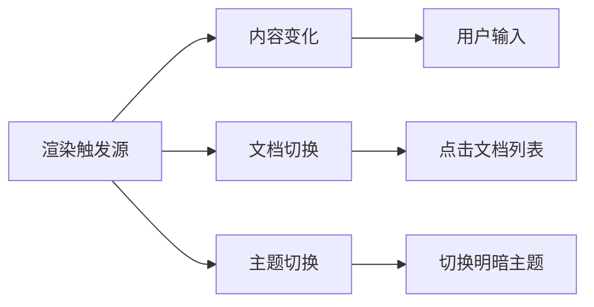
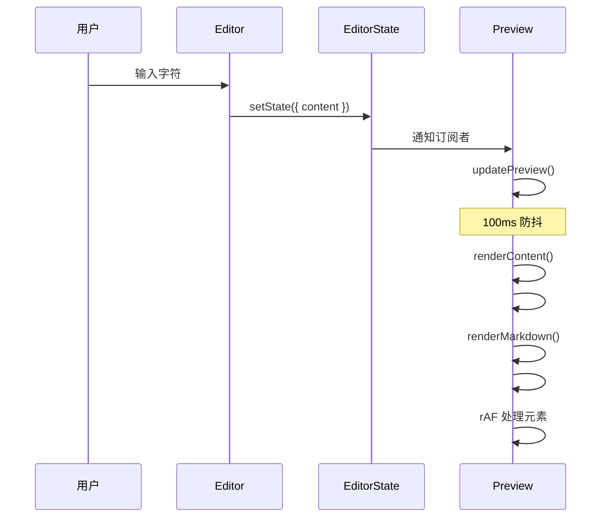
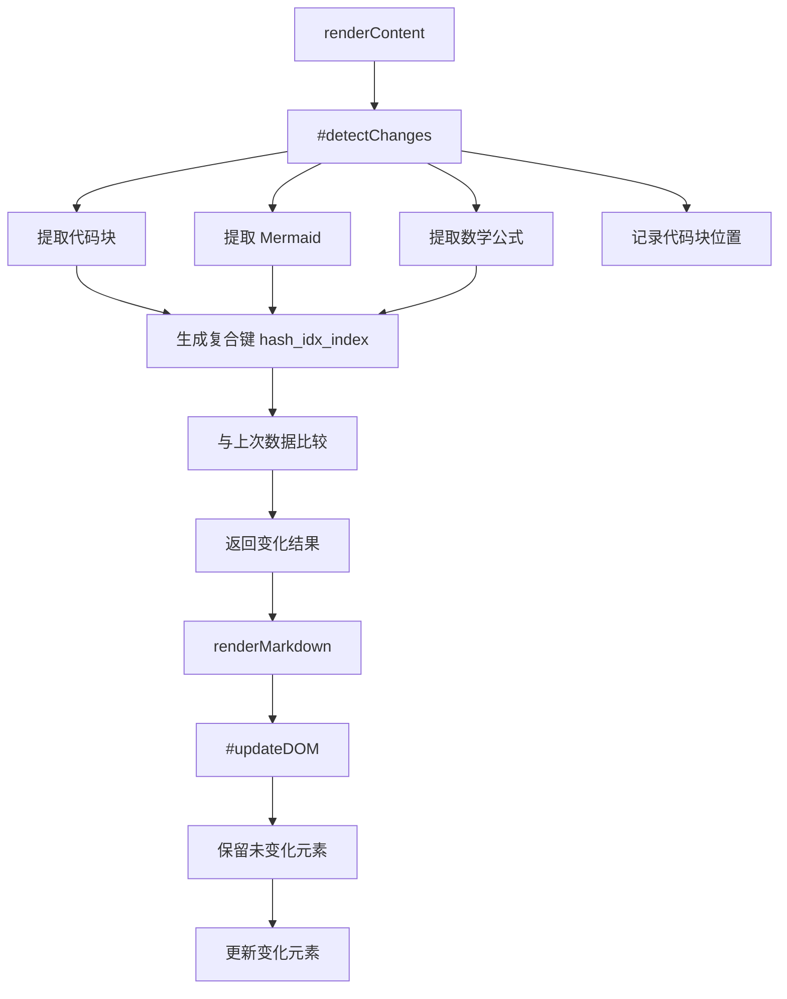
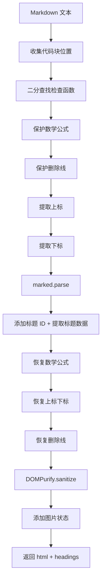
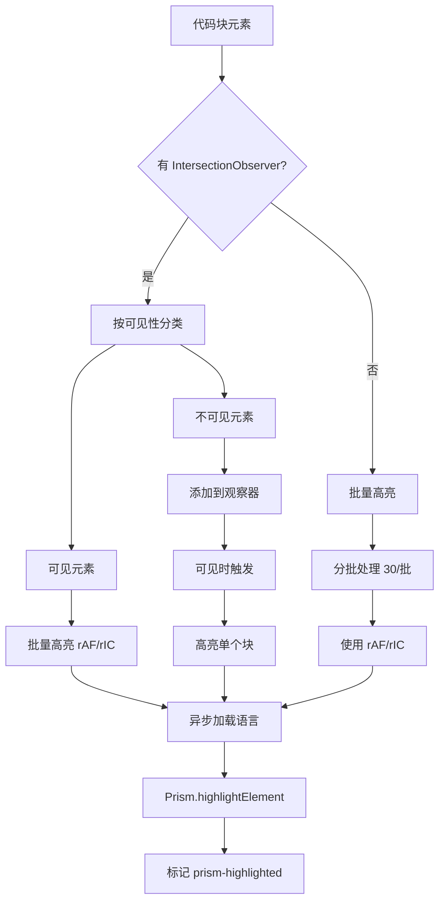
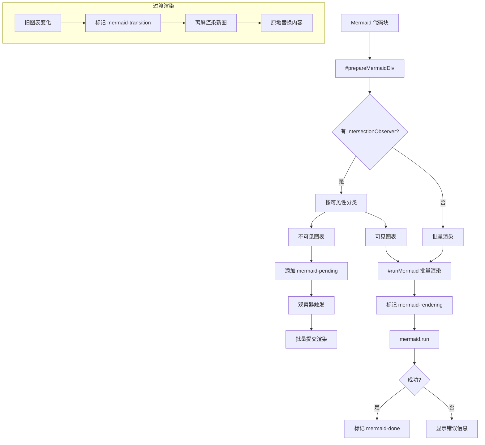
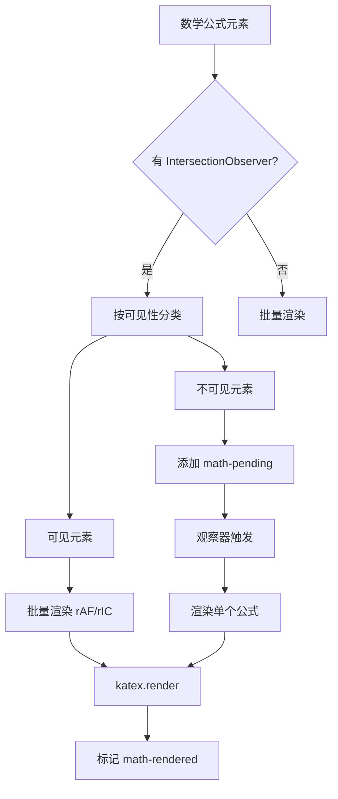
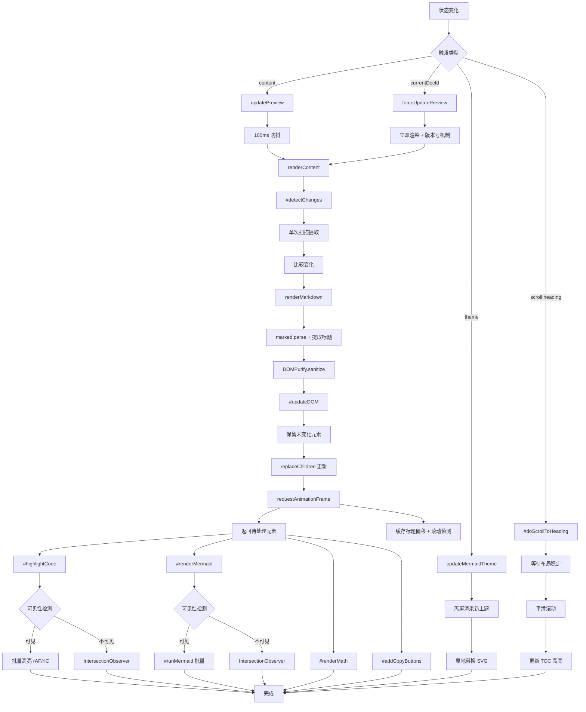

# Preview 组件渲染实现详解

## 📋 目录

- [概述](#概述)
- [组件结构](#组件结构)
- [语言懒加载机制](#语言懒加载机制)
- [渲染触发机制](#渲染触发机制)
- [滚动侦测与 TOC 高亮](#滚动侦测与-toc-高亮)
- [增量渲染机制](#增量渲染机制)
- [渲染流程详解](#渲染流程详解)
  - [1. Markdown 渲染](#1-markdown-渲染)
  - [2. 代码高亮渲染](#2-代码高亮渲染)
  - [3. Mermaid 图表渲染](#3-mermaid-图表渲染)
  - [4. 数学公式渲染](#4-数学公式渲染)
  - [5. 复制按钮添加](#5-复制按钮添加)
  - [6. 图片处理](#6-图片处理)
  - [7. 链接处理](#7-链接处理)
- [可见性优化](#可见性优化)
- [性能优化策略](#性能优化策略)
- [完整渲染流程图](#完整渲染流程图)

---

## 概述

Preview 组件是 Markdown 编辑器的核心渲染引擎，负责将用户输入的 Markdown 文本转换为可视化的 HTML 内容。它集成了多个第三方库来实现完整的渲染功能。

### 核心依赖

```javascript
import { marked } from 'marked';        // Markdown 解析器
import DOMPurify from 'dompurify';       // HTML 净化器
import Prism from 'prismjs';             // 代码高亮库
import mermaid from 'mermaid';           // 图表渲染库
import katex from 'katex';               // 数学公式渲染库
import { BaseComponent } from './BaseComponent.js';
import { dom } from '../utils/dom.js';
```

### 主要职责

1. **Markdown → HTML 转换**：使用 `marked` 库将 Markdown 文本解析为 HTML
2. **HTML 安全净化**：使用 `DOMPurify` 清除潜在的 XSS 攻击
3. **代码语法高亮**：使用 `Prism` 为代码块添加语法高亮（支持懒加载）
4. **Mermaid 图表渲染**：将 Mermaid 代码块渲染为可视化图表（离屏渲染避免闪烁）
5. **数学公式渲染**：使用 `KaTeX` 渲染 LaTeX 数学公式
6. **交互功能**：添加代码复制按钮、图片错误处理、链接处理
7. **滚动侦测**：实现 TOC 目录高亮同步

---

## 组件结构

### 私有字段

```javascript
export class Preview extends BaseComponent {
    // ==================== 私有字段声明 ====================
    
    /** @private 上次渲染的数据 */
    #lastRenderedData = {
        markdown: '',
        codeBlocks: new Map(),
        mermaidBlocks: new Map(),
        mathBlocks: new Map(),
        headings: []
    };
    
    /** @private 上次渲染的原始内容 */
    #lastRenderedContent = '';
    
    /** @private 渲染版本号，用于取消旧的异步渲染 */
    #renderVersion = 0;
    
    /** @private IntersectionObserver 实例 */
    #intersectionObserver = null;
    
    /** @private 待处理的代码块 */
    #pendingCodeBlocks = new Set();
    
    /** @private 待处理的 Mermaid 块 */
    #pendingMermaidBlocks = new Set();
    
    /** @private 待处理的数学公式块 */
    #pendingMathBlocks = new Set();
    
    /** @private 当前高亮的标题 ID */
    #activeHeadingId = null;
    
    /** @private scroll spy 的 rAF 句柄 */
    #scrollSpyRaf = null;
    
    /** @private scroll 事件处理器引用 */
    #scrollHandler = null;
    
    /** @private 缓存的标题偏移量数组 */
    #headingOffsets = [];
    
    /** @private 预览区滚动容器引用 */
    #scrollWrapper = null;
    
    /** @private 程序化滚动期间暂停 scroll spy */
    #suppressScrollSpy = false;
    
    /** @private 滚动调用版本号 */
    #scrollToHeadingVersion = 0;
    
    /** @private 可见区域缓冲区大小（像素）*/
    static #VISIBILITY_BUFFER = 500;
}
```

### 公共字段

```javascript
mermaidInitialized = false;  // Mermaid 初始化状态
renderTimeout = null;        // 渲染防抖定时器
```

### 增量渲染数据结构

```javascript
this.#lastRenderedData = {
    markdown: '',              // 上次渲染的 Markdown 文本
    codeBlocks: new Map(),     // compositeKey -> { lang, code, index }
    mermaidBlocks: new Map(),  // compositeKey -> { code, index }
    mathBlocks: new Map(),     // compositeKey -> { latex, displayMode, index }
    headings: []               // [{ id, level, textContent }]
};
```

---

## 语言懒加载机制

### 概述

Preview 组件实现了 Prism 语言的按需加载，只在遇到特定语言的代码块时才加载对应的语法高亮组件。

### 语言映射表

```javascript
const LANG_MAP = {
    javascript: () => import('prismjs/components/prism-javascript'),
    js: () => import('prismjs/components/prism-javascript'),
    typescript: () => import('prismjs/components/prism-typescript'),
    ts: () => import('prismjs/components/prism-typescript'),
    python: () => import('prismjs/components/prism-python'),
    java: () => import('prismjs/components/prism-java'),
    c: () => import('prismjs/components/prism-c'),
    cpp: () => import('prismjs/components/prism-cpp'),
    csharp: () => import('prismjs/components/prism-csharp'),
    go: () => import('prismjs/components/prism-go'),
    rust: () => import('prismjs/components/prism-rust'),
    ruby: () => import('prismjs/components/prism-ruby'),
    // ... 更多语言
};

const loadedLangs = new Set(['css', 'clike']); // Prism 内置语言
```

### 异步加载函数

```javascript
async function loadLanguage(lang) {
    const key = lang?.toLowerCase();
    if (!key || loadedLangs.has(key) || !LANG_MAP[key]) return true;
    try {
        await LANG_MAP[key]();
        loadedLangs.add(key);
        return true;
    } catch {
        return false;
    }
}
```

---

## 渲染触发机制

### 触发源概览

Preview 组件有三种主要的渲染触发源：



### 状态订阅实现

```javascript
subscribe() {
    // 订阅内容、当前文档和主题变化
    const unsubscribeContent = this.state.subscribeTo(
        ['content', 'currentDocId', 'theme'],
        (newValue, oldValue, key) => {
            if (key === 'content') {
                this.updatePreview();           // 内容变化
            } else if (key === 'currentDocId') {
                this.forceUpdatePreview();      // 切换文档
            } else if (key === 'theme') {
                this.updateMermaidTheme();      // 主题切换
            }
        }
    );

    // 订阅标题跳转请求
    const unsubscribeScroll = this.state.subscribeTo(
        'scroll:heading',
        headingId => this.#doScrollToHeading(headingId)
    );

    // 保存取消订阅函数
    this.unsubscribe = () => {
        unsubscribeContent();
        unsubscribeScroll();
    };
}
```

### 1. 内容变化触发

**触发流程**：



**代码实现**：

```javascript
updatePreview() {
    const content = this.state.get('content');

    // 避免重复渲染（但允许初始渲染）
    if (content === this.#lastRenderedContent && this.#lastRenderedContent !== '') return;

    this.#scheduleRender(content, 100);
}

#scheduleRender(content, delay = 100) {
    if (this.renderTimeout) {
        clearTimeout(this.renderTimeout);
    }

    this.renderTimeout = setTimeout(() => {
        this.renderContent(content);
        this.#lastRenderedContent = content;
        this.renderTimeout = null;
    }, delay);
}
```

### 2. 文档切换触发

**关键特性**：
- 使用版本号机制取消旧的异步渲染
- 立即同步渲染，无延迟
- 重置滚动高亮状态

```javascript
forceUpdatePreview() {
    const currentDocId = this.state.get('currentDocId');
    if (!currentDocId) return;

    const documents = this.state.get('documents');
    const doc = documents.find(d => d.id === currentDocId);
    if (!doc || doc.type === 'folder') return;

    // 🔥 关键：增加版本号，使旧的异步渲染失效
    this.#renderVersion++;

    // 切换文档时重置滚动高亮状态
    this.#scrollToHeadingVersion++;
    this.#activeHeadingId = null;
    this.#headingOffsets = [];
    this.#suppressScrollSpy = false;
    if (this.#scrollSpyRaf) {
        cancelAnimationFrame(this.#scrollSpyRaf);
        this.#scrollSpyRaf = null;
    }
    this.state.updateActiveHeading(null);

    // 清理所有待处理集合
    this.#clearAllPendingTasks();

    // 重置渲染状态
    this.#lastRenderedData = {
        markdown: '',
        codeBlocks: new Map(),
        mermaidBlocks: new Map(),
        mathBlocks: new Map(),
        headings: []
    };

    // 切换文档时立即清空标题
    this.state.updateHeadings([]);

    // 立即渲染（无延迟）
    if (this.renderTimeout) {
        clearTimeout(this.renderTimeout);
        this.renderTimeout = null;
    }

    const content = doc.content || '';
    this.renderContent(content);
    this.#lastRenderedContent = content;
}
```

### 3. 主题切换触发

**代码实现**：

```javascript
async updateMermaidTheme() {
    this.#configureMermaid(this.state.get('interface')?.theme);

    const divs = Array.from(this.container.querySelectorAll('div.mermaid[data-mermaid]'))
        .filter(div => div.isConnected);
    if (!divs.length) return;

    // 🔥 离屏渲染新主题，渲染完成后原地替换，避免闪烁
    const offscreen = document.createElement('div');
    offscreen.style.cssText = 'position:absolute;left:-9999px;top:-9999px;visibility:hidden;';
    document.body.appendChild(offscreen);

    const targets = divs.map(div => {
        const code = div.getAttribute('data-mermaid');
        if (!code) return null;
        const temp = document.createElement('div');
        temp.className = 'mermaid';
        temp.textContent = code;
        offscreen.appendChild(temp);
        return { div, temp, code };
    }).filter(Boolean);

    try {
        await mermaid.run({ nodes: targets.map(t => t.temp) });
        targets.forEach(({ div, temp }) => {
            if (!div.isConnected) return;
            div.innerHTML = temp.innerHTML;
            div.removeAttribute('data-processed');
            div.classList.remove('mermaid-rendering', 'mermaid-pending', 'render-error');
            div.classList.add('mermaid-done');
        });
    } catch (err) {
        console.warn('Mermaid 主题切换失败:', err);
    } finally {
        offscreen.remove();
    }
}
```

---

## 滚动侦测与 TOC 高亮

### 概述

Preview 组件实现了滚动侦测（Scroll Spy），在用户滚动预览区时自动高亮对应的目录项。

### 核心方法

#### 1. 缓存标题偏移量

```javascript
#cacheHeadingOffsets() {
    if (!this.#scrollWrapper) return;
    const wrapperTop = this.#scrollWrapper.getBoundingClientRect().top;
    const scrollTop  = this.#scrollWrapper.scrollTop;
    // Math.floor 消除亚像素浮点误差
    this.#headingOffsets = Array.from(
        this.container.querySelectorAll('[id^="heading-"]'),
        h => ({ id: h.id, top: Math.floor(h.getBoundingClientRect().top - wrapperTop + scrollTop) })
    );
}
```

#### 2. 滚动侦测（二分查找）

```javascript
#runScrollSpy() {
    if (!this.#headingOffsets.length || !this.#scrollWrapper) return;
    if (this.#suppressScrollSpy) return; // 程序化滚动期间暂停

    // 激活线 = 容器已滚动距离 + 16px
    const threshold = this.#scrollWrapper.scrollTop + 16;

    // 🔥 二分查找最后一个 top <= threshold 的标题，O(log n)
    let lo = 0, hi = this.#headingOffsets.length - 1, activeId = null;
    while (lo <= hi) {
        const mid = (lo + hi) >>> 1;
        if (this.#headingOffsets[mid].top <= threshold) {
            activeId = this.#headingOffsets[mid].id;
            lo = mid + 1;
        } else {
            hi = mid - 1;
        }
    }

    if (activeId !== this.#activeHeadingId) {
        this.#activeHeadingId = activeId;
        this.state.updateActiveHeading(activeId);
    }
}
```

#### 3. 滚动到指定标题

```javascript
async #doScrollToHeading(headingId) {
    // 版本号机制，取消旧的滚动调用
    const myVersion = ++this.#scrollToHeadingVersion;
    if (this.#scrollSpyRaf) {
        cancelAnimationFrame(this.#scrollSpyRaf);
        this.#scrollSpyRaf = null;
    }
    this.#suppressScrollSpy = true;

    // ... 等待挂起的数学公式和 Mermaid 渲染完成 ...
    
    // 计算目标位置并执行滚动
    const scrollEl = this.#scrollWrapper;
    if (scrollEl) {
        const top = finalTarget.getBoundingClientRect().top
            - scrollEl.getBoundingClientRect().top
            + scrollEl.scrollTop - 16;
        const clampedTop = Math.min(Math.max(0, top), scrollEl.scrollHeight - scrollEl.clientHeight);

        // 等待 scrollend 事件
        await new Promise(resolve => {
            let settled = false;
            const finish = () => { if (!settled) { settled = true; clearTimeout(fb); resolve(); } };
            const fb = setTimeout(finish, 1500);
            scrollEl.addEventListener('scrollend', finish, { once: true });
            scrollEl.scrollTo({ top: clampedTop, behavior: 'smooth' });
        });
    }

    // 更新高亮状态
    this.#activeHeadingId = headingId;
    this.state.updateActiveHeading(headingId);
    
    // 解除 scroll spy 抑制
    requestAnimationFrame(() => {
        if (myVersion !== this.#scrollToHeadingVersion) return;
        this.#suppressScrollSpy = false;
    });
}
```

---

## 增量渲染机制

### 核心思想

通过哈希比较检测内容变化，只重新渲染变化的部分，保留未变化的元素。

### 变化检测流程



### 代码实现

**1. 变化检测（单次扫描 + 排除代码块内的内容）**：

```javascript
#detectChanges(newMarkdown) {
    const oldData = this.#lastRenderedData;

    // 单次扫描提取所有数据
    const codeBlocks = new Map();
    const mermaidBlocks = new Map();
    const mathBlocks = new Map();

    let codeIndex = 0, mermaidIndex = 0, mathIndex = 0;
    const codeBlockRanges = [];

    // 第一步：提取代码块（包括 mermaid），并记录位置
    const codeBlockRegex = /```(\S*)[ \t]*\r?\n?([\s\S]*?)```/g;
    let match;
    while ((match = codeBlockRegex.exec(newMarkdown)) !== null) {
        const [fullMatch] = match;
        const startIndex = match.index;
        const endIndex = startIndex + fullMatch.length;

        // 记录代码块位置范围（用于排除标题提取和数学公式）
        codeBlockRanges.push({ start: startIndex, end: endIndex });

        const [, lang, content] = match;
        if (lang === 'mermaid') {
            const trimmedCode = content.trim();
            const mermaidHash = this.#generateSimpleHash(trimmedCode);
            const compositeKey = `${mermaidHash}_idx_${mermaidIndex}`;
            mermaidBlocks.set(compositeKey, { code: trimmedCode, index: mermaidIndex++ });
        } else {
            const hash = this.#generateSimpleHash(lang + content);
            const compositeKey = `${hash}_idx_${codeIndex}`;
            codeBlocks.set(compositeKey, { lang: lang || 'text', code: content, index: codeIndex++ });
        }
    }

    // 第一步半：提取行内代码块位置（用于排除数学公式解析）
    const inlineCodeRegex = /`([^`]+)`/g;
    while ((match = inlineCodeRegex.exec(newMarkdown)) !== null) {
        const startIndex = match.index;
        const endIndex = startIndex + match[0].length;
        
        const alreadyInCodeBlock = codeBlockRanges.some(
            range => startIndex >= range.start && startIndex < range.end
        );
        
        if (!alreadyInCodeBlock) {
            codeBlockRanges.push({ start: startIndex, end: endIndex });
        }
    }

    // 辅助函数：检查位置是否在任何代码块内
    const isInAnyCodeBlock = (index) => codeBlockRanges.some(
        range => index >= range.start && index < range.end
    );

    // 第二步：提取数学公式（块级和行内），排除代码块内的
    const mathRegex = /\$\$([\s\S]*?)\$\$|\$([^$\n]+?)\$/g;
    while ((match = mathRegex.exec(newMarkdown)) !== null) {
        const matchIndex = match.index;

        // 跳过代码块内的数学公式标记
        if (isInAnyCodeBlock(matchIndex)) {
            continue;
        }

        const [, blockMath, inlineMath] = match;
        if (blockMath !== undefined) {
            const hash = this.#generateSimpleHash(blockMath.trim());
            const compositeKey = `${hash}_idx_${mathIndex}`;
            mathBlocks.set(compositeKey, {
                latex: blockMath.trim(),
                displayMode: true,
                index: mathIndex++
            });
        } else if (inlineMath !== undefined) {
            const hash = this.#generateSimpleHash(inlineMath.trim());
            const compositeKey = `${hash}_idx_${mathIndex}`;
            mathBlocks.set(compositeKey, {
                latex: inlineMath.trim(),
                displayMode: false,
                index: mathIndex++
            });
        }
    }

    // 比较变化
    const changedCodeBlocks = this.#findChangedMapEntries(oldData.codeBlocks, codeBlocks);
    const changedMermaidBlocks = this.#findChangedMapEntries(oldData.mermaidBlocks, mermaidBlocks);
    const changedMathBlocks = this.#findChangedMapEntries(oldData.mathBlocks, mathBlocks);

    return {
        newCodeBlocks: codeBlocks,
        newMermaidBlocks: mermaidBlocks,
        newMathBlocks: mathBlocks,
        changedCodeBlocks,
        changedMermaidBlocks,
        changedMathBlocks
    };
}
```

**2. 智能更新 DOM（使用 replaceChildren）**：

```javascript
#updateDOM(newHTML, changes) {
    // 首次渲染，使用 innerHTML
    if (!this.#lastRenderedData.markdown) {
        this.container.innerHTML = newHTML;
        return this.#collectElementsToProcess();
    }

    // 如果所有内容都变了，直接替换
    const allChanged =
        changes.changedCodeBlocks.size &&
        changes.changedMermaidBlocks.size &&
        changes.changedMathBlocks.size;
    if (allChanged) {
        this.container.innerHTML = newHTML;
        return this.#collectElementsToProcess();
    }

    // 部分内容未变，使用增量更新
    const tempDiv = document.createElement('div');
    tempDiv.innerHTML = newHTML;

    // 构建旧元素的哈希映射
    const oldElements = this.#buildElementHashMaps();

    // 在新 HTML 中保留未变化的元素
    this.#preserveUnchangedElements(tempDiv, oldElements, changes);

    // 🔥 使用 replaceChildren 减少重排
    if (this.container.replaceChildren) {
        this.container.replaceChildren(...tempDiv.childNodes);
    } else {
        // 降级方案
        const fragment = document.createDocumentFragment();
        while (tempDiv.firstChild) {
            fragment.appendChild(tempDiv.firstChild);
        }
        this.container.innerHTML = '';
        this.container.appendChild(fragment);
    }

    return this.#collectElementsToProcess();
}
```

**3. 保留未变化的元素（直接移动，避免克隆）**：

```javascript
#preserveUnchangedElements(tempDiv, oldElements, changes) {
    // 预先查询一次所有元素
    const newCodeBlocks = dom.getAllIn(
        tempDiv,
        'pre code[class*="language-"]:not(.language-mermaid)'
    );
    const newMermaidBlocks = dom.getAllIn(tempDiv, 'pre code.language-mermaid');
    const newMathBlocks = dom.getAllIn(
        tempDiv,
        '.math-block[data-latex], .math-inline[data-latex]'
    );

    // 保留未变化的代码块
    newCodeBlocks.forEach((newEl, index) => {
        const hash = this.#generateSimpleHash(newEl.textContent);
        const compositeKey = `${hash}_idx_${index}`;
        const oldWrapper = oldElements.code.get(compositeKey);

        if (oldWrapper && !changes.changedCodeBlocks.has(compositeKey)) {
            // 🔥 直接移动旧元素（保留所有事件监听器，无需克隆）
            const newPre = newEl.parentElement;
            const newWrapper = newPre?.parentElement?.classList.contains('code-block-wrapper')
                ? newPre.parentElement
                : newPre;
            newWrapper.replaceWith(oldWrapper);
        }
    });

    // 保留未变化的 Mermaid 图表（直接移动元素，避免深克隆 SVG）
    newMermaidBlocks.forEach((newEl, index) => {
        const text = newEl.textContent.trim();
        const hash = this.#generateSimpleHash(text);
        const compositeKey = `${hash}_idx_${index}`;
        const oldDiv = oldElements.mermaid.get(compositeKey);

        if (oldDiv &&
            !changes.changedMermaidBlocks.has(compositeKey) &&
            oldDiv.classList.contains('mermaid-done')) {
            // 🔥 直接移动旧元素
            newEl.parentElement.replaceWith(oldDiv);
        } else if (changes.changedMermaidBlocks.has(compositeKey)) {
            // 过渡替换：旧 SVG 保持可见直到新图渲染完成
            const oldDivByIdx = oldElements.mermaidByIndex?.get(index);
            if (oldDivByIdx && oldDivByIdx.classList.contains('mermaid-done')) {
                oldDivByIdx.setAttribute('data-mermaid-new', text);
                oldDivByIdx.setAttribute('data-mermaid', text);
                oldDivByIdx.classList.add('mermaid-transition');
                newEl.parentElement.replaceWith(oldDivByIdx);
            }
        }
    });

    // 保留未变化的数学公式
    newMathBlocks.forEach((newEl, index) => {
        const latex = newEl.getAttribute('data-latex');
        if (!latex) return;

        const hash = this.#generateSimpleHash(latex);
        const compositeKey = `${hash}_idx_${index}`;
        const oldEl = oldElements.math.get(compositeKey);

        if (oldEl && !changes.changedMathBlocks.has(compositeKey)) {
            newEl.replaceWith(oldEl); // 直接移动
        }
    });
}
```

---

## 渲染流程详解

### 1. Markdown 渲染

**流程图**：



**代码实现**：

```javascript
renderMarkdown(markdown) {
    const renderedHeadings = []; // 唯一提取点
    try {
        const mathBlocks = [];
        const supSubBlocks = [];
        const strikeBlocks = [];

        // 预处理：找出所有代码块和行内代码的位置
        const codeRanges = [];
        const codeRegex = /```[\s\S]*?```|`[^`]+`/g;
        let codeMatch;
        while ((codeMatch = codeRegex.exec(markdown)) !== null) {
            codeRanges.push({ start: codeMatch.index, end: codeMatch.index + codeMatch[0].length });
        }

        // 🔥 性能优化：排序并合并重叠/相邻的范围
        if (codeRanges.length > 1) {
            codeRanges.sort((a, b) => a.start - b.start);
            const merged = [codeRanges[0]];
            for (let i = 1; i < codeRanges.length; i++) {
                const last = merged[merged.length - 1];
                const curr = codeRanges[i];
                if (curr.start <= last.end) {
                    last.end = Math.max(last.end, curr.end);
                } else {
                    merged.push(curr);
                }
            }
            codeRanges.length = 0;
            codeRanges.push(...merged);
        }

        // 🔥 性能优化：使用二分查找检查位置是否在代码块内
        const isInCode = (index) => {
            let left = 0, right = codeRanges.length - 1;
            while (left <= right) {
                const mid = (left + right) >>> 1;
                const range = codeRanges[mid];
                if (index < range.start) {
                    right = mid - 1;
                } else if (index >= range.end) {
                    left = mid + 1;
                } else {
                    return true;
                }
            }
            return false;
        };

        // 按优先级处理，避免符号冲突
        const processedMarkdown = markdown
            // 第一步：保护数学公式（排除代码块内的）
            .replace(/\$\$([\s\S]*?)\$\$|\$([^$\n]+?)\$/g, (match, block, inline, offset) => {
                if (isInCode(offset)) return match;
                const latex = block !== undefined ? block : inline;
                const displayMode = block !== undefined;
                mathBlocks.push({ latex, displayMode });
                return `\x02MATH${mathBlocks.length - 1}\x02`;
            })
            // 第二步：保护删除线
            .replace(/~~([^~\n]{1,200})~~/g, (match, content) => {
                strikeBlocks.push(content);
                return `\x03STRIKE${strikeBlocks.length - 1}\x03`;
            })
            // 第三步：提取上标
            .replace(/\^([^\n^]{1,50})\^/g, (match, content) => {
                supSubBlocks.push({ type: 'sup', content });
                return `\x01SUP${supSubBlocks.length - 1}\x01`;
            })
            // 第四步：提取下标
            .replace(/~([^~\n]{1,50})~/g, (match, content) => {
                supSubBlocks.push({ type: 'sub', content });
                return `\x01SUB${supSubBlocks.length - 1}\x01`;
            });

        // 使用 marked 解析
        let html;
        if (marked?.parse) {
            html = marked.parse(processedMarkdown, { breaks: false, gfm: true });

            // 🔥 添加标题 ID 并同步提取标题数据（唯一提取点）
            let headingIndex = 0;
            html = html.replace(/<h([1-6])([^>]*)>(.*?)<\/h\1>/gi, (match, level, attrs, inner) => {
                if (attrs.includes('id=')) return match;
                const id = `heading-${headingIndex++}`;
                const textContent = inner.replace(/<[^>]+>/g, '');
                renderedHeadings.push({ id, level: +level, textContent });
                return `<h${level}${attrs} id="${id}">${inner}</h${level}>`;
            });
        } else {
            html = this.escapeHtml(processedMarkdown);
        }

        // 替换占位符（数学公式、上标下标、删除线）
        // ... 省略占位符替换代码 ...

        // 净化 HTML
        if (DOMPurify?.sanitize) {
            html = DOMPurify.sanitize(html, {
                ALLOWED_TAGS: [
                    'p', 'br', 'strong', 'em', 'code', 'pre', 'blockquote',
                    'ul', 'ol', 'li', 'a', 'h1', 'h2', 'h3', 'h4', 'h5', 'h6',
                    'table', 'thead', 'tbody', 'tr', 'th', 'td', 'hr', 'img',
                    'input', 'span', 'div', 'dd', 'dt', 'dl', 's', 'sup', 'sub'
                ],
                ALLOWED_ATTR: [
                    'href', 'src', 'alt', 'title', 'class', 'id', 'type',
                    'checked', 'width', 'height', 'loading', 'colspan',
                    'rowspan', 'start', 'align', 'style', 'data-load-status'
                ],
                ALLOW_DATA_ATTR: true
            });
        }

        return { html, headings: renderedHeadings };
    } catch (e) {
        console.warn('Markdown 渲染失败:', e);
        return { html: this.escapeHtml(markdown), headings: [] };
    }
}
```

### 2. 代码高亮渲染

**流程图**：



**代码实现**：

```javascript
#highlightCode(codeBlocks) {
    if (typeof Prism === 'undefined' || codeBlocks.length === 0) return;

    const blocks = Array.from(codeBlocks);

    if (!this.#intersectionObserver) {
        this.#highlightCodeBatch(blocks);
        return;
    }

    // 分离可见和不可见元素
    const { visible, invisible } = this.#partitionByVisibility(blocks);

    // 🔥 可见块也走 batch 路径，通过 requestIdleCallback 分帧渲染
    if (visible.length > 0) {
        this.#highlightCodeBatch(visible);
    }

    // 监听不可见元素
    invisible.forEach(block => {
        block.classList.add('code-pending');
        this.#pendingCodeBlocks.add(block);
        this.#intersectionObserver.observe(block);
    });
}

async #highlightSingleBlock(block) {
    if (block.classList.contains('prism-highlighted')) return;
    block.classList.add('prism-highlighted');

    try {
        const langClass = [...block.classList].find(c => c.startsWith('language-'));
        const lang = langClass?.replace('language-', '');
        await loadLanguage(lang); // 🔥 异步加载语言
        Prism.highlightElement(block);
    } catch (err) {
        console.warn('代码高亮失败:', err);
    }
}

#highlightCodeBatch(blocks) {
    const BATCH_SIZE = 30;
    let index = 0;

    const processBatch = () => {
        const end = Math.min(index + BATCH_SIZE, blocks.length);

        while (index < end) {
            const block = blocks[index];
            if (!block.classList.contains('prism-highlighted')) {
                this.#highlightSingleBlock(block);
            }
            index++;
        }

        if (index < blocks.length) {
            if (typeof requestIdleCallback !== 'undefined') {
                requestIdleCallback(processBatch, { timeout: 100 });
            } else {
                setTimeout(processBatch, 16);
            }
        }
    };

    requestAnimationFrame(processBatch);
}
```

### 3. Mermaid 图表渲染

**流程图**：



**代码实现**：

```javascript
#renderMermaid(codeBlocks) {
    if (!codeBlocks.length) return;

    const divs = codeBlocks.map(c => this.#prepareMermaidDiv(c)).filter(Boolean);
    if (!divs.length) return;

    if (!this.#intersectionObserver) {
        this.#runMermaid(divs);
        return;
    }

    const { visible, invisible } = this.#partitionByVisibility(divs);

    const toRender = visible.filter(d => !d.classList.contains('mermaid-done'));
    if (toRender.length) this.#runMermaid(toRender);

    invisible.forEach(div => {
        div.classList.add('mermaid-pending');
        this.#pendingMermaidBlocks.add(div);
        this.#intersectionObserver.observe(div);
    });
}

async #runMermaid(nodes) {
    const pending = nodes.filter(div =>
        div.isConnected &&
        !div.classList.contains('mermaid-done') &&
        !div.classList.contains('mermaid-rendering')
    );
    if (!pending.length) return;

    pending.forEach(div => {
        div.classList.remove('mermaid-pending', 'render-error');
        div.classList.add('mermaid-rendering');
    });

    try {
        await mermaid.run({ nodes: pending });
        pending.forEach(div => {
            div.classList.remove('mermaid-rendering');
            if (div.isConnected) div.classList.add('mermaid-done');
        });
    } catch (err) {
        console.warn('Mermaid 渲染失败:', err);
        pending.forEach(div => {
            div.classList.remove('mermaid-rendering');
            if (div.isConnected && !div.classList.contains('mermaid-done')) {
                div.textContent = '图表渲染失败: ' + err.message;
                div.classList.add('render-error');
            }
        });
    }
}

// 🔥 过渡渲染：离屏渲染新图后原地替换，消除闪烁
async #renderMermaidTransitions(transitionDivs) {
    if (!transitionDivs.length) return;

    const offscreen = document.createElement('div');
    offscreen.style.cssText = 'position:absolute;left:-9999px;top:-9999px;visibility:hidden;';
    document.body.appendChild(offscreen);

    const targets = transitionDivs.map(placeholder => {
        const code = placeholder.getAttribute('data-mermaid-new');
        if (!code) return null;
        const temp = document.createElement('div');
        temp.className = 'mermaid';
        temp.textContent = code;
        offscreen.appendChild(temp);
        return { placeholder, temp, code };
    }).filter(Boolean);

    if (!targets.length) { offscreen.remove(); return; }

    try {
        await mermaid.run({ nodes: targets.map(t => t.temp) });
        targets.forEach(({ placeholder, temp, code }) => {
            if (!placeholder.isConnected) return;
            placeholder.innerHTML = temp.innerHTML;
            placeholder.setAttribute('data-mermaid', code);
            placeholder.removeAttribute('data-mermaid-new');
            placeholder.removeAttribute('data-processed');
            placeholder.classList.remove('mermaid-transition', 'mermaid-rendering');
            placeholder.classList.add('mermaid-done');
        });
    } catch (err) {
        console.warn('Mermaid 过渡渲染失败:', err);
    } finally {
        offscreen.remove();
    }
}
```

### 4. 数学公式渲染

**流程图**：



**代码实现**：

```javascript
#renderMath(mathElements) {
    if (typeof katex === 'undefined' || mathElements.length === 0) return;

    const elementsToRender = mathElements.filter(el => {
        const latex = el.getAttribute('data-latex');
        return latex !== null;
    });

    if (elementsToRender.length === 0) return;

    if (!this.#intersectionObserver) {
        this.#renderMathBatch(elementsToRender);
        return;
    }

    const { visible, invisible } = this.#partitionByVisibility(elementsToRender);

    if (visible.length > 0) {
        this.#renderMathBatch(visible);
    }

    invisible.forEach(el => {
        el.classList.add('math-pending');
        this.#pendingMathBlocks.add(el);
        this.#intersectionObserver.observe(el);
    });
}

#renderSingleMath(element) {
    // 🔥 提前标记为已渲染，防止并发重复渲染
    element.classList.add('math-rendered');

    const latex = element.getAttribute('data-latex');
    if (!latex) return;

    try {
        katex.render(latex, element, {
            displayMode: element.classList.contains('math-block'),
            throwOnError: false,
            errorColor: '#cc0000'
        });
        element.classList.remove('math-error', 'math-pending');
    } catch (err) {
        console.warn('KaTeX 渲染失败:', err);
        element.textContent = latex;
        element.classList.add('math-error');
    }
}

#renderMathBatch(elements) {
    const BATCH_SIZE = 50;
    let index = 0;

    const processBatch = () => {
        const end = Math.min(index + BATCH_SIZE, elements.length);

        while (index < end) {
            const el = elements[index];
            this.#renderSingleMath(el);
            index++;
        }

        if (index < elements.length) {
            if (typeof requestIdleCallback !== 'undefined') {
                requestIdleCallback(processBatch, { timeout: 100 });
            } else {
                setTimeout(processBatch, 16);
            }
        }
    };

    requestAnimationFrame(processBatch);
}
```

### 5. 复制按钮添加

```javascript
#addCopyButtons(preElements) {
    if (preElements.length === 0) return;

    preElements.forEach(pre => {
        // 跳过已处理的
        if (pre.classList.contains('has-copy-btn')) return;

        // 检查元素是否仍在 DOM 中
        if (!pre.isConnected || !pre.parentNode) return;

        // 创建包装器
        const wrapper = document.createElement('div');
        wrapper.className = 'code-block-wrapper';
        pre.parentNode.insertBefore(wrapper, pre);
        wrapper.appendChild(pre);

        // 标记为已添加复制按钮
        pre.classList.add('has-copy-btn');

        // 添加复制按钮
        const btn = this.createElement('button', {
            className: 'md-btn md-btn-sm code-copy-btn',
            textContent: '📋',
            attributes: { title: '复制代码' },
            parent: wrapper
        });

        const code = dom.getIn(pre, 'code');
        this.#attachCopyButtonHandler(btn, code);
    });
}

#attachCopyButtonHandler(btn, code) {
    if (!btn || !code) return;

    this.addEventListener(btn, 'click', e => {
        e.preventDefault();
        e.stopPropagation();

        if (!code || btn.classList.contains('copied')) return;

        navigator.clipboard
            .writeText(code.textContent)
            .then(() => {
                btn.innerHTML = '✓';
                btn.classList.add('copied');
                setTimeout(() => {
                    btn.innerHTML = '📋';
                    btn.classList.remove('copied');
                }, 2000);
            })
            .catch(err => console.error('复制失败:', err));
    });
}
```

### 6. 图片处理

```javascript
bindEvents() {
    // 图片加载成功处理
    this.addEventListener(
        this.container,
        'load',
        e => {
            if (e.target.tagName === 'IMG') {
                e.target.dataset.loadStatus = 'success';
            }
        },
        true
    );

    // 图片加载错误处理
    this.addEventListener(
        this.container,
        'error',
        e => {
            if (e.target.tagName === 'IMG') {
                const img = e.target;
                img.alt = `图片加载失败: ${img.src}`;
                img.dataset.loadStatus = 'error';
            }
        },
        true
    );
}
```

### 7. 链接处理

```javascript
bindEvents() {
    // 链接点击处理
    this.addEventListener(
        this.container,
        'click',
        e => {
            const link = e.target.closest('a');
            if (!link) return;

            const href = link.getAttribute('href');
            if (!href) return;

            // 处理内部锚点链接
            if (href.startsWith('#')) {
                e.preventDefault();
                this.#doScrollToHeading(decodeURIComponent(href.slice(1)));
                return;
            }

            // 处理外部链接
            if (href.startsWith('http://') || href.startsWith('https://') || href.startsWith('//')) {
                e.preventDefault();
                window.open(href, '_blank', 'noopener,noreferrer');
            }
        },
        false
    );
}
```

---

## 可见性优化

### IntersectionObserver

使用 IntersectionObserver API 实现可见性检测，优先渲染可见元素。

**初始化（批量处理优化）**：

```javascript
#initIntersectionObserver() {
    if (!('IntersectionObserver' in window)) return;

    const buffer = Preview.#VISIBILITY_BUFFER; // 500px

    this.#intersectionObserver = new IntersectionObserver(
        entries => {
            // 🔥 收集本批次中所有需要渲染的 mermaid 元素，一次性批量提交
            const mermaidBatch = [];

            entries.forEach(entry => {
                if (entry.isIntersecting) {
                    const element = entry.target;

                    // 处理代码高亮
                    if (element.classList.contains('code-pending') &&
                        !element.classList.contains('prism-highlighted')) {
                        this.#pendingCodeBlocks.delete(element);
                        this.#intersectionObserver.unobserve(element);
                        element.classList.remove('code-pending');
                        this.#highlightSingleBlock(element);
                    }

                    // 处理 Mermaid 渲染 —— 收集到批次
                    if (element.classList.contains('mermaid-pending') &&
                        !element.classList.contains('mermaid-done') &&
                        !element.classList.contains('mermaid-rendering')) {
                        this.#pendingMermaidBlocks.delete(element);
                        this.#intersectionObserver.unobserve(element);
                        element.classList.remove('mermaid-pending');
                        mermaidBatch.push(element);
                    }

                    // 处理数学公式渲染
                    if (element.classList.contains('math-pending') &&
                        !element.classList.contains('math-rendered')) {
                        this.#pendingMathBlocks.delete(element);
                        this.#intersectionObserver.unobserve(element);
                        element.classList.remove('math-pending');
                        this.#renderSingleMath(element);
                    }
                }
            });

            // 🔥 单次 mermaid.run 批量渲染所有本轮变为可见的图表
            if (mermaidBatch.length) this.#runMermaid(mermaidBatch);
        },
        {
            root: null,
            rootMargin: `${buffer}px`,
            threshold: 0.01
        }
    );
}
```

**可见性检测**：

```javascript
#isElementVisible(element) {
    const rect = element.getBoundingClientRect();
    const buffer = Preview.#VISIBILITY_BUFFER;
    return rect.top < window.innerHeight + buffer && rect.bottom > -buffer;
}

#partitionByVisibility(elements) {
    const visible = [];
    const invisible = [];
    elements.forEach(el => {
        (this.#isElementVisible(el) ? visible : invisible).push(el);
    });
    return { visible, invisible };
}
```

---

## 性能优化策略

### 1. 增量渲染

通过哈希比较检测变化，只重新渲染变化的部分。使用复合键（`hash_idx_index`）避免哈希冲突。

### 2. 可见性优化

使用 IntersectionObserver 优先渲染可见元素，延迟渲染不可见元素。批量处理可见性变化。

### 3. 批量处理

使用 `requestIdleCallback` 或 `setTimeout` 分批处理大量元素，避免阻塞主线程。

### 4. 防抖

内容变化使用 100ms 防抖，减少渲染频率。

### 5. DOM 优化

- 使用 `replaceChildren` 代替 `innerHTML`，减少重排
- 直接移动元素而非克隆，保留事件监听器

### 6. 语言懒加载

Prism 语言组件按需动态加载，减少初始包体积。

### 7. 离屏渲染

Mermaid 图表变化时，先在离屏容器中渲染新图，完成后原地替换，避免闪烁。

### 8. 滚动优化

- 缓存标题偏移量，避免滚动时重复调用 `getBoundingClientRect`
- 使用二分查找快速定位当前高亮标题（O(log n)）
- 使用 `rAF` 节流滚动事件

### 9. 版本号机制

使用版本号取消旧的异步渲染，避免文档切换时的竞态条件。

---

## 完整渲染流程图



---

**文档版本**：3.0.0  
**最后更新**：2026-03-01  
**维护者**：Markdown Editor Team
