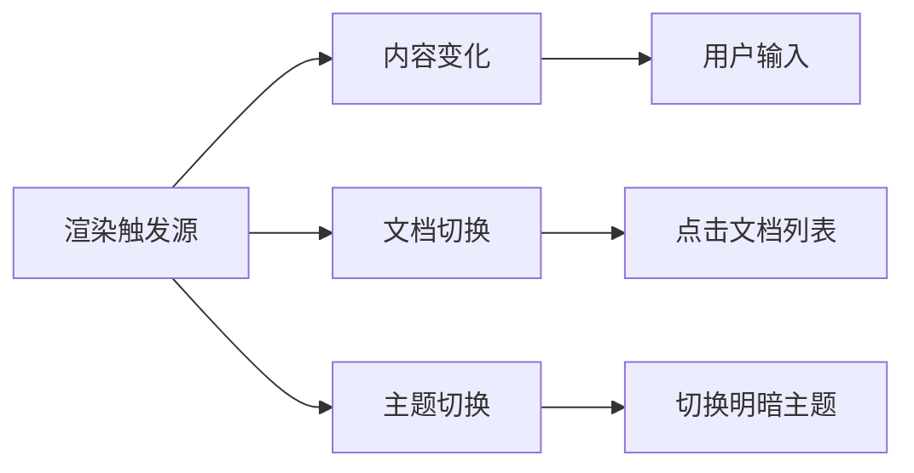
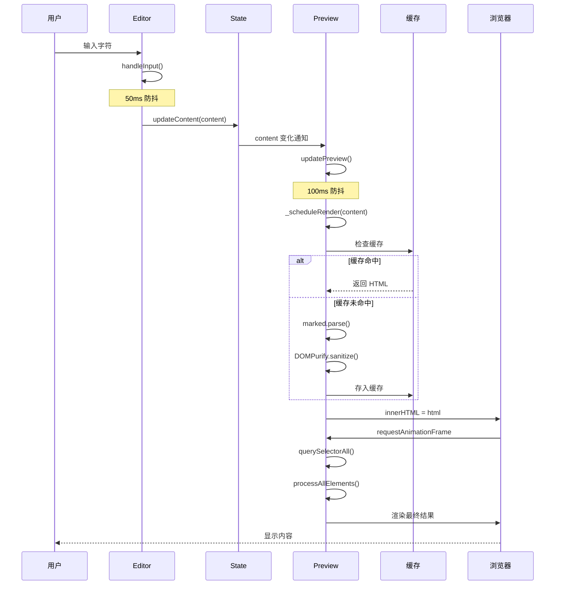
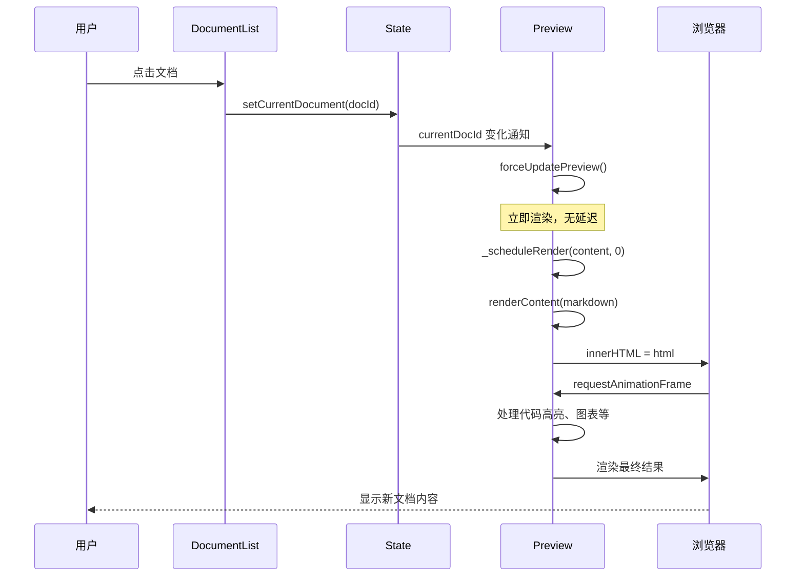
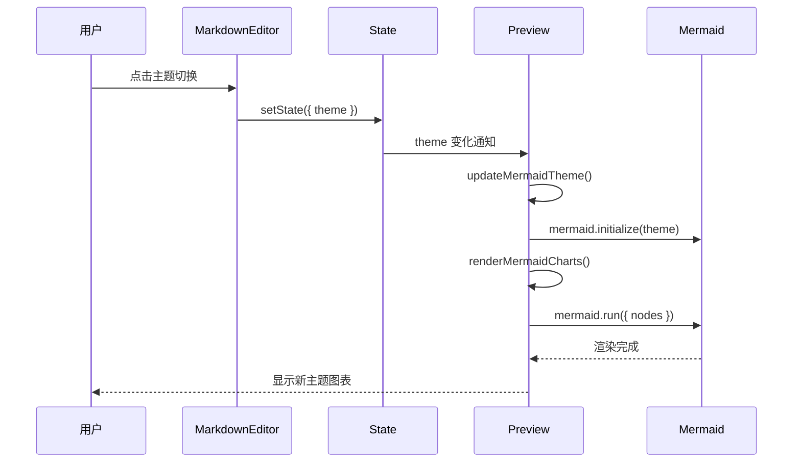
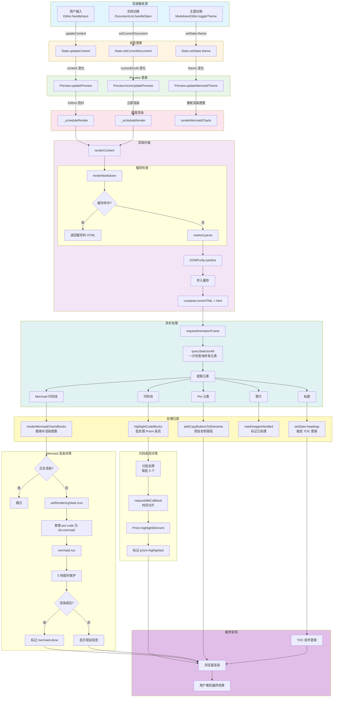
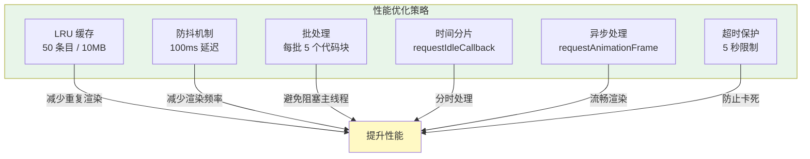

# Preview 组件渲染实现详解

## 📋 目录

- [概述](#概述)
- [渲染触发机制](#渲染触发机制)
- [渲染流程详解](#渲染流程详解)
  - [1. Markdown 渲染](#1-markdown-渲染)
  - [2. 代码高亮渲染](#2-代码高亮渲染)
  - [3. Mermaid 图表渲染](#3-mermaid-图表渲染)
  - [4. 复制按钮添加](#4-复制按钮添加)
  - [5. 图片处理](#5-图片处理)
  - [6. 标题数据更新](#6-标题数据更新)
- [DOM 呈现过程](#dom-呈现过程)
- [性能优化策略](#性能优化策略)
- [完整渲染流程图](#完整渲染流程图)

---

## 概述

Preview 组件是 Markdown 编辑器的核心渲染引擎，负责将用户输入的 Markdown 文本转换为可视化的 HTML 内容。它集成了多个第三方库来实现完整的渲染功能：

### 核心依赖

```javascript
import { marked } from 'marked';        // Markdown 解析器
import DOMPurify from 'dompurify';       // HTML 净化器
import Prism from 'prismjs';             // 代码高亮库
import mermaid from 'mermaid';           // 图表渲染库
```

### 主要职责

1. **Markdown → HTML 转换**：使用 `marked` 库将 Markdown 文本解析为 HTML
2. **HTML 安全净化**：使用 `DOMPurify` 清除潜在的 XSS 攻击
3. **代码语法高亮**：使用 `Prism` 为代码块添加语法高亮
4. **Mermaid 图表渲染**：将 Mermaid 代码块渲染为可视化图表
5. **交互功能**：添加代码复制按钮、图片错误处理等

### 组件结构

```javascript
export class Preview extends BaseComponent {
    // 私有字段
    #renderCache;        // LRU 缓存
    #cleanupInterval;    // 清理定时器
    
    // 公共字段
    mermaidInitialized;  // Mermaid 初始化状态
    renderTimeout;       // 渲染防抖定时器
}
```

---

## 渲染触发机制

### 触发源概览

Preview 组件有三种主要的渲染触发源：



Preview 组件通过**状态订阅**机制监听以下状态变化：

```javascript
subscribe() {
    this.unsubscribe = this.state.subscribeTo(
        ['content', 'currentDocId', 'theme'], 
        (newValue, oldValue, key) => {
            if (key === 'content') {
                this.updatePreview();           // 内容变化
            } else if (key === 'currentDocId') {
                this.forceUpdatePreview();      // 切换文档
            } else if (key === 'theme') {
                this.updateMermaidTheme();      // 主题切换
            }
        }
    );
}
```

### 1. 内容变化触发

**触发路径**：
```
用户输入 → Editor.handleInput() 
         → State.updateContent() 
         → Preview.updatePreview()
```

**代码实现**：
```javascript
updatePreview() {
    const content = this.state.get('content');
    const lastRendered = this.state.get('lastRenderedContent');

    // 避免重复渲染
    if (content === lastRendered && lastRendered !== '') return;

    // 100ms 防抖，减少频繁渲染
    this._scheduleRender(content, 100);
}
```

**防抖机制**：
```javascript
_scheduleRender(content, delay = 100) {
    // 取消之前的渲染任务
    if (this.renderTimeout) {
        clearTimeout(this.renderTimeout);
    }
    
    this.renderTimeout = setTimeout(() => {
        this.renderContent(content);
        this.state.updateLastRenderedContent(content);
        this.renderTimeout = null;
    }, delay);
}
```

**渲染流程**：


### 2. 文档切换触发

**触发路径**：
```
用户点击文档 → DocumentList.handleOpen() 
             → State.setCurrentDocument() 
             → Preview.forceUpdatePreview()
```

**代码实现**：
```javascript
forceUpdatePreview() {
    const currentDocId = this.state.get('currentDocId');
    if (!currentDocId) return;
    
    const documents = this.state.get('documents');
    const doc = documents.find(d => d.id === currentDocId);
    if (!doc || doc.type === 'folder') return;
    
    // 立即渲染，无延迟
    this._scheduleRender(doc.content || '', 0);
}
```

**渲染流程**：


### 3. 主题切换触发

**触发路径**：
```
用户切换主题 → MarkdownEditor.toggleTheme() 
              → State.setState({ theme }) 
              → Preview.updateMermaidTheme()
```

**代码实现**：
```javascript
updateMermaidTheme() {
    const theme = this.state.get('theme');
    mermaid.initialize({
        startOnLoad: false,
        theme: theme === 'dark' ? 'dark' : 'default',
        securityLevel: 'loose'
    });
    this.renderMermaidCharts();  // 重新渲染图表
}
```

**渲染流程**：


---

## 渲染流程详解

### 完整流程概览

```javascript
renderContent(markdown) {
    // 1. Markdown → HTML
    const html = this.renderMarkdown(markdown);
    
    // 2. 插入 DOM
    this.container.innerHTML = html;
    
    // 3. 异步处理增强功能
    requestAnimationFrame(() => {
        // 一次性查询所有元素
        const codeBlocks = this.container.querySelectorAll('pre code:not(.prism-highlighted)');
        const mermaidBlocks = this.container.querySelectorAll('pre code.language-mermaid');
        const preElements = this.container.querySelectorAll('pre:not(.has-copy-btn)');
        const images = this.container.querySelectorAll('img:not([data-error-handled])');
        const headings = this.container.querySelectorAll('h1, h2, h3, h4, h5, h6');

        // 批量处理
        this.processAllElements(codeBlocks, mermaidBlocks, preElements, images, headings);
    });
}
```

**完整渲染流程图**：



---

### 1. Markdown 渲染

#### 1.1 缓存机制（LRU）

**缓存结构**：
```javascript
this.#renderCache = {
    cache: new Map(),           // 缓存存储
    memoryUsage: 0,             // 内存使用量
    hitCount: 0,                // 命中次数
    missCount: 0,               // 未命中次数
    maxSize: 50,                // 最大条目数
    maxMemory: 10 * 1024 * 1024 // 10MB 内存限制
};
```

**缓存键生成**（FNV-1a 哈希算法）：
```javascript
#generateCacheKey(content) {
    let hash = 2166136261;
    for (let i = 0; i < content.length; i++) {
        hash ^= content.charCodeAt(i);
        hash = Math.imul(hash, 16777619);
    }
    return hash.toString(36);
}
```

**缓存读取**：
```javascript
renderMarkdown(markdown) {
    // 1. 尝试从缓存获取
    let html = this.#getFromCache(markdown);
    if (html) return html;
    
    // 2. 缓存未命中，执行渲染
    html = marked.parse(markdown, { breaks: true, gfm: true });
    html = DOMPurify.sanitize(html, { /* 配置 */ });
    
    // 3. 存入缓存
    this.#setToCache(markdown, html);
    return html;
}
```

**缓存驱逐策略**：
```javascript
#setToCache(content, html) {
    const key = this.#generateCacheKey(content);
    const size = this.#estimateSize(html);

    // 检查内存限制
    while (this.#renderCache.memoryUsage + size > this.#renderCache.maxMemory) {
        this.#evictCache();  // 驱逐最旧的条目
    }

    // 检查条目数限制
    while (this.#renderCache.cache.size >= this.#renderCache.maxSize) {
        this.#evictCache();
    }

    this.#renderCache.cache.set(key, { html, timestamp: Date.now() });
    this.#renderCache.memoryUsage += size;
}
```

#### 1.2 Markdown 解析（marked）

**配置选项**：
```javascript
marked.parse(markdown, {
    breaks: true,   // 转义换行符
    gfm: true       // GitHub Flavored Markdown
});
```

**解析示例**：
```markdown
# 标题
**粗体** *斜体*
`代码`

```javascript
console.log('Hello');
```
```

**解析结果**：
```html
<h1>标题</h1>
<p><strong>粗体</strong> <em>斜体</em>
<code>代码</code></p>
<pre><code class="language-javascript">console.log('Hello');
</code></pre>
```

#### 1.3 HTML 净化（DOMPurify）

**净化配置**：
```javascript
DOMPurify.sanitize(html, {
    ALLOWED_TAGS: [
        'p', 'br', 'strong', 'em', 'code', 'pre', 'blockquote',
        'ul', 'ol', 'li', 'a', 'h1', 'h2', 'h3', 'h4', 'h5', 'h6',
        'table', 'thead', 'tbody', 'tr', 'th', 'td', 'hr', 'img',
        'input', 'span', 'div', 'dd', 'dt', 'dl', 's'
    ],
    ALLOWED_ATTR: [
        'href', 'src', 'alt', 'title', 'class', 'id', 'type', 'checked',
        'width', 'height', 'loading', 'colspan', 'rowspan', 'start'
    ],
    ALLOW_DATA_ATTR: true,
    ADD_ATTR: ['data-*']
});
```

**净化作用**：
- 移除 `<script>` 标签
- 移除 `onclick` 等事件属性
- 移除 `javascript:` 协议的链接
- 保留安全的 HTML 标签和属性

---

### 2. 代码高亮渲染

#### 2.1 批处理机制

**为什么需要批处理**？
- `Prism.highlightElement()` 是同步操作
- 处理大代码块会阻塞主线程
- 批处理可以分时处理，避免卡顿

**批处理实现**：
```javascript
highlightCodeBlocks(codeBlocks) {
    if (typeof Prism === 'undefined' || codeBlocks.length === 0) return;

    const BATCH_SIZE = 5;  // 每批处理 5 个代码块
    let index = 0;

    const processBatch = () => {
        const batch = Array.from(codeBlocks).slice(index, index + BATCH_SIZE);
        
        // 处理当前批次
        for (let i = 0; i < batch.length; i++) {
            Prism.highlightElement(batch[i]);
            batch[i].classList.add('prism-highlighted');
        }

        index += BATCH_SIZE;

        // 继续处理下一批
        if (index < codeBlocks.length) {
            if (typeof requestIdleCallback !== 'undefined') {
                requestIdleCallback(processBatch, { timeout: 50 });
            } else {
                setTimeout(processBatch, 0);
            }
        }
    };

    requestAnimationFrame(processBatch);
}
```

**时间分片**：
```
帧1: 处理代码块 1-5   (约 10ms)
帧2: 处理代码块 6-10  (约 10ms)
帧3: 处理代码块 11-15 (约 10ms)
...
```

#### 2.2 高亮标记

**标记已高亮的代码块**：
```javascript
batch[i].classList.add('prism-highlighted');
```

**查询选择器**：
```javascript
'pre code:not(.prism-highlighted)'  // 只查询未高亮的代码块
```

**避免重复高亮**：
```javascript
// 第一次渲染
<pre><code class="language-javascript">...</code></pre>

// 添加标记
<pre><code class="language-javascript prism-highlighted">...</code></pre>

// 下次查询时跳过
querySelectorAll('pre code:not(.prism-highlighted)')  // 不会匹配
```

---

### 3. Mermaid 图表渲染

#### 3.1 初始化配置

**初始化 Mermaid**：
```javascript
initMermaid() {
    if (this.mermaidInitialized) return;

    mermaid.initialize({
        startOnLoad: false,    // 不自动渲染
        theme: 'default',       // 默认主题
        securityLevel: 'loose'  // 允许 HTML
    });

    this.mermaidInitialized = true;
}
```

#### 3.2 图表检测与替换

**检测 Mermaid 代码块**：
```javascript
const mermaidBlocks = this.container.querySelectorAll('pre code.language-mermaid');
```

**替换为容器**：
```javascript
renderMermaidChartsBlocks(mermaidBlocks) {
    const containers = [];

    for (let i = 0; i < mermaidBlocks.length; i++) {
        const block = mermaidBlocks[i];
        const code = block.textContent.trim();
        if (!code) continue;

        // 创建 Mermaid 容器
        const preElement = block.parentElement;
        const mermaidContainer = document.createElement('div');
        mermaidContainer.className = 'mermaid';
        mermaidContainer.textContent = code;

        // 替换 <pre><code> 为 <div class="mermaid">
        if (preElement?.parentNode) {
            preElement.parentNode.replaceChild(mermaidContainer, preElement);
            containers.push(mermaidContainer);
        }
    }

    // 批量渲染
    mermaid.run({ nodes: containers });
}
```

**DOM 变化**：
```html
<!-- 替换前 -->
<pre><code class="language-mermaid">graph TD
    A-->B
</code></pre>

<!-- 替换后 -->
<div class="mermaid">graph TD
    A-->B
</div>
```

#### 3.3 超时保护

**5秒超时机制**：
```javascript
const timeoutId = setTimeout(() => {
    console.warn('Mermaid 渲染超时');
    containers.forEach(c => {
        if (!c.classList.contains('mermaid-done')) {
            c.textContent = '图表渲染超时';
            c.classList.add('render-error');
        }
    });
    this.state.setRenderingState(false);
}, 5000);

mermaid.run({ nodes: containers })
    .then(() => {
        clearTimeout(timeoutId);  // 渲染成功，清除超时
        containers.forEach(c => c.classList.add('mermaid-done'));
        this.state.setRenderingState(false);
    })
    .catch((err) => {
        clearTimeout(timeoutId);  // 渲染失败，清除超时
        console.warn('Mermaid 渲染失败:', err);
        containers.forEach(c => {
            c.textContent = '图表渲染失败: ' + err.message;
            c.classList.add('render-error');
        });
        this.state.setRenderingState(false);
    });
```

#### 3.4 防止并发渲染

**状态检查**：
```javascript
const isRendering = this.state.get('isRenderingMermaid');
if (isRendering) return;  // 如果正在渲染，直接返回

this.state.setRenderingState(true);  // 设置渲染状态
```

**为什么需要**？
- Mermaid 渲染是异步操作
- 避免多个渲染任务同时执行
- 防止状态混乱

---

### 4. 复制按钮添加

#### 4.1 按钮创建

**创建按钮**：
```javascript
addCopyButtonsToElements(preElements) {
    if (preElements.length === 0) return;

    for (let i = 0; i < preElements.length; i++) {
        const pre = preElements[i];
        pre.classList.add('has-copy-btn');

        // 创建按钮
        const btn = this.createElement('button', {
            className: 'md-btn md-btn-sm code-copy-btn',
            textContent: '📋',
            attributes: { title: '复制代码' },
            parent: pre
        });

        // 绑定点击事件
        this.addEventListener(btn, 'click', (e) => {
            e.preventDefault();
            e.stopPropagation();

            const code = pre.querySelector('code');
            if (!code || btn.classList.contains('copied')) return;

            // 复制到剪贴板
            navigator.clipboard.writeText(code.textContent).then(() => {
                btn.innerHTML = '✓';
                btn.classList.add('copied');
                setTimeout(() => {
                    btn.innerHTML = '📋';
                    btn.classList.remove('copied');
                }, 2000);
            }).catch((err) => {
                console.error('复制失败:', err);
            });
        });
    }
}
```

#### 4.2 复制流程

```
用户点击 → navigator.clipboard.writeText()
         → 按钮变为 ✓ (成功)
         → 2秒后恢复为 📋
```

**防止重复点击**：
```javascript
if (btn.classList.contains('copied')) return;  // 已复制，跳过
```

---

### 5. 图片处理

#### 5.1 错误处理

**事件监听**：
```javascript
bindEvents() {
    this.addEventListener(this.container, 'error', (e) => {
        if (e.target.tagName === 'IMG') {
            this.handleImageError(e.target);
        }
    }, true);  // 使用捕获阶段
}
```

**错误处理**：
```javascript
handleImageError(img) {
    img.alt = `图片加载失败: ${img.src}`;
    img.style.cssText = 'border: 2px dashed #f44336; padding: 10px;';
}
```

#### 5.2 标记已处理

**标记图片**：
```javascript
markImagesHandled(images) {
    images.forEach(img => img.dataset.errorHandled = 'true');
}
```

**查询选择器**：
```javascript
'img:not([data-error-handled])'  // 只查询未处理的图片
```

---

### 6. 标题数据更新

#### 6.1 标题提取

**查询标题**：
```javascript
const headings = this.container.querySelectorAll('h1, h2, h3, h4, h5, h6');
```

**转换为数组**：
```javascript
this.state.setState({ headings: Array.from(headings) });
```

#### 6.2 TOC 生成

**触发 TOC 更新**：
```javascript
// Preview 组件
this.state.setState({ headings: Array.from(headings) });

// TOC 组件订阅
this.state.subscribeTo('headings', () => {
    this.generateTOC();
});
```

**TOC 生成**：
```javascript
generateTOC() {
    const headings = this.state.get('headings');
    
    headings.forEach((heading, index) => {
        if (!heading.id) {
            heading.id = 'heading-' + index;
        }
        
        const level = parseInt(heading.tagName.substring(1));
        const text = heading.textContent;
        
        // 创建 TOC 项
        const item = document.createElement('div');
        item.className = 'md-toc-item level-' + level;
        item.dataset.headingId = heading.id;
        item.textContent = text;
        
        fragment.appendChild(item);
    });
}
```

---

## DOM 呈现过程

### 1. HTML 插入

**innerHTML 替换**：
```javascript
const html = this.renderMarkdown(markdown);
this.container.innerHTML = html;  // 完全替换 DOM
```

**性能影响**：
- 销毁所有子元素
- 重新创建 DOM 树
- 触发重排和重绘

### 2. DOM 查询优化

**合并查询**：
```javascript
// ❌ 不好的做法（5次查询）
const codeBlocks = this.container.querySelectorAll('pre code:not(.prism-highlighted)');
const mermaidBlocks = this.container.querySelectorAll('pre code.language-mermaid');
const preElements = this.container.querySelectorAll('pre:not(.has-copy-btn)');
const images = this.container.querySelectorAll('img:not([data-error-handled])');
const headings = this.container.querySelectorAll('h1, h2, h3, h4, h5, h6');

// ✅ 好的做法（一次性查询，然后过滤）
const allElements = this.container.querySelectorAll('*');
const codeBlocks = [];
const mermaidBlocks = [];
// ... 分类处理
```

**当前实现**：
```javascript
requestAnimationFrame(() => {
    // 在浏览器准备好时查询 DOM
    const codeBlocks = this.container.querySelectorAll('...');
    const mermaidBlocks = this.container.querySelectorAll('...');
    // ...
    
    this.processAllElements(codeBlocks, mermaidBlocks, ...);
});
```

### 3. 异步处理

**为什么使用 requestAnimationFrame**？
- 确保在浏览器准备好绘制时执行
- 避免阻塞主线程
- 与浏览器渲染周期同步

**执行时机**：
```
1. JavaScript 执行
2. innerHTML 替换 DOM
3. requestAnimationFrame 回调
4. 浏览器渲染
```

---

## 性能优化策略

### 性能优化概览



### 1. LRU 缓存

**缓存配置**：
```javascript
maxSize: 50,                // 最多 50 个条目
maxMemory: 10 * 1024 * 1024 // 最多 10MB
```

**缓存命中率**：
```javascript
hitCount: 120    // 命中 120 次
missCount: 30    // 未命中 30 次
命中率 = 120 / (120 + 30) = 80%
```

### 2. 防抖机制

**渲染防抖**：
```javascript
updatePreview() {
    this._scheduleRender(content, 100);  // 100ms 防抖
}
```

**作用**：
- 减少渲染次数
- 避免频繁更新
- 提升性能

### 3. 批处理

**代码高亮批处理**：
```javascript
const BATCH_SIZE = 5;
const batch = codeBlocks.slice(index, index + BATCH_SIZE);
```

**时间分片**：
```javascript
requestIdleCallback(processBatch, { timeout: 50 });
```

### 4. 懒加载

**Mermaid 按需渲染**：
```javascript
const isRendering = this.state.get('isRenderingMermaid');
if (isRendering) return;  // 正在渲染，跳过
```

### 5. 定期清理

**缓存清理**：
```javascript
setInterval(() => {
    this.#cleanupRenderCache();
}, 60 * 1000);  // 每 60 秒清理一次
```

---

## 总结

Preview 组件的渲染实现是一个复杂但高效的过程，它通过以下策略确保性能和用户体验：

1. **缓存机制**：LRU 缓存减少重复渲染
2. **防抖机制**：减少渲染频率
3. **批处理**：分时处理避免阻塞
4. **异步处理**：requestAnimationFrame 确保流畅
5. **超时保护**：防止 Mermaid 渲染卡死
6. **错误处理**：优雅处理各种异常情况

这些优化策略使得 Preview 组件能够高效地渲染大型 Markdown 文档，同时保持良好的用户体验。
