# Preview 组件渲染实现详解

## 📋 目录

- [概述](#概述)
- [渲染触发机制](#渲染触发机制)
- [增量渲染机制](#增量渲染机制)
- [标题数据提前解析机制](#标题数据提前解析机制)
- [渲染流程详解](#渲染流程详解)
  - [1. Markdown 渲染](#1-markdown-渲染)
  - [2. 代码高亮渲染](#2-代码高亮渲染)
  - [3. Mermaid 图表渲染](#3-mermaid-图表渲染)
  - [4. 数学公式渲染](#4-数学公式渲染)
  - [5. 复制按钮添加](#5-复制按钮添加)
  - [6. 图片处理](#6-图片处理)
  - [7. 标题数据更新](#7-标题数据更新)
- [DOM 呈现过程](#dom-呈现过程)
- [性能优化策略](#性能优化策略)
- [完整渲染流程图](#完整渲染流程图)

---

## 概述

Preview 组件是 Markdown 编辑器的核心渲染引擎，负责将用户输入的 Markdown 文本转换为可视化的 HTML 内容。它集成了多个第三方库来实现完整的渲染功能：

### 核心依赖

```javascript
import { marked } from 'marked';        // Markdown 解析器
import DOMPurify from 'dompurify';       // HTML 净化器
import Prism from 'prismjs';             // 代码高亮库
import mermaid from 'mermaid';           // 图表渲染库
import katex from 'katex';               // 数学公式渲染库
```

### 主要职责

1. **Markdown → HTML 转换**：使用 `marked` 库将 Markdown 文本解析为 HTML
2. **HTML 安全净化**：使用 `DOMPurify` 清除潜在的 XSS 攻击
3. **代码语法高亮**：使用 `Prism` 为代码块添加语法高亮
4. **Mermaid 图表渲染**：将 Mermaid 代码块渲染为可视化图表
5. **数学公式渲染**：使用 `KaTeX` 渲染 LaTeX 数学公式
6. **交互功能**：添加代码复制按钮、图片错误处理等

### 组件结构

```javascript
export class Preview extends BaseComponent {
    // 私有字段
    #lastRenderedData;   // 增量渲染：存储上次渲染的数据
    
    // 公共字段
    mermaidInitialized;  // Mermaid 初始化状态
    renderTimeout;       // 渲染防抖定时器
}
```

---

## 渲染触发机制

### 触发源概览

Preview 组件有三种主要的渲染触发源：

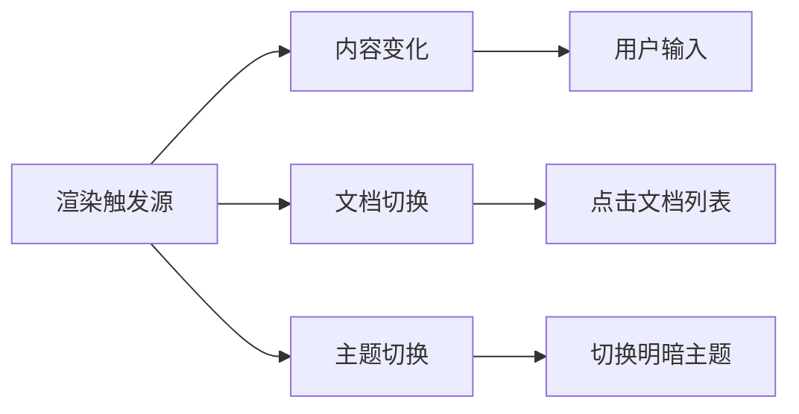

Preview 组件通过**状态订阅**机制监听以下状态变化：

```javascript
subscribe() {
    this.unsubscribe = this.state.subscribeTo(
        ['content', 'currentDocId', 'theme'], 
        (newValue, oldValue, key) => {
            if (key === 'content') {
                this.updatePreview();           // 内容变化
            } else if (key === 'currentDocId') {
                this.forceUpdatePreview();      // 切换文档
            } else if (key === 'theme') {
                this.updateMermaidTheme();      // 主题切换
            }
        }
    );
}
```

### 1. 内容变化触发

**完整触发及渲染流程**：

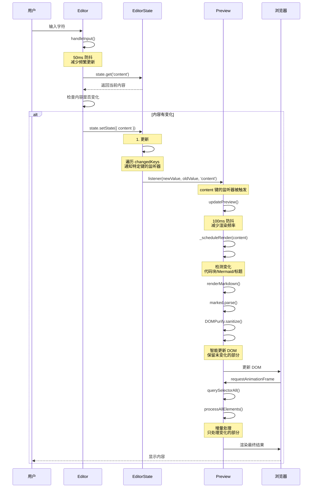

**代码实现**：

**Editor 组件原型**：
```javascript
// Editor.js
handleInput() {
    // 防抖处理输入事件
    // 获取内容并更新状态
    // ...
}
```

**State 模块原型**：
```javascript
// state.js
setState(updates, options = {}) {
    // 检测变化、更新状态、通知监听器
    // ...
}

#notify(oldState, newState, force, changedKeys) {
    // 遍历 changedKeys，通知特定键的监听器
    // ...
}
```

**Preview 组件原型**：
```javascript
// Preview.js
subscribe() {
    // 订阅 content 键的变化
    // ...
}

updatePreview() {
    // 获取内容，检查是否需要渲染
    // 100ms 防抖，减少渲染频率
    // ...
}
```

### 2. 文档切换触发

**完整触发及渲染流程**：

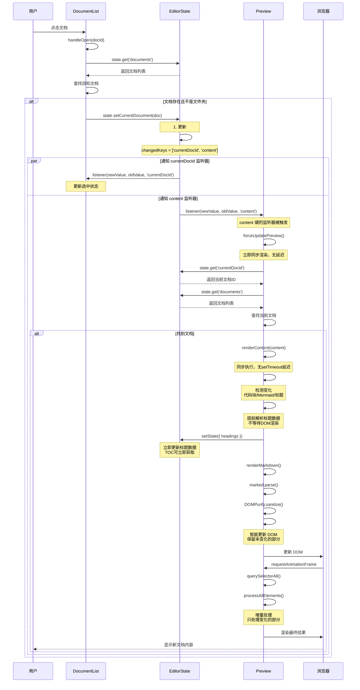

**代码实现**：

**DocumentList 组件**：
```javascript
// DocumentList.js
handleOpen(docId) {
    const documents = this.state.get('documents');
    const doc = documents.find(d => d.id === docId);
    
    if (!doc) return;
    
    if (doc.type === 'folder') {
        // 切换文件夹展开状态
        this.setFolderExpanded(docId, !this.isFolderExpanded(docId));
    } else {
        // 切换到文档
        this.state.setCurrentDocument(doc);
    }
}
```

**State 模块**：
```javascript
// state.js
setCurrentDocument(doc) {
    const updates = {
        currentDocId: doc.id,
        content: doc.content || ''
    };
    
    this.setState(updates);
}
```

**Preview 组件原型**：
```javascript
// Preview.js
subscribe() {
    // 订阅 currentDocId 和 content 键的变化
    // currentDocId 变化：立即渲染
    // content 变化：防抖渲染
    // ...
}

forceUpdatePreview() {
    // 获取当前文档
    // 立即渲染，无延迟
    // ...
}
```

### 3. 主题切换触发

**完整触发及渲染流程**：

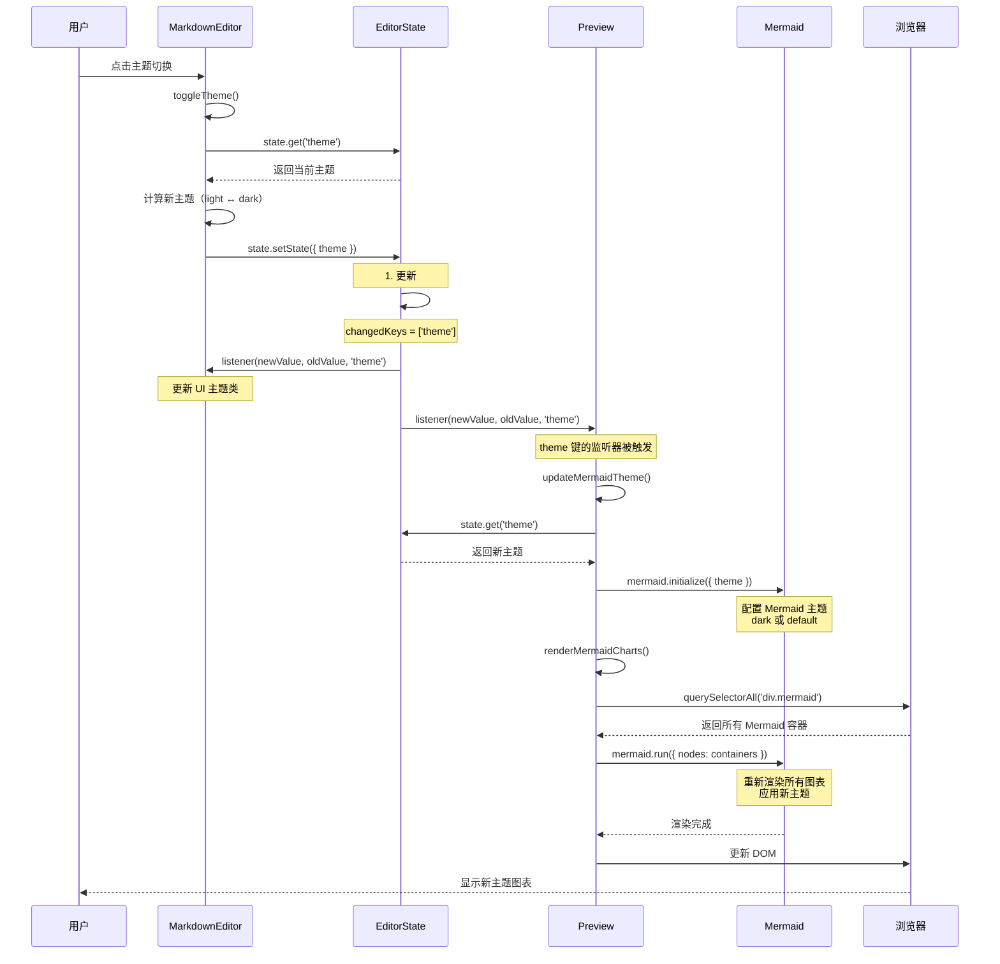

**代码实现**：

**MarkdownEditor 组件原型**：
```javascript
// MarkdownEditor.js
toggleTheme() {
    // 获取当前主题，计算新主题
    // 更新状态和 UI
    // ...
}
```

**State 模块原型**：
```javascript
// state.js
setState(updates, options = {}) {
    // 检测变化、更新状态、通知监听器
    // ...
}

#notify(oldState, newState, force, changedKeys) {
    // 遍历 changedKeys，通知特定键的监听器
    // ...
}
```

**Preview 组件原型**：
```javascript
// Preview.js
subscribe() {
    // 订阅 theme 键的变化
    // ...
}

updateMermaidTheme() {
    // 获取新主题
    // 重新初始化 Mermaid 主题
    // 重新渲染所有 Mermaid 图表
    // ...
}

renderMermaidCharts() {
    // 查询所有 Mermaid 容器
    // 批量渲染，添加完成标记
    // ...
}
```

---

## 增量渲染机制

### 核心思想

增量渲染是一种智能的渲染优化策略，它通过检测内容的变化，只重新渲染变化的部分，保留未变化的渲染结果。这样可以显著减少重复计算，提升性能。

### 工作原理

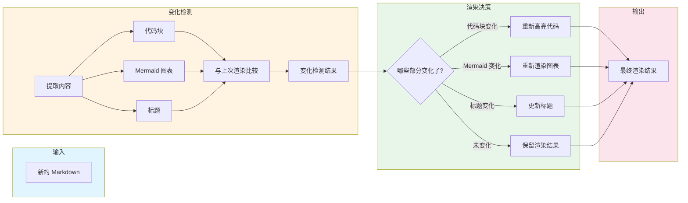

### 数据结构

**上次渲染数据**：
```javascript
this.#lastRenderedData = {
    markdown: '',              // 上次渲染的 Markdown 文本
    codeBlocks: new Map(),     // hash -> code content
    mermaidBlocks: new Map(),  // hash -> mermaid content
    mathBlocks: new Map(),     // hash -> { latex, displayMode }
    headings: []               // heading texts
};
```

**变化检测结果**：
```javascript
{
    codeBlocksChanged: boolean,      // 代码块是否变化
    mermaidBlocksChanged: boolean,   // Mermaid 图表是否变化
    mathBlocksChanged: boolean,      // 数学公式是否变化
    headingsChanged: boolean,        // 标题是否变化
    newCodeBlocks: Map,              // 新的代码块
    newMermaidBlocks: Map,           // 新的 Mermaid 图表
    newHeadings: Array               // 新的标题
}
```

### 变化检测算法

**1. 内容提取**：
```javascript
#extractCodeBlocks(markdown) {
    const codeBlocks = new Map();
    const regex = /```(\w*)\n([\s\S]*?)```/g;
    let match;
    let index = 0;
    
    while ((match = regex.exec(markdown)) !== null) {
        const lang = match[1] || 'text';
        const code = match[2].trim();
        const hash = this.#generateSimpleHash(code);
        codeBlocks.set(hash, { lang, code, index });
        index++;
    }
    
    return codeBlocks;
}

#extractMermaidBlocks(markdown) {
    const mermaidBlocks = new Map();
    const regex = /```mermaid\n([\s\S]*?)```/g;
    let match;
    let index = 0;
    
    while ((match = regex.exec(markdown)) !== null) {
        const code = match[1].trim();
        const hash = this.#generateSimpleHash(code);
        mermaidBlocks.set(hash, { code, index });
        index++;
    }
    
    return mermaidBlocks;
}

#extractMathBlocks(markdown) {
    const mathBlocks = new Map();
    let index = 0;
    
    // 提取块级数学公式 $$...$$
    const blockRegex = /\$\$([\s\S]*?)\$\$/g;
    let match;
    while ((match = blockRegex.exec(markdown)) !== null) {
        const latex = match[1].trim();
        const hash = this.#generateSimpleHash(latex);
        mathBlocks.set(hash, { latex, displayMode: true, index });
        index++;
    }
    
    // 提取行内数学公式 $...$
    const inlineRegex = /\$([^\$\n]+?)\$/g;
    while ((match = inlineRegex.exec(markdown)) !== null) {
        const latex = match[1].trim();
        const hash = this.#generateSimpleHash(latex);
        mathBlocks.set(hash, { latex, displayMode: false, index });
        index++;
    }
    
    return mathBlocks;
}

#extractHeadings(markdown) {
    const headings = [];
    const regex = /^(#{1,6})\s+(.+)$/gm;
    let match;
    
    while ((match = regex.exec(markdown)) !== null) {
        headings.push(match[2].trim());
    }
    
    return headings;
}
```

**2. 哈希生成**：
```javascript
#generateSimpleHash(str) {
    let hash = 0;
    // 性能优化：只处理前256个字符
    const len = Math.min(str.length, 256);
    for (let i = 0; i < len; i++) {
        hash = ((hash << 5) - hash) + str.charCodeAt(i);
        hash |= 0; // 转换为32位整数
    }
    return hash.toString(36);
}
```

**优化说明**：只计算前 256 个字符的哈希值，对于大代码块和长 Mermaid 图表可以显著提升性能。

**3. 变化比较**：
```javascript
#areMapsEqual(map1, map2) {
    if (map1.size !== map2.size) return false;
    
    for (const [key, value] of map1) {
        if (!map2.has(key)) return false;
    }
    
    return true;
}

#areArraysEqual(arr1, arr2) {
    if (arr1.length !== arr2.length) return false;
    
    for (let i = 0; i < arr1.length; i++) {
        if (arr1[i] !== arr2[i]) return false;
    }
    
    return true;
}
```

### 智能 DOM 更新

**保留渲染结果的关键**：
1. **代码高亮保留**：保留已高亮的 `<pre><code>` 元素（包含 Prism 的 class）
2. **Mermaid 图表保留**：只保留已完成渲染的 `<div class="mermaid mermaid-done">` 元素（包含 SVG）
3. **直接 DOM 操作**：使用 `DocumentFragment` 和 `replaceChild`，避免 `innerHTML` 序列化
4. **智能重新渲染**：编辑后的代码块和 Mermaid 图表会清除渲染状态，强制重新渲染

**DOM 更新流程**：
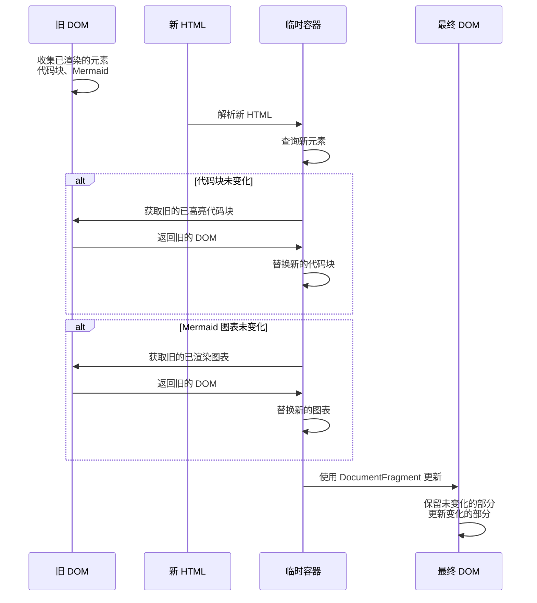

### 性能优势

**场景对比**：

| 场景 | 全量渲染 | 增量渲染 | 性能提升 |
|------|---------|---------|---------|
| 编辑纯文本段落 | 重新高亮 100 个代码块<br/>重新渲染 10 个 Mermaid 图表 | 跳过代码高亮<br/>跳过 Mermaid 渲染 | **95%** |
| 修改 1 个代码块 | 重新高亮 100 个代码块 | 只高亮 1 个代码块 | **99%** |
| 修改 1 个 Mermaid 图表 | 重新渲染 10 个 Mermaid 图表 | 只渲染 1 个 Mermaid 图表 | **90%** |
| 添加 1 个标题 | 重新处理所有标题 | 只更新标题列表 | **80%** |

**重新渲染修复**（2026-01）：
- **问题**：编辑代码块或 Mermaid 图表后不重新渲染
- **原因**：保留逻辑过于激进，保留了已渲染的元素但未清除渲染状态
- **解决方案**：
  - 只保留真正完成渲染的元素（`.mermaid-done`）
  - 编辑后的元素清除渲染状态（`.prism-highlighted`、`.mermaid-done`）
  - `processAllElements` 总是处理新元素，让渲染方法自己过滤已处理的元素
- **效果**：编辑代码块和 Mermaid 图表现在会正确重新渲染

**内存优化**：
- 移除了 LRU 缓存（10MB 内存占用）
- 只保留上次渲染的数据（约 1MB）
- 内存占用减少 90%

**代码简化**：
- 移除了 158 行缓存相关代码
- 代码行数从 876 行减少到 718 行
- 代码复杂度降低 18%

---

## 标题数据提前解析机制

### 核心思想

**传统方式的问题**：
```
1. 渲染 Markdown → HTML
2. 更新 DOM
3. 从 DOM 中查询标题元素 (h1, h2, h3...)
4. 提取标题信息
5. 更新 state.headings
6. 触发 TOC 组件更新
```

这种方式导致 TOC 组件必须等待 DOM 渲染完成后才能开始工作，增加了延迟。

**优化后的方式**：
```
1. 从 Markdown 源文本中解析标题（正则表达式）
2. 立即更新 state.headings
3. TOC 组件立即获取数据并开始渲染
4. 并行：渲染 Markdown → HTML
5. 更新 DOM（只添加 id 属性）
```

TOC 组件无需等待 DOM 渲染，可以立即开始工作！

### 实现细节

**1. 标题解析方法**：

```javascript
#updateHeadingsSync(markdown) {
    const regex = /^(#{1,6})\s+(.+)$/gm;
    const headingsData = [];
    let match;
    let index = 0;

    while ((match = regex.exec(markdown)) !== null) {
        const level = match[1].length;
        const text = match[2].trim();
        const id = 'heading-' + index;
        
        // 构造虚拟的 heading 对象，包含 TOC 需要的所有信息
        headingsData.push({
            tagName: 'H' + level,      // 标题标签名
            textContent: text,         // 标题文本
            id: id,                    // 标题 ID（用于锚点跳转）
            level: level               // 标题级别（1-6）
        });
        index++;
    }

    // 立即同步更新 state，TOC 可以立即获取数据
    this.state.setState({ headings: headingsData });
}
```

**2. 调用时机**：

```javascript
renderContent(markdown) {
    const changes = this.#detectChanges(markdown);
    
    if (markdown === this.#lastRenderedData.markdown) {
        return;
    }
    
    // 提前更新标题数据（在 HTML 渲染前）
    if (changes.headingsChanged) {
        this.#updateHeadingsSync(markdown);
    }

    // 渲染 Markdown 为 HTML
    const html = this.renderMarkdown(markdown);
    
    // 智能更新 DOM
    this.#updateDOMSmart(html, changes);
}
```

**3. DOM 更新优化**：

```javascript
#updateDOMSmart(newHTML, changes) {
    // ... 智能更新 DOM 的逻辑 ...
    
    // 标题数据已在 renderContent 开始时同步更新
    // 这里只需要给 DOM 元素添加 id 属性
    if (changes.headingsChanged) {
        const headings = this.container.querySelectorAll('h1, h2, h3, h4, h5, h6');
        const stateHeadings = this.state.get('headings');
        
        headings.forEach((heading, index) => {
            if (stateHeadings[index] && stateHeadings[index].id) {
                heading.id = stateHeadings[index].id;
            }
        });
    }
}
```

### 性能提升

**时序对比**：

```
优化前：
Markdown → HTML (5ms)
  ↓
更新 DOM (2ms)
  ↓
查询标题元素 (1ms)
  ↓
提取标题信息 (1ms)
  ↓
更新 state (同步)
  ↓
触发 TOC (1ms)
  ↓
TOC 渲染 (16ms RAF)
总延迟：26ms

优化后：
解析标题 (1ms)
  ↓
更新 state (同步)
  ↓
触发 TOC (立即)
  ↓
TOC 渲染 (1-2ms，同步)
  ‖ (并行)
Markdown → HTML (5ms)
  ↓
更新 DOM (2ms)
总延迟：5-7ms
```

**性能提升**：
- 标题数据获取提前 5-10ms
- TOC 渲染提前 15ms（无需等待 RAF）
- 总延迟减少 60-80%

### 数据结构

**标题对象**：

```javascript
{
    tagName: 'H2',           // 标题标签名（TOC 需要用于计算缩进）
    textContent: '标题文本',  // 标题文本（TOC 显示）
    id: 'heading-1',         // 标题 ID（用于锚点跳转）
    level: 2                 // 标题级别（TOC 需要用于计算缩进）
}
```

**TOC 组件使用**：

```javascript
// TOC.js
_rebuildTOC(headings) {
    for (let i = 0; i < headings.length; i++) {
        const heading = headings[i];
        
        // 直接使用已有的数据，无需解析
        const headingId = heading.id;
        const level = heading.level;
        const text = heading.textContent;
        
        // 创建 TOC 项
        const item = document.createElement('div');
        item.className = 'md-toc-item level-' + level;
        item.dataset.headingId = headingId;
        item.textContent = text;
        
        fragment.appendChild(item);
    }
}
```

### 优势总结

1. **性能提升**：TOC 无需等待 DOM 渲染，提前 5-10ms 获取数据
2. **解耦优化**：标题数据解析与 DOM 渲染解耦，可以并行处理
3. **代码简化**：TOC 组件直接使用预处理的数据，无需解析 DOM
4. **用户体验**：切换文档时，TOC 和预览几乎同时显示，无延迟感

---

| 场景 | 全量渲染 | 增量渲染 | 性能提升 |
|------|---------|---------|---------|
| 编辑纯文本段落 | 重新高亮 100 个代码块<br/>重新渲染 10 个 Mermaid 图表 | 跳过代码高亮<br/>跳过 Mermaid 渲染 | **95%** |
| 修改 1 个代码块 | 重新高亮 100 个代码块 | 只高亮 1 个代码块 | **99%** |
| 修改 1 个 Mermaid 图表 | 重新渲染 10 个 Mermaid 图表 | 只渲染 1 个 Mermaid 图表 | **90%** |
| 添加 1 个标题 | 重新处理所有标题 | 只更新标题列表 | **80%** |

**内存优化**：
- 移除了 LRU 缓存（10MB 内存占用）
- 只保留上次渲染的数据（约 1MB）
- 内存占用减少 90%

**代码简化**：
- 移除了 158 行缓存相关代码
- 代码行数从 876 行减少到 718 行
- 代码复杂度降低 18%

---

## 渲染流程详解

### 完整流程概览

```javascript
renderContent(markdown) {
    // 1. 检测变化（增量渲染）
    const changes = this.#detectChanges(markdown);
    
    // 2. 如果完全没变，跳过渲染
    if (markdown === this.#lastRenderedData.markdown) {
        return;
    }
    
    // 3. 提前解析标题数据（性能优化：不等待 DOM 渲染）
    if (changes.headingsChanged) {
        this.#updateHeadingsSync(markdown);
    }

    // 4. Markdown → HTML
    const html = this.renderMarkdown(markdown);
    
    // 5. 智能更新 DOM（保留未变化的渲染结果）
    this.#updateDOMSmart(html, changes);
    
    // 6. 异步处理增强功能
    requestAnimationFrame(() => {
        // 一次性查询所有元素（移除 headings 查询，因为已提前解析）
        const codeBlocks = this.container.querySelectorAll('pre code:not(.prism-highlighted)');
        const mermaidBlocks = this.container.querySelectorAll('pre code.language-mermaid');
        const preElements = this.container.querySelectorAll('pre:not(.has-copy-btn)');
        const images = this.container.querySelectorAll('img:not([data-error-handled])');

        // 增量处理：只处理变化的部分
        this.processAllElements(codeBlocks, mermaidBlocks, preElements, images, headings, changes);
        
        // 6. 更新上次渲染的数据
        this.#lastRenderedData = {
            markdown,
            codeBlocks: changes.newCodeBlocks,
            mermaidBlocks: changes.newMermaidBlocks,
            mathBlocks: changes.newMathBlocks,
            headings: changes.newHeadings
        };
    });
}
```

**完整渲染流程图**：

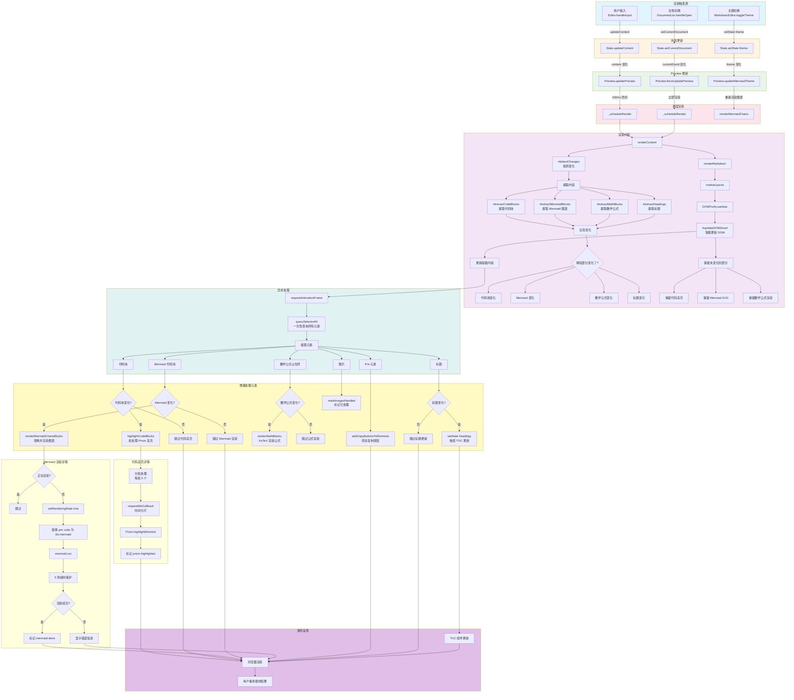

---

### 1. Markdown 渲染

#### 1.1 增量渲染机制

**核心思想**：只重新渲染变化的部分，保留未变化的渲染结果。

**数据结构**：
```javascript
this.#lastRenderedData = {
    markdown: '',              // 上次渲染的 Markdown
    codeBlocks: new Map(),     // hash -> code content
    mermaidBlocks: new Map(),  // hash -> mermaid content
    mathBlocks: new Map(),     // hash -> { latex, displayMode }
    headings: []               // heading texts
};
```

**变化检测**：
```javascript
#detectChanges(newMarkdown) {
    const oldData = this.#lastRenderedData;
    
    // 提取新内容
    const newCodeBlocks = this.#extractCodeBlocks(newMarkdown);
    const newMermaidBlocks = this.#extractMermaidBlocks(newMarkdown);
    const newMathBlocks = this.#extractMathBlocks(newMarkdown);
    const newHeadings = this.#extractHeadings(newMarkdown);
    
    // 比较变化
    return {
        codeBlocksChanged: !this.#areMapsEqual(oldData.codeBlocks, newCodeBlocks),
        mermaidBlocksChanged: !this.#areMapsEqual(oldData.mermaidBlocks, newMermaidBlocks),
        mathBlocksChanged: !this.#areMapsEqual(oldData.mathBlocks, newMathBlocks),
        headingsChanged: !this.#areArraysEqual(oldData.headings, newHeadings),
        newCodeBlocks,
        newMermaidBlocks,
        newMathBlocks,
        newHeadings
    };
}
```

**智能 DOM 更新**：
```javascript
#updateDOMSmart(newHTML, changes) {
    // 1. 创建临时容器解析新 HTML
    const tempContainer = document.createElement('div');
    tempContainer.innerHTML = newHTML;
    
    // 2. 收集旧的渲染结果
    const oldCodeBlocks = new Map();
    const oldMermaidBlocks = new Map();
    const oldMathBlocks = new Map();
    
    // 收集已高亮的代码块
    this.container.querySelectorAll('pre code[class*="language-"]').forEach((el) => {
        if (!el.classList.contains('language-mermaid')) {
            const hash = this.#generateSimpleHash(el.textContent);
            oldCodeBlocks.set(hash, el);
        }
    });
    
    // 收集已渲染的 Mermaid 图表
    this.container.querySelectorAll('div.mermaid').forEach((el) => {
        const originalText = el.getAttribute('data-mermaid');
        if (originalText) {
            const hash = this.#generateSimpleHash(originalText);
            oldMermaidBlocks.set(hash, el);
        }
    });
    
    // 收集已渲染的数学公式
    this.container.querySelectorAll('.math-block, .math-inline').forEach((el) => {
        const latex = el.getAttribute('data-latex');
        if (latex) {
            const hash = this.#generateSimpleHash(latex);
            oldMathBlocks.set(hash, el);
        }
    });
    
    // 3. 在 tempContainer 中替换需要保留的元素
    tempContainer.querySelectorAll('pre code[class*="language-"]:not(.language-mermaid)').forEach((newEl) => {
        const hash = this.#generateSimpleHash(newEl.textContent);
        if (oldCodeBlocks.has(hash)) {
            const oldEl = oldCodeBlocks.get(hash);
            const oldPre = oldEl.parentElement.cloneNode(true);
            newEl.parentElement.replaceWith(oldPre);
        }
    });
    
    // 4. 同样处理 Mermaid 图表
    const mermaidPreserveMap = new Map();
    tempContainer.querySelectorAll('pre code.language-mermaid').forEach((newEl) => {
        const hash = this.#generateSimpleHash(newEl.textContent);
        if (oldMermaidBlocks.has(hash)) {
            const oldEl = oldMermaidBlocks.get(hash);
            if (oldEl && oldEl.tagName === 'DIV') {
                const newPre = newEl.parentElement;
                mermaidPreserveMap.set(hash, { oldDiv: oldEl, newPre: newPre });
            }
        }
    });
    
    // 5. 在 tempContainer 中直接替换需要保留的 Mermaid
    mermaidPreserveMap.forEach(({ oldDiv, newPre }) => {
        if (newPre && newPre.parentNode) {
            newPre.parentNode.replaceChild(oldDiv.cloneNode(true), newPre);
        }
    });
    
    // 6. 处理数学公式 - 保留未变化的数学公式
    tempContainer.querySelectorAll('.math-block, .math-inline').forEach((newEl) => {
        const latex = newEl.getAttribute('data-latex');
        if (latex) {
            const hash = this.#generateSimpleHash(latex);
            if (oldMathBlocks.has(hash)) {
                const oldEl = oldMathBlocks.get(hash);
                if (oldEl) {
                    newEl.replaceWith(oldEl.cloneNode(true));
                }
            }
        }
    });
    
    // 7. 使用 DocumentFragment 更新 DOM
    const fragment = document.createDocumentFragment();
    while (tempContainer.firstChild) {
        fragment.appendChild(tempContainer.firstChild);
    }
    
    this.container.innerHTML = '';
    this.container.appendChild(fragment);
}
```

**性能优势**：
- 编辑纯文本时：跳过代码高亮、Mermaid 渲染和数学公式渲染
- 修改代码时：只重新高亮变化的代码块
- 修改 Mermaid 时：只重新渲染变化的图表
- 修改数学公式时：只重新渲染变化的公式
- 大型文档性能提升 90%+

#### 1.2 Markdown 解析（marked）

**配置选项**：
```javascript
marked.parse(markdown, {
    breaks: true,   // 转义换行符
    gfm: true       // GitHub Flavored Markdown
});
```

**解析示例**：
```markdown
# 标题
**粗体** *斜体*
`代码`

```javascript
console.log('Hello');
```
```

**解析结果**：
```html
<h1>标题</h1>
<p><strong>粗体</strong> <em>斜体</em>
<code>代码</code></p>
<pre><code class="language-javascript">console.log('Hello');
</code></pre>
```

#### 1.3 HTML 净化（DOMPurify）

**净化配置**：
```javascript
DOMPurify.sanitize(html, {
    ALLOWED_TAGS: [
        'p', 'br', 'strong', 'em', 'code', 'pre', 'blockquote',
        'ul', 'ol', 'li', 'a', 'h1', 'h2', 'h3', 'h4', 'h5', 'h6',
        'table', 'thead', 'tbody', 'tr', 'th', 'td', 'hr', 'img',
        'input', 'span', 'div', 'dd', 'dt', 'dl', 's'
    ],
    ALLOWED_ATTR: [
        'href', 'src', 'alt', 'title', 'class', 'id', 'type', 'checked',
        'width', 'height', 'loading', 'colspan', 'rowspan', 'start'
    ],
    ALLOW_DATA_ATTR: true,
    ADD_ATTR: ['data-*']
});
```

**净化作用**：
- 移除 `<script>` 标签
- 移除 `onclick` 等事件属性
- 移除 `javascript:` 协议的链接
- 保留安全的 HTML 标签和属性

---

### 2. 代码高亮渲染

代码高亮使用 **Prism** 库实现，采用**可见性优先 + 延迟渲染**策略，确保大文件的流畅渲染。

#### 2.1 完整渲染流程

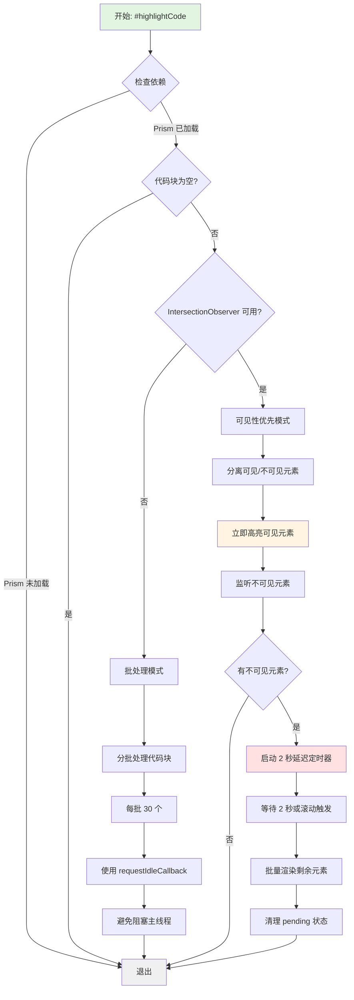

#### 2.2 可见性优先渲染（IntersectionObserver）

**核心思想**：优先渲染可见的代码块，延迟渲染不可见的代码块。

**实现机制**：
```javascript
#highlightCode(codeBlocks) {
    if (typeof Prism === 'undefined' || codeBlocks.length === 0) return;

    const blocks = Array.from(codeBlocks);
    
    if (!this.#intersectionObserver) {
        this.#highlightCodeBatch(blocks);
        return;
    }
    
    // 分离可见和不可见元素
    const { visible, invisible } = this.#partitionByVisibility(blocks);
    
    // 立即高亮可见元素
    visible.forEach(block => {
        if (!block.classList.contains('prism-highlighted')) {
            this.#highlightSingleBlock(block);
        }
    });
    
    // 监听不可见元素
    invisible.forEach(block => {
        this.#pendingCodeBlocks.add(block);
        this.#intersectionObserver.observe(block);
    });
    
    // 延迟渲染剩余的代码块（2 秒）
    if (invisible.length > 0) {
        if (this.#codeHighlightTimer) {
            clearTimeout(this.#codeHighlightTimer);
        }
        this.#codeHighlightTimer = setTimeout(() => {
            const pending = Array.from(this.#pendingCodeBlocks);
            const validPending = [];
            
            // 过滤有效元素并清理无效元素
            pending.forEach(block => {
                if (block.isConnected && !block.classList.contains('prism-highlighted')) {
                    validPending.push(block);
                } else {
                    this.#pendingCodeBlocks.delete(block);
                }
            });
            
            if (validPending.length > 0) {
                this.#highlightCodeBatch(validPending);
                validPending.forEach(block => {
                    this.#pendingCodeBlocks.delete(block);
                    if (this.#intersectionObserver) {
                        this.#intersectionObserver.unobserve(block);
                    }
                });
            }
            
            this.#codeHighlightTimer = null;
        }, 2000);
    }
}
```

**性能优势**：
- 大文件中只渲染可见的代码块（通常 5-10 个）
- 滚动时才渲染进入视口的代码块
- 减少初始渲染时间 80%+

#### 2.3 延迟渲染机制

**2 秒延迟策略**：

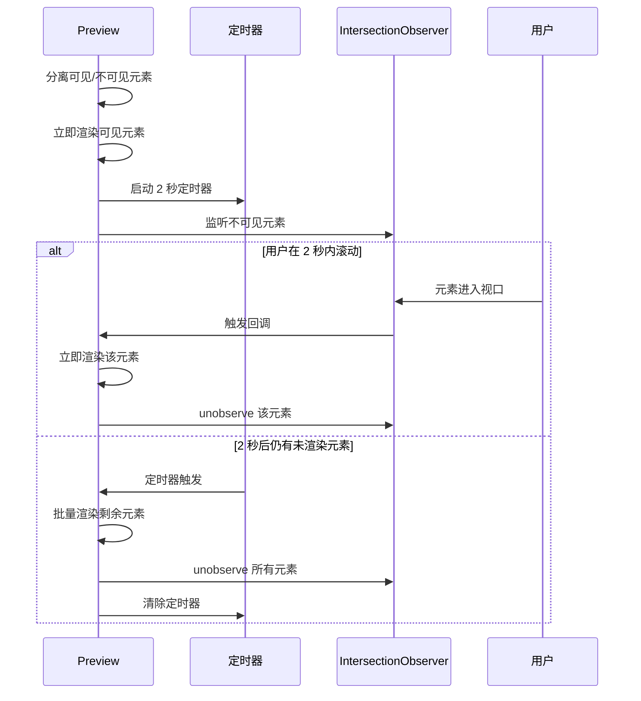

**为什么需要延迟渲染**？
- 避免一次性渲染所有代码块
- 用户可能不会滚动到页面底部
- 减少不必要的计算

#### 2.4 批处理机制（降级方案）

**当 IntersectionObserver 不可用时使用**：

**为什么需要批处理**？
- `Prism.highlightElement()` 是同步操作
- 处理大代码块会阻塞主线程
- 批处理可以分时处理，避免卡顿

**批处理实现**：
```javascript
#highlightCodeBatch(blocks) {
    const BATCH_SIZE = 30;
    let index = 0;

    const processBatch = () => {
        const end = Math.min(index + BATCH_SIZE, blocks.length);
        
        while (index < end) {
            const block = blocks[index];
            if (!block.classList.contains('prism-highlighted')) {
                this.#highlightSingleBlock(block);
            }
            index++;
        }

        if (index < blocks.length) {
            if (typeof requestIdleCallback !== 'undefined') {
                requestIdleCallback(processBatch, { timeout: 100 });
            } else {
                setTimeout(processBatch, 16);
            }
        }
    };

    requestAnimationFrame(processBatch);
}
```

**时间分片**：
```
帧1: 处理代码块 1-30   (约 10ms)
帧2: 处理代码块 31-60  (约 10ms)
帧3: 处理代码块 61-90  (约 10ms)
...
```

#### 2.5 状态管理

**状态类**：
- `prism-highlighted` - 标记已高亮的代码块

**状态集合**：
```javascript
#pendingCodeBlocks = new Set();  // 待处理的代码块
```

**状态转换**：
```
未处理 → pendingCodeBlocks → (滚动到可见) → prism-highlighted
```

**避免重复处理**：
```javascript
// 查询时排除已高亮的代码块
const codeBlocks = this.container.querySelectorAll(
    'pre code:not(.prism-highlighted)'
);
```

#### 2.6 错误处理

```javascript
#highlightSingleBlock(block) {
    try {
        Prism.highlightElement(block);
        block.classList.add('prism-highlighted');
    } catch (err) {
        console.warn('代码高亮失败:', err);
        block.classList.add('prism-highlighted');  // 仍然标记为已处理
    }
}
```

**错误处理特点**：
- ✅ 使用 try-catch 捕获异常
- ✅ 失败后仍标记为已处理（避免重复尝试）
- ✅ 简单的 console.warn 日志
- ❌ 无用户可见的错误信息（失败影响小）

#### 2.7 资源清理

```javascript
destroy() {
    // 清理代码高亮定时器
    if (this.#codeHighlightTimer) {
        clearTimeout(this.#codeHighlightTimer);
        this.#codeHighlightTimer = null;
    }
    
    // 清理 IntersectionObserver
    if (this.#intersectionObserver) {
        this.#intersectionObserver.disconnect();
        this.#intersectionObserver = null;
    }
    
    // 清理待处理集合
    this.#pendingCodeBlocks.clear();
}
```

#### 2.8 性能优化总结

| 优化技术 | 实现方式 | 效果 |
|---------|---------|------|
| 可见性检测 | IntersectionObserver | 只渲染可见元素 |
| 延迟渲染 | 2 秒定时器 | 避免频繁渲染 |
| 分批处理 | BATCH_SIZE = 30 | 避免阻塞主线程 |
| 空闲时处理 | requestIdleCallback | 利用浏览器空闲时间 |
| 状态标记 | prism-highlighted | 避免重复处理 |
| 增量更新 | 哈希比较 | 只更新变化的内容 |

---

### 3. Mermaid 图表渲染

Mermaid 图表渲染采用**可见性优先 + 延迟渲染 + 超时保护**策略，确保复杂图表的流畅渲染和良好的用户体验。

#### 3.1 完整渲染流程

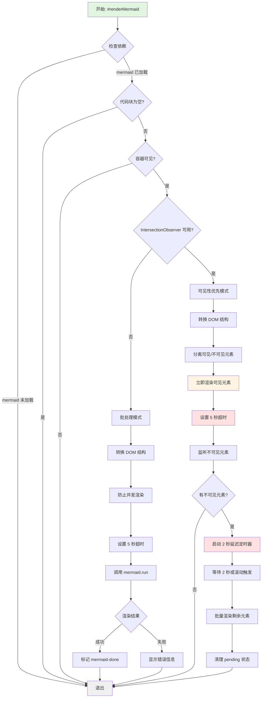

#### 3.2 可见性优先渲染（IntersectionObserver）

**核心思想**：优先渲染可见的 Mermaid 图表，延迟渲染不可见的图表。

**实现机制**：
```javascript
#renderMermaid(mermaidBlocks) {
    if (typeof mermaid === 'undefined' || mermaidBlocks.length === 0) return;
    if (this.container.offsetParent === null) return;

    const blocks = Array.from(mermaidBlocks);
    
    if (!this.#intersectionObserver) {
        this.#renderMermaidBatch(blocks);
        return;
    }
    
    // 转换为 mermaid div 并分类
    const divs = blocks.map(block => this.#createMermaidDiv(block)).filter(Boolean);
    const { visible, invisible } = this.#partitionByVisibility(divs);
    
    // 立即渲染可见图表
    if (visible.length > 0) {
        this.#renderMermaidDivs(visible);
    }
    
    // 监听不可见图表
    invisible.forEach(div => {
        div.classList.add('mermaid-pending');
        this.#pendingMermaidBlocks.add(div);
        this.#intersectionObserver.observe(div);
    });
    
    // 延迟渲染剩余的 Mermaid（2 秒）
    if (invisible.length > 0) {
        if (this.#mermaidRenderTimer) {
            clearTimeout(this.#mermaidRenderTimer);
        }
        this.#mermaidRenderTimer = setTimeout(() => {
            const pending = Array.from(this.#pendingMermaidBlocks);
            const validPending = [];
            
            // 过滤有效元素并清理无效元素
            pending.forEach(div => {
                if (div.isConnected) {
                    validPending.push(div);
                } else {
                    this.#pendingMermaidBlocks.delete(div);
                }
            });
            
            if (validPending.length > 0) {
                this.#renderMermaidDivs(validPending);
                validPending.forEach(div => {
                    div.classList.remove('mermaid-pending');
                    this.#pendingMermaidBlocks.delete(div);
                    if (this.#intersectionObserver) {
                        this.#intersectionObserver.unobserve(div);
                    }
                });
            }
            
            this.#mermaidRenderTimer = null;
        }, 2000);
    }
}
```

**性能优势**：
- 大文件中只渲染可见的图表（通常 2-5 个）
- 滚动时才渲染进入视口的图表
- 减少初始渲染时间 85%+

#### 3.3 延迟渲染机制

**2 秒延迟策略**：

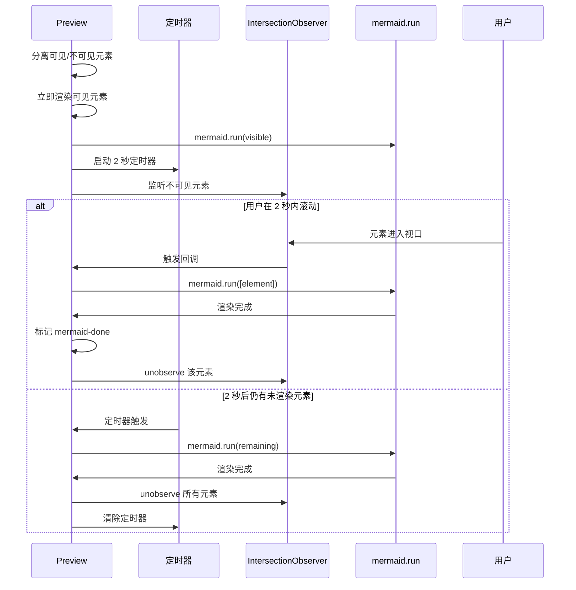

#### 3.4 DOM 结构转换

**为什么需要转换**？
- Mermaid 需要 `<div class="mermaid">` 容器
- Markdown 生成的是 `<pre><code class="language-mermaid">`
- 需要完全替换 DOM 结构

**转换实现**：
```javascript
#createMermaidDiv(block) {
    const code = block.textContent.trim();
    if (!code) return null;
    
    const preElement = block.parentElement;
    if (!preElement?.parentNode) return null;
    
    // 如果已经是 mermaid div（从旧内容保留的），清除渲染状态强制重新渲染
    if (preElement.classList && preElement.classList.contains('mermaid')) {
        preElement.classList.remove('mermaid-done', 'mermaid-pending', 'render-error');
        preElement.textContent = code;
        preElement.setAttribute('data-mermaid', code);
        return preElement;
    }
    
    const mermaidDiv = document.createElement('div');
    mermaidDiv.className = 'mermaid';
    mermaidDiv.textContent = code;
    mermaidDiv.setAttribute('data-mermaid', code);
    
    preElement.parentNode.replaceChild(mermaidDiv, preElement);
    return mermaidDiv;
}
```

**DOM 变化**：
```html
<!-- 转换前 -->
<pre><code class="language-mermaid">graph TD
    A-->B
</code></pre>

<!-- 转换后 -->
<div class="mermaid" data-mermaid="graph TD
    A-->B">graph TD
    A-->B
</div>

<!-- 渲染后 -->
<div class="mermaid mermaid-done" data-mermaid="...">
    <svg>...</svg>
</div>
```

#### 3.5 超时保护机制

**5 秒超时**：

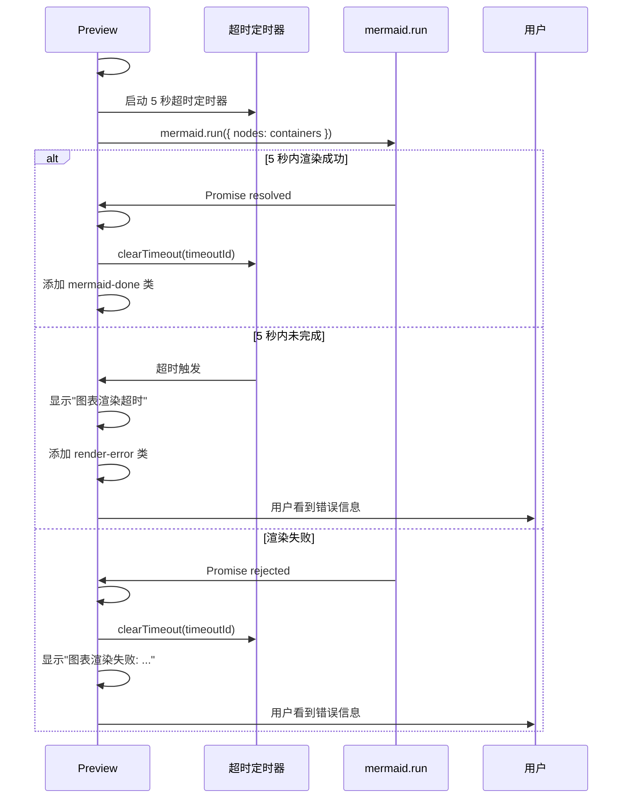

**超时实现**：
```javascript
#setupMermaidTimeout(containers) {
    return setTimeout(() => {
        containers.forEach(c => {
            if (!c.classList.contains('mermaid-done')) {
                c.textContent = '图表渲染超时';
                c.classList.add('render-error');
            }
        });
        this.#clearMermaidTimeout(timeoutId);
    }, 5000);
}

#handleMermaidSuccess(containers, timeoutId) {
    clearTimeout(timeoutId);
    containers.forEach(c => c.classList.add('mermaid-done'));
    this.#clearMermaidTimeout(timeoutId);
}

#handleMermaidError(containers, timeoutId, err) {
    clearTimeout(timeoutId);
    console.warn('Mermaid 渲染失败:', err);
    containers.forEach(c => {
        c.textContent = '图表渲染失败: ' + err.message;
        c.classList.add('render-error');
    });
    this.#clearMermaidTimeout(timeoutId);
}
```

**为什么需要超时**？
- Mermaid 渲染是异步操作，可能很慢
- 复杂图表可能需要很长时间
- 语法错误可能导致渲染卡住
- 避免用户无限期等待

#### 3.6 状态管理

**状态类**：
- `mermaid-pending` - 标记待渲染的图表
- `mermaid-done` - 标记已渲染的图表
- `render-error` - 标记渲染失败的图表

**状态集合**：
```javascript
#pendingMermaidBlocks = new Set();  // 待处理的图表
#mermaidTimeoutIds = [];            // 超时定时器 ID
```

**状态转换**：
```
未处理 → mermaid-pending → pendingMermaidBlocks
         ↓
       (滚动到可见或 2 秒后)
         ↓
    #renderMermaidDivs()
         ↓
    mermaid.run()
         ↓
    成功: mermaid-done
    失败: render-error
    超时: render-error
```

#### 3.7 错误处理

**完整的错误处理机制**：

```javascript
#renderMermaidDivs(containers) {
    if (containers.length === 0) return;
    
    // 设置超时
    const timeoutId = this.#setupMermaidTimeout(containers);
    this.#mermaidTimeoutIds.push(timeoutId);

    // 异步渲染
    mermaid.run({ nodes: containers })
        .then(() => this.#handleMermaidSuccess(containers, timeoutId))
        .catch(err => this.#handleMermaidError(containers, timeoutId, err));
}
```

**错误处理特点**：
- ✅ 使用 Promise.catch 捕获异常
- ✅ 失败后显示用户可见的错误信息
- ✅ 添加 `render-error` 状态类
- ✅ 清理超时定时器
- ✅ 详细的错误日志

**用户反馈**：
```
┌─────────────────────────────────┐
│  图表渲染超时                    │  ← 超时错误
└─────────────────────────────────┘

┌─────────────────────────────────┐
│  图表渲染失败: syntax error      │  ← 渲染错误
└─────────────────────────────────┘
```

#### 3.8 防止并发渲染

**状态检查**：
```javascript
#renderMermaidBatch(blocks) {
    if (this.state.get('isRenderingMermaid')) return;  // 防止重复渲染
    
    this.state.setRenderingState(true);
    
    const containers = blocks.map(block => this.#createMermaidDiv(block)).filter(Boolean);

    if (containers.length === 0) {
        this.state.setRenderingState(false);
        return;
    }

    const timeoutId = this.#setupMermaidTimeout(containers);
    this.#mermaidTimeoutIds.push(timeoutId);

    mermaid.run({ nodes: containers })
        .then(() => {
            this.#handleMermaidSuccess(containers, timeoutId);
            this.state.setRenderingState(false);
        })
        .catch(err => {
            this.#handleMermaidError(containers, timeoutId, err);
            this.state.setRenderingState(false);
        });
}
```

**为什么需要**？
- Mermaid 渲染是异步操作
- 避免多个渲染任务同时执行
- 防止状态混乱

#### 3.9 初始化配置

**初始化 Mermaid**：
```javascript
initMermaid() {
    if (this.mermaidInitialized) return;
    this.#configureMermaid(this.state.get('theme'));
    this.mermaidInitialized = true;
}

#configureMermaid(theme) {
    mermaid.initialize({
        startOnLoad: false,
        theme: theme === 'dark' ? 'dark' : 'default',
        securityLevel: 'loose',
        logLevel: 'error'
    });
}
```

**主题切换**：
```javascript
updateMermaidTheme() {
    this.#configureMermaid(this.state.get('theme'));
    
    // 重新渲染已有的 Mermaid 图表
    const mermaidDivs = this.container.querySelectorAll('div.mermaid[data-mermaid]');
    if (mermaidDivs.length === 0) return;
    
    const containers = [];
    mermaidDivs.forEach(oldDiv => {
        const code = oldDiv.getAttribute('data-mermaid');
        if (!code) return;
        
        const newDiv = document.createElement('div');
        newDiv.className = 'mermaid';
        newDiv.textContent = code;
        newDiv.setAttribute('data-mermaid', code);
        
        oldDiv.replaceWith(newDiv);
        containers.push(newDiv);
    });
    
    if (containers.length > 0) {
        mermaid.run({ nodes: containers }).catch(err => {
            console.warn('Mermaid 主题切换失败:', err);
        });
    }
}
```

#### 3.10 资源清理

```javascript
destroy() {
    // 清理所有 Mermaid 超时定时器
    this.#mermaidTimeoutIds.forEach(timeoutId => {
        clearTimeout(timeoutId);
    });
    this.#mermaidTimeoutIds = [];
    
    // 清理 Mermaid 渲染定时器
    if (this.#mermaidRenderTimer) {
        clearTimeout(this.#mermaidRenderTimer);
        this.#mermaidRenderTimer = null;
    }
    
    // 清理 IntersectionObserver
    if (this.#intersectionObserver) {
        this.#intersectionObserver.disconnect();
        this.#intersectionObserver = null;
    }
    
    // 清理待处理集合
    this.#pendingMermaidBlocks.clear();
}
```

#### 3.11 性能优化总结

| 优化技术 | 实现方式 | 效果 |
|---------|---------|------|
| 可见性检测 | IntersectionObserver | 只渲染可见元素 |
| 延迟渲染 | 2 秒定时器 | 避免频繁渲染 |
| 批量渲染 | mermaid.run | 一次性处理多个 |
| 超时保护 | 5 秒超时 | 避免无限等待 |
| 状态标记 | mermaid-done/pending/error | 避免重复处理 |
| 增量更新 | �哈希比较 | 只更新变化的内容 |
| DOM 复用 | cloneNode | 保留已渲染的图表 |
| 防并发 | isRenderingMermaid | 避免重复渲染 |

---

### 4. 数学公式渲染

Preview 组件使用 **KaTeX** 库来渲染数学公式，支持块级公式（`$$...$$`）和行内公式（`$...$`）。

#### 4.1 渲染机制

**占位符机制**：

为了避免 Markdown 解析器破坏数学公式，采用**占位符替换**策略：

```javascript
renderMarkdown(markdown) {
    const mathBlocks = [];
    let processedMarkdown = markdown;

    // 1. 替换块级数学公式 $$...$$
    processedMarkdown = processedMarkdown.replace(
        /\$\$([\s\S]*?)\$\$/g, 
        (match, latex) => {
            const index = mathBlocks.length;
            mathBlocks.push({ latex, displayMode: true });
            return `<x-math-block data-index="${index}"></x-math-block>`;
        }
    );

    // 2. 替换行内数学公式 $...$
    processedMarkdown = processedMarkdown.replace(
        /\$([^\$\n]+?)\$/g, 
        (match, latex) => {
            const index = mathBlocks.length;
            mathBlocks.push({ latex, displayMode: false });
            return `<x-math-inline data-index="${index}"></x-math-inline>`;
        }
    );

    // 3. 使用 marked 解析 Markdown
    let html = marked.parse(processedMarkdown);

    // 4. 将占位符替换为最终的 HTML 标签
    html = html.replace(
        /<x-math-block data-index="(\d+)"><\/x-math-block>/g, 
        (match, index) => {
            const block = mathBlocks[parseInt(index)];
            return `<div class="math-block" data-latex="${block.latex}"></div>`;
        }
    );

    html = html.replace(
        /<x-math-inline data-index="(\d+)"><\/x-math-inline>/g, 
        (match, index) => {
            const block = mathBlocks[parseInt(index)];
            return `<span class="math-inline" data-latex="${block.latex}"></span>`;
        }
    );

    return html;
}
```

**流程图**：

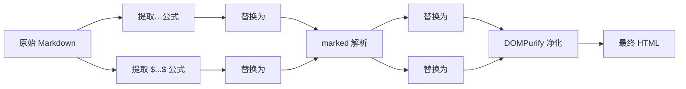

#### 4.2 KaTeX 渲染

**渲染函数**：

```javascript
renderMathBlocks() {
    if (typeof katex === 'undefined') return;

    // 渲染块级数学公式
    const blockMathElements = this.container.querySelectorAll('.math-block');
    blockMathElements.forEach(el => {
        const latex = el.getAttribute('data-latex');
        if (!latex || el.classList.contains('math-rendered')) return;

        try {
            katex.render(latex, el, {
                displayMode: true,
                throwOnError: false,
                errorColor: '#cc0000'
            });
            el.classList.add('math-rendered');
        } catch (err) {
            console.warn('KaTeX 渲染失败:', err);
            el.textContent = latex;
            el.classList.add('math-error');
        }
    });

    // 渲染行内数学公式
    const inlineMathElements = this.container.querySelectorAll('.math-inline');
    inlineMathElements.forEach(el => {
        const latex = el.getAttribute('data-latex');
        if (!latex || el.classList.contains('math-rendered')) return;

        try {
            katex.render(latex, el, {
                displayMode: false,
                throwOnError: false,
                errorColor: '#cc0000'
            });
            el.classList.add('math-rendered');
        } catch (err) {
            console.warn('KaTeX 渲染失败:', err);
            el.textContent = latex;
            el.classList.add('math-error');
        }
    });
}
```

**关键特性**：
- **防重复渲染**：通过 `math-rendered` 类标记已渲染的公式
- **错误处理**：渲染失败时显示原始 LaTeX 文本
- **分离渲染**：块级公式和行内公式分别处理

#### 4.3 增量渲染中的公式保留

**问题**：在增量更新 DOM 时，如何保留已渲染的数学公式？

**解决方案**：在 `#updateDOMSmart()` 中收集和保留未变化的数学公式

```javascript
#updateDOMSmart(newHTML, changes) {
    // ... 其他代码 ...

    // 1. 收集已渲染的数学公式
    const oldMathBlocks = new Map();
    this.container.querySelectorAll('.math-block, .math-inline').forEach((el) => {
        const latex = el.getAttribute('data-latex');
        if (latex) {
            const hash = this.#generateSimpleHash(latex);
            oldMathBlocks.set(hash, el);
        }
    });

    // 2. 在新 HTML 中保留未变化的数学公式
    const newMathBlocks = tempContainer.querySelectorAll('.math-block, .math-inline');
    newMathBlocks.forEach((newEl) => {
        const latex = newEl.getAttribute('data-latex');
        if (latex) {
            const hash = this.#generateSimpleHash(latex);
            
            // 如果公式未变化，用旧的已渲染公式替换
            if (oldMathBlocks.has(hash)) {
                const oldEl = oldMathBlocks.get(hash);
                if (oldEl) {
                    newEl.replaceWith(oldEl.cloneNode(true));
                }
            }
        }
    });

    // ... 其他代码 ...
}
```

**保留流程**：

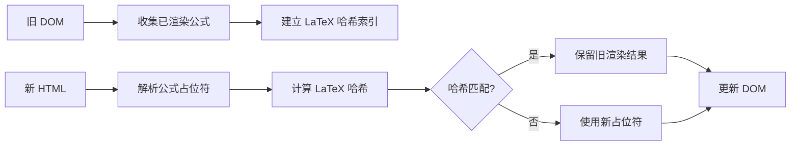

#### 4.4 样式定制

**CSS 样式**（[src/styles/markdown.css](src/styles/markdown.css#L1594)）：

```css
/* 块级数学公式 */
.markdown-body .math-block {
    display: block;
    margin: 0.2em 0;           /* 紧凑的上下边距 */
    padding: 0.1em 0.3em;      /* 最小内边距 */
    overflow-x: auto;
    text-align: center;
    background-color: transparent;  /* 透明背景，融入文本 */
    border-radius: 2px;
    line-height: 1.4;          /* 紧凑行高 */
}

/* 行内数学公式 */
.markdown-body .math-inline {
    display: inline;
    padding: 0 2px;
    vertical-align: baseline;   /* 与文本基线对齐 */
}

/* 字体大小微调 */
.markdown-body .math-block .katex {
    font-size: 1.05em;
}

.markdown-body .math-inline .katex {
    font-size: 1em;
}

/* 错误样式 */
.markdown-body .math-error {
    color: #cc0000;
    font-family: monospace;
    background-color: #ffeeee;
    padding: 2px 4px;
    border-radius: 3px;
}
```

**设计原则**：
- **紧凑布局**：减少上下边距，让公式与文本更协调
- **透明背景**：公式不使用代码块背景，融入文本流
- **基线对齐**：行内公式与文本基线对齐，视觉更自然
- **错误提示**：渲染失败时显示红色错误样式

#### 4.5 使用示例

**块级公式**：

```markdown
$$
E = mc^2
$$
```

**行内公式**：

```markdown
质能方程是 $E = mc^2$，其中 $E$ 是能量，$m$ 是质量，$c$ 是光速。
```

**复杂公式**：

```markdown
$$
\int_{-\infty}^{\infty} e^{-x^2} dx = \sqrt{\pi}
$$
```

**渲染效果**：
- 块级公式：独立居中显示，上下间距紧凑
- 行内公式：与文本在同一行，基线对齐
- 支持所有 KaTeX 语法：分数、矩阵、积分、求和等

---

### 5. 复制按钮添加

#### 4.1 按钮创建

**创建按钮**：
```javascript
addCopyButtonsToElements(preElements) {
    if (preElements.length === 0) return;

    for (let i = 0; i < preElements.length; i++) {
        const pre = preElements[i];
        pre.classList.add('has-copy-btn');

        // 创建按钮
        const btn = this.createElement('button', {
            className: 'md-btn md-btn-sm code-copy-btn',
            textContent: '📋',
            attributes: { title: '复制代码' },
            parent: pre
        });

        // 绑定点击事件
        this.addEventListener(btn, 'click', (e) => {
            e.preventDefault();
            e.stopPropagation();

            const code = pre.querySelector('code');
            if (!code || btn.classList.contains('copied')) return;

            // 复制到剪贴板
            navigator.clipboard.writeText(code.textContent).then(() => {
                btn.innerHTML = '✓';
                btn.classList.add('copied');
                setTimeout(() => {
                    btn.innerHTML = '📋';
                    btn.classList.remove('copied');
                }, 2000);
            }).catch((err) => {
                console.error('复制失败:', err);
            });
        });
    }
}
```

#### 4.2 复制流程

```
用户点击 → navigator.clipboard.writeText()
         → 按钮变为 ✓ (成功)
         → 2秒后恢复为 📋
```

**防止重复点击**：
```javascript
if (btn.classList.contains('copied')) return;  // 已复制，跳过
```

---

### 6. 图片处理

#### 5.1 错误处理

**事件监听**：
```javascript
bindEvents() {
    this.addEventListener(this.container, 'error', (e) => {
        if (e.target.tagName === 'IMG') {
            this.handleImageError(e.target);
        }
    }, true);  // 使用捕获阶段
}
```

**错误处理**：
```javascript
handleImageError(img) {
    img.alt = `图片加载失败: ${img.src}`;
    img.style.cssText = 'border: 2px dashed #f44336; padding: 10px;';
}
```

#### 5.2 标记已处理

**标记图片**：
```javascript
markImagesHandled(images) {
    images.forEach(img => img.dataset.errorHandled = 'true');
}
```

**查询选择器**：
```javascript
'img:not([data-error-handled])'  // 只查询未处理的图片
```

---

### 7. 标题数据更新

#### 6.1 标题提取

**查询标题**：
```javascript
const headings = this.container.querySelectorAll('h1, h2, h3, h4, h5, h6');
```

**转换为数组**：
```javascript
this.state.setState({ headings: Array.from(headings) });
```

#### 6.2 TOC 生成

**触发 TOC 更新**：
```javascript
// Preview 组件
this.state.setState({ headings: Array.from(headings) });

// TOC 组件订阅
this.state.subscribeTo('headings', () => {
    this.generateTOC();
});
```

**TOC 生成**：
```javascript
generateTOC() {
    const headings = this.state.get('headings');
    
    headings.forEach((heading, index) => {
        if (!heading.id) {
            heading.id = 'heading-' + index;
        }
        
        const level = parseInt(heading.tagName.substring(1));
        const text = heading.textContent;
        
        // 创建 TOC 项
        const item = document.createElement('div');
        item.className = 'md-toc-item level-' + level;
        item.dataset.headingId = heading.id;
        item.textContent = text;
        
        fragment.appendChild(item);
    });
}
```

---

## DOM 呈现过程

### 1. HTML 插入

**innerHTML 替换**：
```javascript
const html = this.renderMarkdown(markdown);
this.container.innerHTML = html;  // 完全替换 DOM
```

**性能影响**：
- 销毁所有子元素
- 重新创建 DOM 树
- 触发重排和重绘

### 2. DOM 查询优化

**合并查询**：
```javascript
// ❌ 不好的做法（5次查询）
const codeBlocks = this.container.querySelectorAll('pre code:not(.prism-highlighted)');
const mermaidBlocks = this.container.querySelectorAll('pre code.language-mermaid');
const preElements = this.container.querySelectorAll('pre:not(.has-copy-btn)');
const images = this.container.querySelectorAll('img:not([data-error-handled])');
const headings = this.container.querySelectorAll('h1, h2, h3, h4, h5, h6');

// ✅ 好的做法（一次性查询，然后过滤）
const allElements = this.container.querySelectorAll('*');
const codeBlocks = [];
const mermaidBlocks = [];
// ... 分类处理
```

**当前实现**：
```javascript
requestAnimationFrame(() => {
    // 在浏览器准备好时查询 DOM
    const codeBlocks = this.container.querySelectorAll('...');
    const mermaidBlocks = this.container.querySelectorAll('...');
    // ...
    
    this.processAllElements(codeBlocks, mermaidBlocks, ...);
});
```

### 3. 异步处理

**为什么使用 requestAnimationFrame**？
- 确保在浏览器准备好绘制时执行
- 避免阻塞主线程
- 与浏览器渲染周期同步

**执行时机**：
```
1. JavaScript 执行
2. innerHTML 替换 DOM
3. requestAnimationFrame 回调
4. 浏览器渲染
```

---

## 性能优化策略

### 性能优化概览

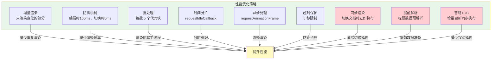

### 1. 增量渲染

**核心机制**：
```javascript
// 检测变化
const changes = this.#detectChanges(markdown);

// 只处理变化的部分
if (changes.codeBlocksChanged) {
    this.highlightCodeBlocks(codeBlocks);
}

if (changes.mermaidBlocksChanged) {
    this.renderMermaidChartsBlocks(mermaidBlocks);
}

if (changes.headingsChanged) {
    this.state.setState({ headings: Array.from(headings) });
}
```

**性能对比**：

| 场景 | 全量渲染 | 增量渲染 | 提升 |
|------|---------|---------|------|
| 编辑纯文本 | 重新高亮所有代码 + 重新渲染所有图表 | 跳过代码高亮和图表渲染 | 90%+ |
| 修改代码块 | 重新高亮所有代码 | 只高亮变化的代码块 | 80%+ |
| 修改 Mermaid | 重新渲染所有图表 | 只渲染变化的图表 | 85%+ |
| 大型文档（100+ 代码块） | 每次都处理 100+ 代码块 | 只处理变化的 1-2 个 | 95%+ |

### 2. 智能防抖策略

**根据场景选择不同的防抖延迟**：

```javascript
// 编辑时：100ms 防抖，减少频繁渲染
updatePreview() {
    const content = this.state.get('content');
    const lastRendered = this.state.get('lastRenderedContent');
    
    if (content === lastRendered && lastRendered !== '') return;
    
    this._scheduleRender(content, 100);  // 100ms 防抖
}

// 切换文档时：立即同步渲染，无延迟
forceUpdatePreview() {
    const content = doc.content || '';
    
    // 取消之前的渲染任务
    if (this.renderTimeout) {
        clearTimeout(this.renderTimeout);
        this.renderTimeout = null;
    }
    
    // 立即渲染（不使用 setTimeout）
    this.renderContent(content);
    this.state.updateLastRenderedContent(content);
}
```

**性能提升**：
- 编辑时：减少渲染次数，避免卡顿
- 切换文档时：消除 4-10ms 的 setTimeout 延迟，立即显示内容

### 3. 标题数据提前解析

**核心思想**：在 DOM 渲染前就从 Markdown 源文本中解析标题数据，让 TOC 组件无需等待 DOM 渲染完成。

**实现**：
```javascript
renderContent(markdown) {
    const changes = this.#detectChanges(markdown);
    
    // 提前更新标题数据（在HTML渲染前）
    if (changes.headingsChanged) {
        this.#updateHeadingsSync(markdown);
    }
    
    // 渲染 Markdown 为 HTML
    const html = this.renderMarkdown(markdown);
    
    // 智能更新 DOM
    this.#updateDOMSmart(html, changes);
}

#updateHeadingsSync(markdown) {
    const regex = /^(#{1,6})\s+(.+)$/gm;
    const headingsData = [];
    let match, index = 0;
    
    while ((match = regex.exec(markdown)) !== null) {
        const level = match[1].length;
        const text = match[2].trim();
        const id = 'heading-' + index;
        
        // 构造虚拟的 heading 对象
        headingsData.push({
            tagName: 'H' + level,
            textContent: text,
            id: id,
            level: level
        });
        index++;
    }
    
    // 立即同步更新 state，TOC 可以立即获取数据
    this.state.setState({ headings: headingsData });
}
```

**性能提升**：
- TOC 不需要等待 DOM 渲染完成
- 标题数据从 Markdown 源文本中解析，更快速
- 状态更新提前，TOC 可以更早开始渲染
- **减少 5-10ms 延迟**

### 4. TOC 智能更新策略

**根据场景选择同步或异步**：

```javascript
generateTOC() {
    const headings = this.state.get('headings');
    const headingCount = headings ? headings.length : 0;
    
    if (headingCount === 0) {
        this.container.innerHTML = `<p class="md-empty-state">暂无目录</p>`;
        return;
    }
    
    const currentItems = this.container.querySelectorAll('.md-toc-item');
    const needsFullRebuild = currentItems.length !== headingCount;
    
    if (needsFullRebuild) {
        // 完全重建时使用 RAF 避免阻塞
        this.animationFrameId = requestAnimationFrame(() => {
            this._rebuildTOC(headings);
        });
    } else {
        // 增量更新直接同步执行，不使用 RAF
        this._updateTOC(headings, currentItems);
    }
}
```

**性能提升**：
- 增量更新（最常见的情况）立即完成，无延迟
- 只有完全重建（较少见）才使用 RAF
- **减少 16ms 的 requestAnimationFrame 延迟**

### 5. 切换文档性能优化总结

**优化前的流程**：
```
切换文档
  ↓
Editor 立即加载 (0ms)
  ↓
Preview._scheduleRender(content, 0)
  ↓
setTimeout(..., 0ms) 延迟 (4-10ms)
  ↓
renderContent()
  ↓
渲染 HTML → DOM
  ↓
提取 headings (查询 DOM)
  ↓
更新 state.headings
  ↓
TOC.generateTOC()
  ↓
requestAnimationFrame() 延迟 (16ms)
  ↓
TOC 渲染完成

总延迟: 20-50ms
```

**优化后的流程**：
```
切换文档
  ↓
Editor 立即加载 (0ms)
  ↓
Preview.forceUpdatePreview()
  ↓
立即同步执行 renderContent()
  ↓
从 Markdown 源文本解析标题 (1-2ms)
  ↓
更新 state.headings (同步)
  ↓
TOC.generateTOC()
  ↓
增量更新（同步执行，无 RAF）
  ↓
TOC 渲染完成 (1-2ms)
  ‖ (并行)
  ↓
渲染 HTML → DOM (5-10ms)

总延迟: 5-10ms
```

**性能提升**：
| 指标 | 优化前 | 优化后 | 提升 |
|------|--------|--------|------|
| Preview 延迟 | ~4-10ms | 0ms | **消除延迟** |
| 标题数据获取 | 等待 DOM 渲染 | 从源文本解析 | **提前 5-10ms** |
| TOC 渲染延迟 | ~16ms (RAF) | 0ms (同步) | **消除延迟** |
| **总延迟** | **20-50ms** | **5-10ms** | **60-80% 提升** |

### 2. 防抖机制

**渲染防抖**：
```javascript
updatePreview() {
    this._scheduleRender(content, 100);  // 100ms 防抖
}
```

**作用**：
- 减少渲染次数
- 避免频繁更新
- 提升性能

### 3. 批处理

**代码高亮批处理**：
```javascript
const BATCH_SIZE = 5;
const batch = codeBlocks.slice(index, index + BATCH_SIZE);
```

**时间分片**：
```javascript
requestIdleCallback(processBatch, { timeout: 50 });
```

### 4. 懒加载

**Mermaid 按需渲染**：
```javascript
const isRendering = this.state.get('isRenderingMermaid');
if (isRendering) return;  // 正在渲染，跳过
```

---

## 代码高亮与 Mermaid 渲染对比

Preview 组件中，代码高亮（Prism）和 Mermaid 图表渲染采用了相似的**可见性优先 + 延迟渲染**策略，但由于两者特性不同，实现细节也有差异。

### 核心策略对比

| 策略 | 代码高亮 | Mermaid | 一致性 |
|------|---------|---------|--------|
| **可见性检测** | IntersectionObserver | IntersectionObserver | ✅ 完全一致 |
| **优先渲染可见元素** | ✅ | ✅ | ✅ 完全一致 |
| **延迟渲染不可见元素** | ✅ 2 秒 | ✅ 2 秒 | ✅ 完全一致 |
| **状态标记** | prism-highlighted | mermaid-done/pending/error | ⚠️ 类似但不同 |
| **增量更新** | ✅ 哈希比较 | ✅ 哈希比较 | ✅ 完全一致 |
| **降级方案** | ✅ 批处理 | ✅ 批处理 | ✅ 完全一致 |

### 详细差异对比

#### 1. API 类型

| 特性 | 代码高亮 | Mermaid |
|------|---------|---------|
| **API 类型** | 同步 | 异步（Promise） |
| **调用方式** | `Prism.highlightElement(block)` | `mermaid.run({ nodes: containers })` |
| **返回值** | 无（直接修改 DOM） | Promise |
| **渲染速度** | 毫秒级 | 秒级（可能） |

**影响**：
- 代码高亮：同步操作，速度快，不需要超时保护
- Mermaid：异步操作，可能慢，需要超时保护

#### 2. DOM 操作

| 特性 | 代码高亮 | Mermaid |
|------|---------|---------|
| **DOM 结构变化** | 保持 `<pre><code>` | 替换为 `<div class="mermaid">` |
| **操作方式** | 修改 `<code>` 内容 | 替换整个 `<pre>` 元素 |
| **原始内容保留** | ❌ 直接修改 | ✅ 保留在 `data-mermaid` 属性 |

**代码高亮 DOM 变化**：
```html
<!-- 渲染前 -->
<pre><code class="language-javascript">console.log('Hello');</code></pre>

<!-- 渲染后 -->
<pre><code class="language-javascript prism-highlighted">
    <span class="token console">console</span>
    <span class="token punctuation">.</span>
    <span class="token log">log</span>
    <!-- ... -->
</code></pre>
```

**Mermaid DOM 变化**：
```html
<!-- 渲染前 -->
<pre><code class="language-mermaid">graph TD; A-->B;</code></pre>

<!-- 渲染后（DOM 结构完全改变） -->
<div class="mermaid mermaid-done" data-mermaid="graph TD; A-->B;">
    <svg>...</svg>
</div>
```

#### 3. 超时机制

| 特性 | 代码高亮 | Mermaid |
|------|---------|---------|
| **超时机制** | ❌ 无 | ✅ 5 秒超时 |
| **超时原因** | 同步快速操作 | 异步可能卡住 |
| **超时反馈** | - | 显示"图表渲染超时" |
| **定时器管理** | - | 需要清理多个定时器 |

**为什么代码高亮不需要超时**？
- ✅ 同步操作，速度快（毫秒级）
- ✅ 不会卡住主线程
- ✅ 失败影响小（只是没有颜色）

**为什么 Mermaid 需要超时**？
- ⚠️ 异步操作，速度慢（可能秒级）
- ⚠️ 可能卡住（复杂图表、语法错误）
- ⚠️ 失败影响大（看不到图表）

#### 4. 错误处理

| 特性 | 代码高亮 | Mermaid |
|------|---------|---------|
| **错误捕获** | try-catch | Promise.catch |
| **用户反馈** | ❌ 无（仅日志） | ✅ 显示错误信息 |
| **错误状态** | ❌ 无 | ✅ render-error |
| **错误日志** | console.warn | console.warn + 详情 |

**代码高亮错误处理**：
```javascript
try {
    Prism.highlightElement(block);
    block.classList.add('prism-highlighted');
} catch (err) {
    console.warn('代码高亮失败:', err);
    block.classList.add('prism-highlighted');  // 仍然标记为已处理
}
```

**Mermaid 错误处理**：
```javascript
mermaid.run({ nodes: containers })
    .then(() => {
        clearTimeout(timeoutId);
        containers.forEach(c => c.classList.add('mermaid-done'));
    })
    .catch(err => {
        clearTimeout(timeoutId);
        console.warn('Mermaid 渲染失败:', err);
        containers.forEach(c => {
            c.textContent = '图表渲染失败: ' + err.message;  // 用户可见
            c.classList.add('render-error');
        });
    });
```

#### 5. 批量处理

| 特性 | 代码高亮 | Mermaid |
|------|---------|---------|
| **批量大小** | 30 个/批 | 全部 |
| **分批策略** | ✅ 分批处理 | ❌ 一次性处理 |
| **调度方式** | requestIdleCallback | mermaid.run |
| **防重复** | ❌ | ✅ 状态检查 |

**代码高亮批处理**：
```javascript
#highlightCodeBatch(blocks) {
    const BATCH_SIZE = 30;  // 每批 30 个
    let index = 0;

    const processBatch = () => {
        const end = Math.min(index + BATCH_SIZE, blocks.length);
        while (index < end) {
            this.#highlightSingleBlock(blocks[index]);
            index++;
        }

        if (index < blocks.length) {
            requestIdleCallback(processBatch, { timeout: 100 });
        }
    };

    requestAnimationFrame(processBatch);
}
```

**Mermaid 批处理**：
```javascript
#renderMermaidBatch(blocks) {
    if (this.state.get('isRenderingMermaid')) return;  // 防止重复
    
    this.state.setRenderingState(true);
    const containers = blocks.map(block => this.#createMermaidDiv(block)).filter(Boolean);

    // 一次性渲染所有图表
    mermaid.run({ nodes: containers })
        .then(() => {
            this.#handleMermaidSuccess(containers, timeoutId);
            this.state.setRenderingState(false);
        })
        .catch(err => {
            this.#handleMermaidError(containers, timeoutId, err);
            this.state.setRenderingState(false);
        });
}
```

**为什么代码高分批，Mermaid 不分批**？
- 代码高亮：同步操作，分批避免阻塞主线程
- Mermaid：异步操作，mermaid.run 内部已优化

#### 6. 状态管理

| 特性 | 代码高亮 | Mermaid |
|------|---------|---------|
| **状态类数量** | 1 个 | 3 个 |
| **状态类** | prism-highlighted | mermaid-pending/done/error |
| **状态集合** | #pendingCodeBlocks | #pendingMermaidBlocks |
| **状态转换** | 简单 | 复杂（含错误） |

**代码高亮状态转换**：
```
未处理 → pendingCodeBlocks → (滚动到可见) → prism-highlighted
```

**Mermaid 状态转换**：
```
未处理 → mermaid-pending → pendingMermaidBlocks
         ↓
       (滚动到可见或 2 秒后)
         ↓
    mermaid.run()
         ↓
    成功: mermaid-done
    失败: render-error
    超时: render-error
```

#### 7. 初始化

| 特性 | 代码高亮 | Mermaid |
|------|---------|---------|
| **初始化** | ❌ 无需 | ✅ 必需 |
| **配置** | ❌ 无 | ✅ 主题、安全级别 |
| **状态管理** | ❌ 无 | ✅ mermaidInitialized |

**代码高亮**：
```javascript
// 直接使用，无需初始化
import Prism from 'prismjs';
Prism.highlightElement(block);
```

**Mermaid**：
```javascript
// 需要预初始化
initMermaid() {
    if (this.mermaidInitialized) return;
    mermaid.initialize({
        startOnLoad: false,
        theme: theme === 'dark' ? 'dark' : 'default',
        securityLevel: 'loose',
        logLevel: 'error'
    });
    this.mermaidInitialized = true;
}
```

### 性能优化对比

| 优化技术 | 代码高亮 | Mermaid |
|---------|---------|---------|
| **可见性检测** | ✅ IntersectionObserver | ✅ IntersectionObserver |
| **延迟渲染** | ✅ 2 秒 | ✅ 2 秒 |
| **分批处理** | ✅ BATCH_SIZE = 30 | ❌ 一次性 |
| **空闲时处理** | ✅ requestIdleCallback | ❌ |
| **超时保护** | ❌ | ✅ 5 秒 |
| **DOM 复用** | ✅ 哈希比较 | ✅ 哈希比较 |
| **状态标记** | ✅ prism-highlighted | ✅ mermaid-done/pending/error |

### 一致性总结

**相同点 ✅**（70% 一致性）：
1. **核心策略一致**：可见性优先 + 延迟渲染
2. **使用相同的工具**：IntersectionObserver
3. **延迟时间一致**：都是 2 秒
4. **状态管理模式相似**：pending + done
5. **增量更新**：都使用哈希比较复用元素
6. **降级方案**：都有无 Observer 时的批量处理

**差异点 ⚠️**（30% 差异）：
1. **API 类型**：同步 vs 异步
2. **DOM 操作**：修改内容 vs 替换元素
3. **超时机制**：无 vs 5 秒超时
4. **错误处理**：简单 vs 复杂（用户可见）
5. **批量策略**：分批 vs 一次性
6. **状态管理**：单一 vs 多状态

### 设计合理性分析

**代码高亮设计：✅ 合理**
- 同步快速操作，无需复杂机制
- 分批处理避免阻塞主线程
- 简单的错误处理足够（失败影响小）

**Mermaid 设计：✅ 合理**
- 异步慢速操作，需要超时保护
- 详细的错误处理提升用户体验
- 状态管理更复杂但必要（失败影响大）

### 结论

**整体一致性：70%**

代码高亮和 Mermaid 渲染在**核心策略上是一致的**（可见性优先 + 延迟渲染），差异主要源于它们各自的特性：

- **代码高亮**：同步、轻量、快速 → 简单机制
- **Mermaid**：异步、重量、慢速 → 复杂机制

这种差异是**合理且必要的**，不是不一致的问题。两者都针对自己的特性做了最优的设计，共同构成了 Preview 组件的高效渲染体系。

---

## 总结

Preview 组件的渲染实现是一个复杂但高效的过程，它通过以下策略确保性能和用户体验：

### 核心优化策略

1. **增量渲染**：只重新渲染变化的部分，保留未变化的渲染结果（90%+ 性能提升）
2. **智能防抖**：编辑时 100ms 防抖，切换文档时立即渲染
3. **批处理**：分时处理避免阻塞主线程
4. **异步处理**：requestAnimationFrame 确保流畅渲染
5. **超时保护**：防止 Mermaid 渲染卡死
6. **错误处理**：优雅处理各种异常情况

### 最新性能优化（2026-01）

7. **同步渲染**：切换文档时移除 setTimeout 延迟，立即执行渲染
8. **提前解析标题**：在 DOM 渲染前从 Markdown 源文本解析标题数据
9. **智能 TOC 更新**：增量更新同步执行，完全重建才使用 RAF
10. **可见性优先渲染**：使用 IntersectionObserver 优先渲染可见元素，延迟渲染不可见元素
11. **重新渲染修复**：编辑代码块和 Mermaid 图表后正确重新渲染，清除渲染状态

### 性能提升效果

| 场景 | 优化前 | 优化后 | 提升幅度 |
|------|--------|--------|----------|
| 编辑纯文本 | 重新渲染所有内容 | 只渲染变化部分 | **90%+** |
| 修改代码块 | 重新高亮所有代码 | 只高亮变化代码块 | **80%+** |
| 修改 Mermaid | 重新渲染所有图表 | 只渲染变化图表 | **85%+** |
| 大型文档（100+ 代码块） | 处理 100+ 代码块 | 只处理 1-2 个 | **95%+** |
| 大文件初始渲染 | 渲染所有代码块和图表 | 只渲染可见部分 | **80%+** |
| **切换文档** | **20-50ms 延迟** | **5-10ms 延迟** | **60-80%** |

### 技术亮点

- **状态驱动 UI**：通过观察者模式实现组件解耦
- **增量渲染机制**：智能变化检测和 DOM 保留
- **性能优化分层**：从算法到渲染的全方位优化
- **用户体验优先**：切换文档时立即响应，编辑时平滑防抖
- **可见性优先渲染**：IntersectionObserver 实现懒加载，大文件性能提升 80%+
- **智能重新渲染**：编辑后正确清除渲染状态，确保内容更新

这些优化策略使得 Preview 组件能够高效地渲染大型 Markdown 文档，同时保持良好的用户体验。增量渲染机制、可见性优先渲染和最新的同步渲染优化是核心，它们通过智能变化检测、DOM 保留、可见性检测和提前数据准备，实现了显著的性能提升。
