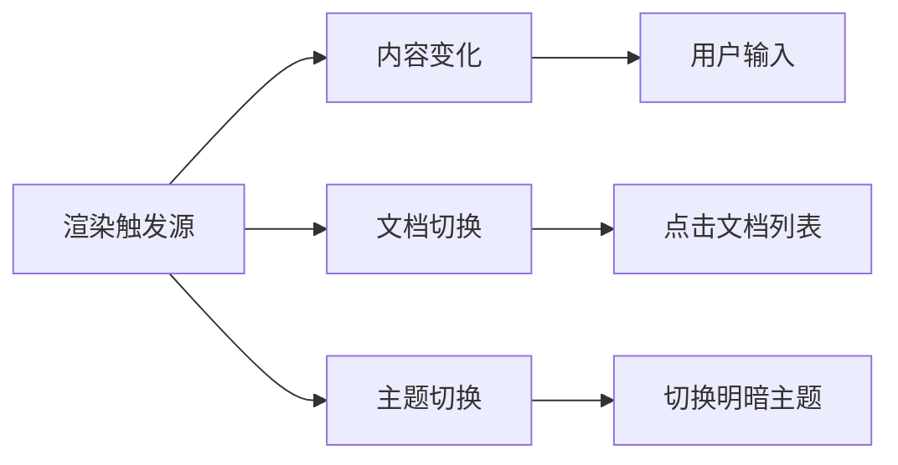
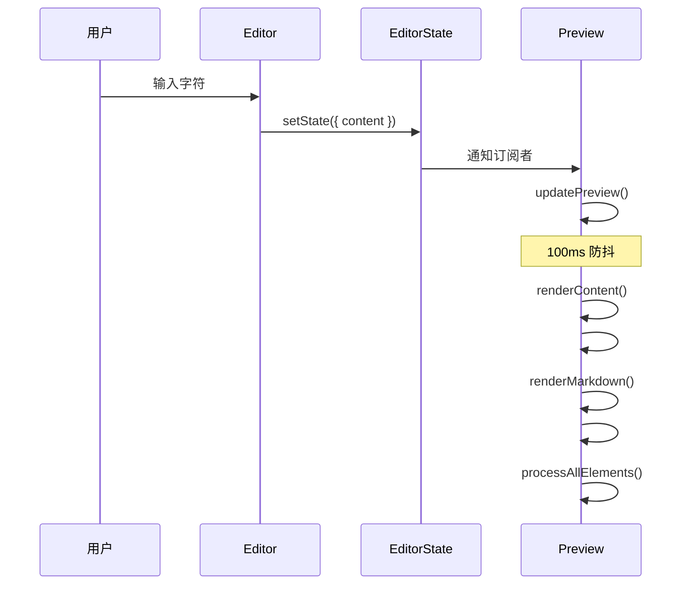
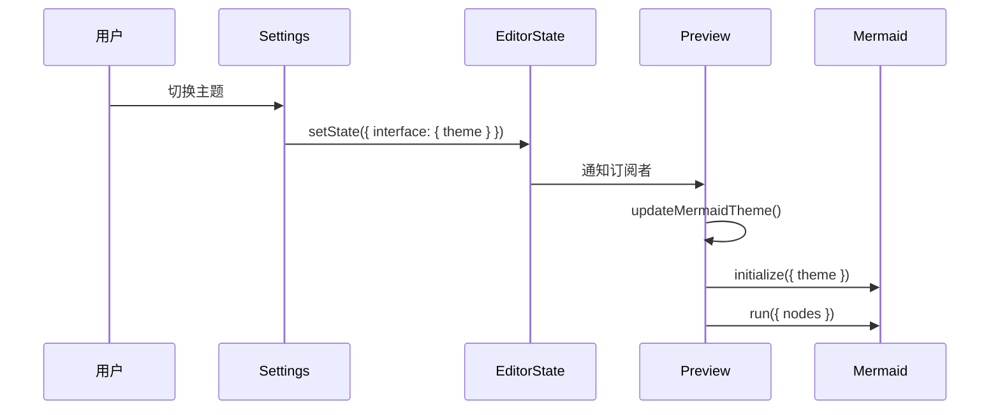
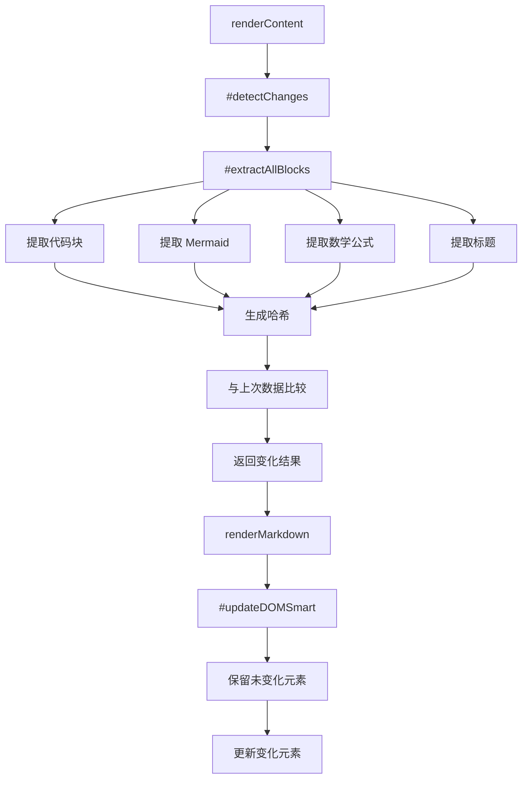
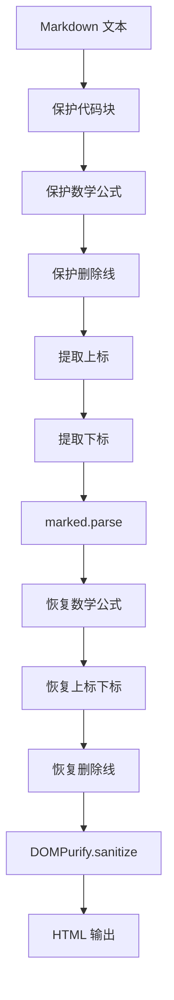
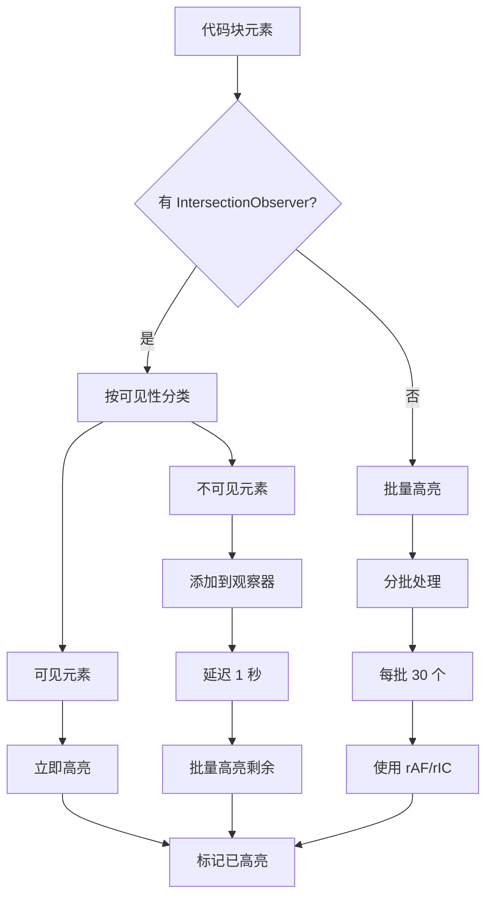
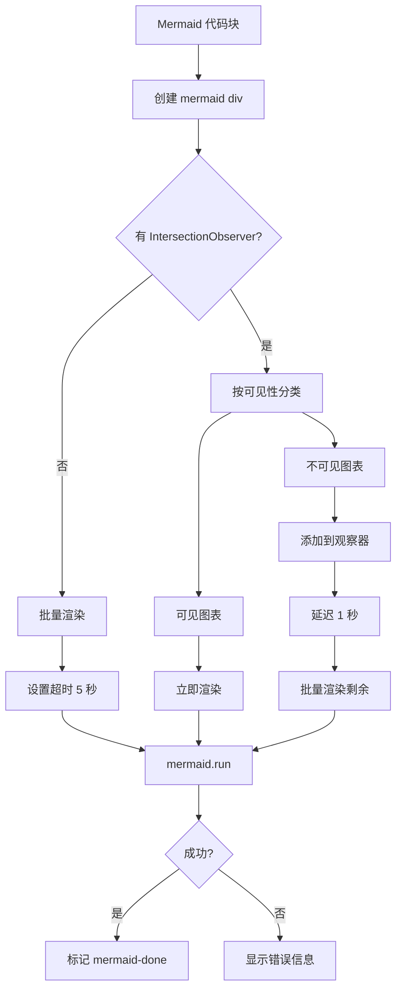
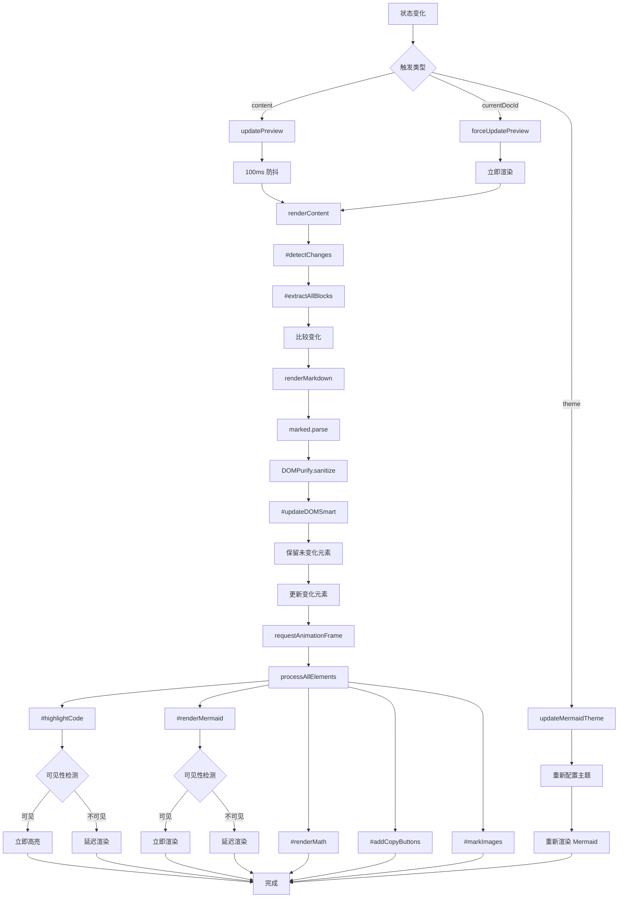

# Preview 组件渲染实现详解

## 📋 目录

- [概述](#概述)
- [组件结构](#组件结构)
- [渲染触发机制](#渲染触发机制)
- [增量渲染机制](#增量渲染机制)
- [渲染流程详解](#渲染流程详解)
  - [1. Markdown 渲染](#1-markdown-渲染)
  - [2. 代码高亮渲染](#2-代码高亮渲染)
  - [3. Mermaid 图表渲染](#3-mermaid-图表渲染)
  - [4. 数学公式渲染](#4-数学公式渲染)
  - [5. 复制按钮添加](#5-复制按钮添加)
  - [6. 图片处理](#6-图片处理)
  - [7. 链接处理](#7-链接处理)
- [可见性优化](#可见性优化)
- [导出功能](#导出功能)
- [性能优化策略](#性能优化策略)
- [完整渲染流程图](#完整渲染流程图)

---

## 概述

Preview 组件是 Markdown 编辑器的核心渲染引擎，负责将用户输入的 Markdown 文本转换为可视化的 HTML 内容。它集成了多个第三方库来实现完整的渲染功能。

### 核心依赖

```javascript
import { marked } from 'marked';        // Markdown 解析器
import DOMPurify from 'dompurify';       // HTML 净化器
import Prism from 'prismjs';             // 代码高亮库
import mermaid from 'mermaid';           // 图表渲染库
import katex from 'katex';               // 数学公式渲染库
import { BaseComponent } from './BaseComponent.js';
import { dom } from '../utils/dom.js';
```

### 主要职责

1. **Markdown → HTML 转换**：使用 `marked` 库将 Markdown 文本解析为 HTML
2. **HTML 安全净化**：使用 `DOMPurify` 清除潜在的 XSS 攻击
3. **代码语法高亮**：使用 `Prism` 为代码块添加语法高亮
4. **Mermaid 图表渲染**：将 Mermaid 代码块渲染为可视化图表
5. **数学公式渲染**：使用 `KaTeX` 渲染 LaTeX 数学公式
6. **交互功能**：添加代码复制按钮、图片错误处理、链接处理
7. **导出功能**：支持导出为 HTML、Markdown、PDF

---

## 组件结构

### 私有字段

```javascript
export class Preview extends BaseComponent {
    // ==================== 私有字段声明 ====================
    
    /** @private */
    #lastRenderedData;              // 增量渲染：存储上次渲染的数据
    /** @private */
    #mermaidTimeoutIds = [];        // Mermaid 超时定时器 ID 集合
    /** @private */
    #intersectionObserver = null;   // 可见性观察器
    /** @private */
    #pendingCodeBlocks = new Set(); // 待处理的代码块
    /** @private */
    #pendingMermaidBlocks = new Set(); // 待处理的 Mermaid 块
    /** @private */
    #mermaidRenderTimer = null;     // Mermaid 渲染定时器
    /** @private */
    #codeHighlightTimer = null;     // 代码高亮定时器
}
```

### 公共字段

```javascript
    // ==================== 公共字段 ====================
    
    mermaidInitialized = false;  // Mermaid 初始化状态
    renderTimeout = null;        // 渲染防抖定时器
```

### 增量渲染数据结构

```javascript
this.#lastRenderedData = {
    markdown: '',              // 上次渲染的 Markdown 文本
    codeBlocks: new Map(),     // hash -> { lang, code, index }
    mermaidBlocks: new Map(),  // hash -> { code, index }
    mathBlocks: new Map(),     // hash -> { latex, displayMode, index }
    headings: []               // [{ level, text }]
};
```

---

## 渲染触发机制

### 触发源概览

Preview 组件有三种主要的渲染触发源：



### 状态订阅实现

```javascript
subscribe() {
    // 订阅内容、当前文档和主题变化
    this.unsubscribe = this.state.subscribeTo(
        ['content', 'currentDocId', 'theme'],
        (newValue, oldValue, key) => {
            if (key === 'content') {
                this.updatePreview();           // 内容变化
            } else if (key === 'currentDocId') {
                this.forceUpdatePreview();      // 切换文档
            } else if (key === 'theme') {
                this.updateMermaidTheme();      // 主题切换
            }
        }
    );
}
```

### 1. 内容变化触发

**触发流程**：



**代码实现**：

```javascript
updatePreview() {
    const content = this.state.get('content');
    const lastRendered = this.state.get('lastRenderedContent');

    // 避免重复渲染
    if (content === lastRendered && lastRendered !== '') return;

    this._scheduleRender(content, 100);
}

_scheduleRender(content, delay = 100) {
    if (this.renderTimeout) {
        clearTimeout(this.renderTimeout);
    }

    this.renderTimeout = setTimeout(() => {
        this.renderContent(content);
        this.state.updateLastRenderedContent(content);
        this.renderTimeout = null;
    }, delay);
}
```

### 2. 文档切换触发

**触发流程**：


**代码实现**：

**DocumentTree 组件**：
```javascript
// DocumentTree.js
handleOpen(docId) {
    const documents = this.state.get('documents');
    const doc = documents.find(d => d.id === docId);
    
    if (!doc) return;
    
    if (doc.type === 'folder') {
        // 切换文件夹展开状态
        this.setFolderExpanded(docId, !this.isFolderExpanded(docId));
    } else {
        // 切换到文档
        this.state.setCurrentDocument(doc);
    }
}
```

**State 模块**：
```javascript
// state.js
setCurrentDocument(doc) {
    const updates = {
        currentDocId: doc.id,
        content: doc.content || ''
    };
    
    this.setState(updates);
}
```

**Preview 组件原型**：
```javascript
forceUpdatePreview() {
    const currentDocId = this.state.get('currentDocId');
    if (!currentDocId) return;

    const documents = this.state.get('documents');
    const doc = documents.find(d => d.id === currentDocId);
    if (!doc || doc.type === 'folder') return;

    // 切换文档时立即同步渲染，无延迟
    const content = doc.content || '';

    // 取消之前的渲染任务
    if (this.renderTimeout) {
        clearTimeout(this.renderTimeout);
        this.renderTimeout = null;
    }

    // 立即渲染
    this.renderContent(content);
    this.state.updateLastRenderedContent(content);
}
```

### 3. 主题切换触发

**触发流程**：



**代码实现**：

```javascript
updateMermaidTheme() {
    this.#configureMermaid(this.state.get('interface').theme);

    // 使用 dom.js 统一查询，重新渲染已有的 Mermaid 图表
    const mermaidDivs = dom.getAllIn(this.container, 'div.mermaid[data-mermaid]');
    if (mermaidDivs.length === 0) return;

    const containers = [];
    mermaidDivs.forEach(oldDiv => {
        const code = oldDiv.getAttribute('data-mermaid');
        if (!code) return;

        const newDiv = document.createElement('div');
        newDiv.className = 'mermaid';
        newDiv.textContent = code;
        newDiv.setAttribute('data-mermaid', code);

        oldDiv.replaceWith(newDiv);
        containers.push(newDiv);
    });

    if (containers.length > 0) {
        mermaid.run({ nodes: containers }).catch(err => {
            console.warn('Mermaid 主题切换失败:', err);
        });
    }
}

#configureMermaid(theme) {
    mermaid.initialize({
        startOnLoad: false,
        theme: theme === 'dark' ? 'dark' : 'default',
        securityLevel: 'loose',
        logLevel: 'error'
    });
}
```

---

## 增量渲染机制

### 核心思想

通过哈希比较检测内容变化，只重新渲染变化的部分，保留未变化的元素。

### 变化检测流程



### 代码实现

**1. 提取所有块**：

```javascript
#extractAllBlocks(markdown) {
    const result = {
        codeBlocks: new Map(),
        mermaidBlocks: new Map(),
        mathBlocks: new Map(),
        headings: []
    };

    let codeIndex = 0, mermaidIndex = 0, mathIndex = 0;

    // 收集所有代码区域的范围
    const codeRanges = [];

    // 提取代码块
    const codeRegex = /```(\w*)\n([\s\S]*?)```/g;
    let match;
    while ((match = codeRegex.exec(markdown)) !== null) {
        const [fullMatch, lang = 'text', code] = match;
        codeRanges.push([match.index, match.index + fullMatch.length]);

        const hash = this.#generateSimpleHash(lang + code);
        if (lang === 'mermaid') {
            const trimmedCode = code.trim();
            const mermaidHash = this.#generateSimpleHash(trimmedCode);
            result.mermaidBlocks.set(mermaidHash, { code: trimmedCode, index: mermaidIndex++ });
        } else {
            result.codeBlocks.set(hash, { lang, code, index: codeIndex++ });
        }
    }

    // 提取行内代码
    const inlineCodeRegex = /`[^`\n]+?`/g;
    while ((match = inlineCodeRegex.exec(markdown)) !== null) {
        const pos = match.index;
        if (!codeRanges.some(([start, end]) => pos >= start && pos < end)) {
            codeRanges.push([pos, pos + match[0].length]);
        }
    }

    // 排序范围数组以便二分查找
    codeRanges.sort((a, b) => a[0] - b[0]);

    // 辅助函数：使用二分查找检查位置是否在代码区域
    const isInCode = pos => {
        let left = 0, right = codeRanges.length - 1;
        while (left <= right) {
            const mid = (left + right) >> 1;
            const [start, end] = codeRanges[mid];
            if (pos >= start && pos < end) return true;
            if (pos < start) right = mid - 1;
            else left = mid + 1;
        }
        return false;
    };

    // 提取数学公式（块级和行内）
    const blockMathRegex = /\$\$([\s\S]*?)\$\$/g;
    while ((match = blockMathRegex.exec(markdown)) !== null) {
        if (!isInCode(match.index)) {
            const hash = this.#generateSimpleHash(match[1].trim());
            result.mathBlocks.set(hash, {
                latex: match[1].trim(),
                displayMode: true,
                index: mathIndex++
            });
        }
    }

    const inlineMathRegex = /\$([^$\n]+?)\$/g;
    while ((match = inlineMathRegex.exec(markdown)) !== null) {
        if (!isInCode(match.index)) {
            const hash = this.#generateSimpleHash(match[1].trim());
            result.mathBlocks.set(hash, {
                latex: match[1].trim(),
                displayMode: false,
                index: mathIndex++
            });
        }
    }

    // 提取标题
    const lines = markdown.split('\n');
    let inCodeBlock = false;
    for (const line of lines) {
        if (line.trim().startsWith('```')) {
            inCodeBlock = !inCodeBlock;
            continue;
        }
        if (inCodeBlock) continue;

        const headingMatch = line.match(/^(#{1,6})\s+(.+)$/);
        if (headingMatch) {
            result.headings.push({
                level: headingMatch[1].length,
                text: headingMatch[2]
            });
        }
    }

    return result;
}
```

**2. 检测变化**：

```javascript
#detectChanges(newMarkdown) {
    const oldData = this.#lastRenderedData;

    // 单次扫描提取所有数据
    const extracted = this.#extractAllBlocks(newMarkdown);

    // 比较变化
    return {
        codeBlocksChanged: !this.#areMapsEqual(oldData.codeBlocks, extracted.codeBlocks),
        mermaidBlocksChanged: !this.#areMapsEqual(oldData.mermaidBlocks, extracted.mermaidBlocks),
        mathBlocksChanged: !this.#areMapsEqual(oldData.mathBlocks, extracted.mathBlocks),
        headingsChanged: !this.#areArraysEqual(oldData.headings, extracted.headings),
        newCodeBlocks: extracted.codeBlocks,
        newMermaidBlocks: extracted.mermaidBlocks,
        newMathBlocks: extracted.mathBlocks,
        newHeadings: extracted.headings
    };
}
```

**3. 智能更新 DOM**：

```javascript
#updateDOMSmart(newHTML, changes) {
    // 首次渲染，使用 innerHTML（性能更好）
    if (!this.#lastRenderedData.markdown) {
        this.container.innerHTML = newHTML;
        this.#updateHeadingIds();
        return;
    }

    // 如果所有内容都变了，直接替换
    const allChanged = changes.codeBlocksChanged && 
                      changes.mermaidBlocksChanged && 
                      changes.mathBlocksChanged;
    if (allChanged) {
        this.container.innerHTML = newHTML;
        this.#updateHeadingIds();
        return;
    }

    // 部分内容未变，使用增量更新
    const tempDiv = document.createElement('div');
    tempDiv.innerHTML = newHTML;

    // 构建旧元素的哈希映射
    const oldElements = this.#buildElementHashMaps();

    // 在新 HTML 中保留未变化的元素
    this.#preserveUnchangedElements(tempDiv, oldElements, changes);

    // 更新 DOM - 使用 replaceChildren 减少重排
    if (this.container.replaceChildren) {
        this.container.replaceChildren(...tempDiv.childNodes);
    } else {
        // 降级方案
        const fragment = document.createDocumentFragment();
        while (tempDiv.firstChild) {
            fragment.appendChild(tempDiv.firstChild);
        }
        this.container.innerHTML = '';
        this.container.appendChild(fragment);
    }

    // 更新标题 ID
    if (changes.headingsChanged) {
        this.#updateHeadingIds();
    }
}
```

---

## 渲染流程详解

### 1. Markdown 渲染

**流程图**：



**代码实现**：

```javascript
renderMarkdown(markdown) {
    try {
        const mathBlocks = [];
        const supSubBlocks = [];
        const codeBlocks = [];
        const strikeBlocks = [];

        // 按优先级处理，避免符号冲突
        let processedMarkdown = markdown
            // 第一步：保护代码块
            .replace(/```[\s\S]*?```|`[^`\n]+?`/g, match => {
                codeBlocks.push(match);
                return `\x00CODE${codeBlocks.length - 1}\x00`;
            })
            // 第二步：保护数学公式
            .replace(/\$\$([\s\S]*?)\$\$|\$([^$\n]+?)\$/g, (match, block, inline) => {
                const latex = block !== undefined ? block : inline;
                const displayMode = block !== undefined;
                mathBlocks.push({ latex, displayMode });
                return `\x02MATH${mathBlocks.length - 1}\x02`;
            })
            // 第三步：保护删除线
            .replace(/~~([^~\n]{1,200})~~/g, (match, content) => {
                strikeBlocks.push(content);
                return `\x03STRIKE${strikeBlocks.length - 1}\x03`;
            })
            // 第四步：提取上标
            .replace(/\^([^\n^]{1,50})\^/g, (match, content) => {
                supSubBlocks.push({ type: 'sup', content });
                return `\x01SUP${supSubBlocks.length - 1}\x01`;
            })
            // 第五步：提取下标
            .replace(/~([^~\n]{1,50})~/g, (match, content) => {
                supSubBlocks.push({ type: 'sub', content });
                return `\x01SUB${supSubBlocks.length - 1}\x01`;
            });

        // 恢复代码块
        processedMarkdown = processedMarkdown.replace(
            /\x00CODE(\d+)\x00/g,
            (_, i) => codeBlocks[+i]
        );

        // 使用 marked 解析
        const renderer = new marked.Renderer();
        let headingIndex = 0;

        renderer.heading = (text, level) =>
            `<h${level} id="heading-${headingIndex++}">${text}</h${level}>`;

        let html = marked.parse(processedMarkdown, { renderer, breaks: false, gfm: true });

        // 替换数学公式占位符
        html = html.replace(/\x02MATH(\d+)\x02/g, (_, index) => {
            const math = mathBlocks[+index];
            const tag = math.displayMode ? 'div' : 'span';
            const cls = math.displayMode ? 'math-block' : 'math-inline';
            return `<${tag} class="${cls}" data-latex="${math.latex}"></${tag}>`;
        });

        // 替换上标和下标占位符
        html = html.replace(/\x01(SUP|SUB)(\d+)\x01/g, (_, type, index) => {
            const item = supSubBlocks[+index];
            const tag = item.type === 'sup' ? 'sup' : 'sub';
            return `<${tag}>${item.content}</${tag}>`;
        });

        // 恢复删除线占位符
        html = html.replace(/\x03STRIKE(\d+)\x03/g, (_, index) => {
            return `<s>${strikeBlocks[+index]}</s>`;
        });

        // 净化 HTML
        html = DOMPurify.sanitize(html, {
            ALLOWED_TAGS: [
                'p', 'br', 'strong', 'em', 'code', 'pre', 'blockquote',
                'ul', 'ol', 'li', 'a', 'h1', 'h2', 'h3', 'h4', 'h5', 'h6',
                'table', 'thead', 'tbody', 'tr', 'th', 'td', 'hr', 'img',
                'input', 'span', 'div', 'dd', 'dt', 'dl', 's', 'sup', 'sub'
            ],
            ALLOWED_ATTR: [
                'href', 'src', 'alt', 'title', 'class', 'id', 'type',
                'checked', 'width', 'height', 'loading', 'colspan',
                'rowspan', 'start', 'align', 'style'
            ],
            ALLOW_DATA_ATTR: true
        });

        return html;
    } catch (e) {
        console.warn('Markdown 渲染失败:', e);
        return this.escapeHtml(markdown);
    }
}
```

### 2. 代码高亮渲染

**流程图**：



**代码实现**：

```javascript
#highlightCode(codeBlocks) {
    if (typeof Prism === 'undefined' || codeBlocks.length === 0) return;

    const blocks = Array.from(codeBlocks);

    if (!this.#intersectionObserver) {
        this.#highlightCodeBatch(blocks);
        return;
    }

    // 分离可见和不可见元素
    const { visible, invisible } = this.#partitionByVisibility(blocks);

    // 立即高亮可见元素
    visible.forEach(block => {
        if (!block.classList.contains('prism-highlighted')) {
            this.#highlightSingleBlock(block);
        }
    });

    // 监听不可见元素
    invisible.forEach(block => {
        this.#pendingCodeBlocks.add(block);
        this.#intersectionObserver.observe(block);
    });

    // 延迟渲染剩余的代码块
    if (invisible.length > 0) {
        if (this.#codeHighlightTimer) {
            clearTimeout(this.#codeHighlightTimer);
        }
        this.#codeHighlightTimer = setTimeout(() => {
            const pending = Array.from(this.#pendingCodeBlocks);
            const validPending = [];

            pending.forEach(block => {
                if (block.isConnected && !block.classList.contains('prism-highlighted')) {
                    validPending.push(block);
                } else {
                    this.#pendingCodeBlocks.delete(block);
                }
            });

            if (validPending.length > 0) {
                this.#highlightCodeBatch(validPending);
                validPending.forEach(block => {
                    this.#pendingCodeBlocks.delete(block);
                    if (this.#intersectionObserver) {
                        this.#intersectionObserver.unobserve(block);
                    }
                });
            }

            this.#codeHighlightTimer = null;
        }, 1000);
    }
}

#highlightSingleBlock(block) {
    try {
        Prism.highlightElement(block);
        block.classList.add('prism-highlighted');
    } catch (err) {
        console.warn('代码高亮失败:', err);
        block.classList.add('prism-highlighted');
    }
}

#highlightCodeBatch(blocks) {
    const BATCH_SIZE = 30;
    let index = 0;

    const processBatch = () => {
        const end = Math.min(index + BATCH_SIZE, blocks.length);

        while (index < end) {
            const block = blocks[index];
            if (!block.classList.contains('prism-highlighted')) {
                this.#highlightSingleBlock(block);
            }
            index++;
        }

        if (index < blocks.length) {
            if (typeof requestIdleCallback !== 'undefined') {
                requestIdleCallback(processBatch, { timeout: 100 });
            } else {
                setTimeout(processBatch, 16);
            }
        }
    };

    requestAnimationFrame(processBatch);
}
```

### 3. Mermaid 图表渲染

**流程图**：



**代码实现**：

```javascript
#renderMermaid(mermaidBlocks) {
    if (typeof mermaid === 'undefined' || mermaidBlocks.length === 0) return;
    if (this.container.offsetParent === null) return;

    const blocks = Array.from(mermaidBlocks);

    if (!this.#intersectionObserver) {
        this.#renderMermaidBatch(blocks);
        return;
    }

    // 转换为 mermaid div 并分类
    const divs = blocks.map(block => this.#createMermaidDiv(block)).filter(Boolean);
    const { visible, invisible } = this.#partitionByVisibility(divs);

    // 立即渲染可见图表
    if (visible.length > 0) {
        this.#renderMermaidDivs(visible);
    }

    // 监听不可见图表
    invisible.forEach(div => {
        div.classList.add('mermaid-pending');
        this.#pendingMermaidBlocks.add(div);
        this.#intersectionObserver.observe(div);
    });

    // 延迟渲染剩余的 Mermaid
    if (invisible.length > 0) {
        if (this.#mermaidRenderTimer) {
            clearTimeout(this.#mermaidRenderTimer);
        }
        this.#mermaidRenderTimer = setTimeout(() => {
            const pending = Array.from(this.#pendingMermaidBlocks);
            const validPending = [];

            pending.forEach(div => {
                if (div.isConnected) {
                    validPending.push(div);
                } else {
                    this.#pendingMermaidBlocks.delete(div);
                }
            });

            if (validPending.length > 0) {
                this.#renderMermaidDivs(validPending);
                validPending.forEach(div => {
                    div.classList.remove('mermaid-pending');
                    this.#pendingMermaidBlocks.delete(div);
                    if (this.#intersectionObserver) {
                        this.#intersectionObserver.unobserve(div);
                    }
                });
            }

            this.#mermaidRenderTimer = null;
        }, 1000);
    }
}

#createMermaidDiv(block) {
    const code = block.textContent.trim();
    if (!code) return null;

    const preElement = block.parentElement;
    if (!preElement?.parentNode) return null;

    // 如果已经是 mermaid div，清除渲染状态
    if (preElement.classList && preElement.classList.contains('mermaid')) {
        preElement.classList.remove('mermaid-done', 'mermaid-pending', 'render-error');
        preElement.textContent = code;
        preElement.setAttribute('data-mermaid', code);
        return preElement;
    }

    const mermaidDiv = document.createElement('div');
    mermaidDiv.className = 'mermaid';
    mermaidDiv.textContent = code;
    mermaidDiv.setAttribute('data-mermaid', code);

    preElement.parentNode.replaceChild(mermaidDiv, preElement);
    return mermaidDiv;
}

#renderMermaidDivs(containers) {
    if (containers.length === 0) return;

    const timeoutId = this.#setupMermaidTimeout(containers);
    this.#mermaidTimeoutIds.push(timeoutId);

    mermaid
        .run({ nodes: containers })
        .then(() => this.#handleMermaidSuccess(containers, timeoutId))
        .catch(err => this.#handleMermaidError(containers, timeoutId, err));
}

#setupMermaidTimeout(containers) {
    const timeoutId = setTimeout(() => {
        containers.forEach(c => {
            if (!c.classList.contains('mermaid-done')) {
                c.textContent = '图表渲染超时';
                c.classList.add('render-error');
            }
        });
        this.#clearMermaidTimeout(timeoutId);
    }, 5000);
    return timeoutId;
}

#handleMermaidSuccess(containers, timeoutId) {
    clearTimeout(timeoutId);
    containers.forEach(c => c.classList.add('mermaid-done'));
    this.#clearMermaidTimeout(timeoutId);
}

#handleMermaidError(containers, timeoutId, err) {
    clearTimeout(timeoutId);
    console.warn('Mermaid 渲染失败:', err);
    containers.forEach(c => {
        c.textContent = '图表渲染失败: ' + err.message;
        c.classList.add('render-error');
    });
    this.#clearMermaidTimeout(timeoutId);
}
```

### 4. 数学公式渲染

**代码实现**：

```javascript
#renderMath() {
    if (typeof katex === 'undefined') return;

    // 使用 dom.js 统一查询
    dom.getAllIn(
        this.container,
        '.math-block:not(.math-rendered), .math-inline:not(.math-rendered)'
    ).forEach(el => {
        const latex = el.getAttribute('data-latex');
        if (!latex) return;

        try {
            katex.render(latex, el, {
                displayMode: el.classList.contains('math-block'),
                throwOnError: false,
                errorColor: '#cc0000'
            });
            el.classList.add('math-rendered');
        } catch (err) {
            console.warn('KaTeX 渲染失败:', err);
            el.textContent = latex;
            el.classList.add('math-error');
        }
    });
}
```

### 5. 复制按钮添加

**代码实现**：

```javascript
#addCopyButtons(preElements) {
    if (preElements.length === 0) return;

    preElements.forEach(pre => {
        // 跳过已处理的
        if (!pre.parentNode || pre.parentElement?.classList.contains('code-block-wrapper')) {
            return;
        }

        // 创建包装器
        const wrapper = document.createElement('div');
        wrapper.className = 'code-block-wrapper';
        pre.parentNode.insertBefore(wrapper, pre);
        wrapper.appendChild(pre);

        // 添加复制按钮
        const btn = this.createElement('button', {
            className: 'md-btn md-btn-sm code-copy-btn',
            textContent: '📋',
            attributes: { title: '复制代码' },
            parent: wrapper
        });

        this.addEventListener(btn, 'click', e => {
            e.preventDefault();
            e.stopPropagation();

            const code = dom.getIn(pre, 'code');
            if (!code || btn.classList.contains('copied')) return;

            navigator.clipboard
                .writeText(code.textContent)
                .then(() => {
                    btn.innerHTML = '✓';
                    btn.classList.add('copied');
                    setTimeout(() => {
                        btn.innerHTML = '📋';
                        btn.classList.remove('copied');
                    }, 2000);
                })
                .catch(err => console.error('复制失败:', err));
        });
    });
}
```

### 6. 图片处理

**错误处理**：

```javascript
handleImageError(img) {
    img.alt = `图片加载失败: ${img.src}`;
    img.classList.add('markdown-image-error');
}

#markImages(images) {
    images.forEach(img => (img.dataset.errorHandled = 'true'));
}
```

### 7. 链接处理

**内部链接跳转**：

```javascript
#handleInternalLink(href) {
    // 移除 # 号并解码
    const targetId = decodeURIComponent(href.slice(1));

    // 查找目标元素
    let targetElement = this.container.querySelector(`[id="${CSS.escape(targetId)}"]`);

    // 如果在容器内找不到，尝试在整个文档中查找
    if (!targetElement) {
        targetElement = document.getElementById(targetId);
    }

    if (targetElement) {
        // 平滑滚动到目标元素
        targetElement.scrollIntoView({
            behavior: 'smooth',
            block: 'start'
        });

        // 更新 URL hash
        history.replaceState(null, null, href);
    } else {
        console.warn(`未找到目标元素: ${targetId}`);
    }
}
```

**事件绑定**：

```javascript
bindEvents() {
    // 图片加载错误处理
    this.addEventListener(
        this.container,
        'error',
        e => {
            if (e.target.tagName === 'IMG') {
                this.handleImageError(e.target);
            }
        },
        true
    );

    // 链接点击处理
    this.addEventListener(
        this.container,
        'click',
        e => {
            const link = e.target.closest('a');
            if (!link) return;

            const href = link.getAttribute('href');
            if (!href) return;

            // 处理内部锚点链接
            if (href.startsWith('#')) {
                e.preventDefault();
                this.#handleInternalLink(href);
                return;
            }

            // 处理外部链接：在新标签页中打开
            if (href.startsWith('http://') || href.startsWith('https://') || href.startsWith('//')) {
                e.preventDefault();
                window.open(href, '_blank', 'noopener,noreferrer');
                return;
            }
        },
        false
    );
}
```

---

## 可见性优化

### IntersectionObserver

使用 IntersectionObserver API 实现可见性检测，优先渲染可见元素。

**初始化**：

```javascript
#initIntersectionObserver() {
    if (!('IntersectionObserver' in window)) return;

    this.#intersectionObserver = new IntersectionObserver(
        entries => {
            entries.forEach(entry => {
                if (entry.isIntersecting) {
                    const element = entry.target;

                    // 处理代码高亮
                    if (element.tagName === 'CODE' && this.#pendingCodeBlocks.has(element)) {
                        this.#highlightSingleBlock(element);
                        this.#pendingCodeBlocks.delete(element);
                        this.#intersectionObserver.unobserve(element);
                    }

                    // 处理 Mermaid 渲染
                    if (element.classList.contains('mermaid-pending')) {
                        this.#renderSingleMermaid(element);
                        this.#pendingMermaidBlocks.delete(element);
                        this.#intersectionObserver.unobserve(element);
                    }
                }
            });
        },
        {
            root: null,
            rootMargin: '500px', // 提前 500px 开始渲染
            threshold: 0.01
        }
    );
}
```

**可见性检测**：

```javascript
#isElementVisible(element) {
    const rect = element.getBoundingClientRect();
    return rect.top < window.innerHeight + 200 && rect.bottom > -200;
}

#partitionByVisibility(elements) {
    const visible = [];
    const invisible = [];
    elements.forEach(el => {
        (this.#isElementVisible(el) ? visible : invisible).push(el);
    });
    return { visible, invisible };
}
```

---

## 导出功能

### 导出 HTML

```javascript
exportHTML() {
    // 直接获取预览容器中已经渲染好的 HTML
    let html = this.container.innerHTML;

    // 清理不需要的属性和类
    html = html
        .replace(/ class="prism-highlighted"/g, '')
        .replace(/ class="mermaid-done"/g, '')
        .replace(/ data-error-handled="true"/g, '')
        .replace(/ class="math-rendered"/g, '');

    const fullHtml = `<!DOCTYPE html>
<html lang="zh-CN">
<head>
<meta charset="UTF-8">
<meta name="viewport" content="width=device-width,initial-scale=1">
<title>Markdown 导出</title>
<style>
/* 样式内容 */
</style>
</head>
<body>
${html}
</body>
</html>`;

    this.downloadFile(fullHtml, 'text/html', '.html');
    this.showMessage('HTML 导出成功', 'success');
}
```

### 导出 Markdown

```javascript
exportMarkdown() {
    const content = this.state.get('content');
    this.downloadFile(content, 'text/markdown', '.md');
    this.showMessage('Markdown 导出成功', 'success');
}
```

### 导出 PDF

```javascript
exportPDF() {
    const content = this.state.get('content');
    if (!content) {
        this.showMessage('没有内容可导出', 'warning');
        return;
    }

    // 添加打印专用类
    document.body.classList.add('printing-pdf');

    // 触发浏览器打印对话框
    window
        .print()
        .then(() => {
            document.body.classList.remove('printing-pdf');
        })
        .catch(error => {
            console.error('打印失败:', error);
            document.body.classList.remove('printing-pdf');
            this.showMessage('打印失败: ' + error.message, 'error');
        });

    this.showMessage('请在打印对话框中选择"另存为 PDF"', 'info');
}
```

### 下载文件

```javascript
downloadFile(content, mimeType, extension) {
    const blob = new Blob([content], { type: mimeType + ';charset=utf-8' });
    const url = URL.createObjectURL(blob);
    const a = document.createElement('a');
    a.href = url;
    a.download = 'document-' + new Date().toISOString().slice(0, 10) + extension;
    document.body.appendChild(a);
    a.click();
    document.body.removeChild(a);
    URL.revokeObjectURL(url);
}
```

---

## 性能优化策略

### 1. 增量渲染

通过哈希比较检测变化，只重新渲染变化的部分。

### 2. 可见性优化

使用 IntersectionObserver 优先渲染可见元素，延迟渲染不可见元素。

### 3. 批量处理

使用 requestIdleCallback 或 setTimeout 分批处理大量元素。

### 4. 防抖

内容变化使用 100ms 防抖，减少渲染频率。

### 5. DOM 缓存

使用 dom.js 统一管理 DOM 元素，减少重复查询。

### 6. 智能更新

使用 replaceChildren 代替 innerHTML，减少重排。

---

## 完整渲染流程图



---

**文档版本**：2.0.0  
**最后更新**：2026-01-27  
**维护者**：Markdown Editor Team
