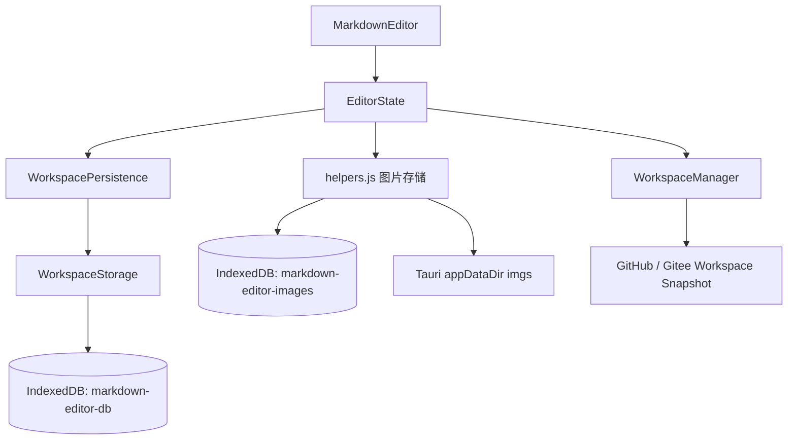
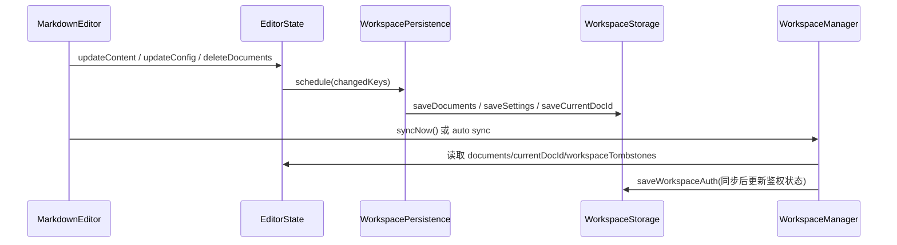
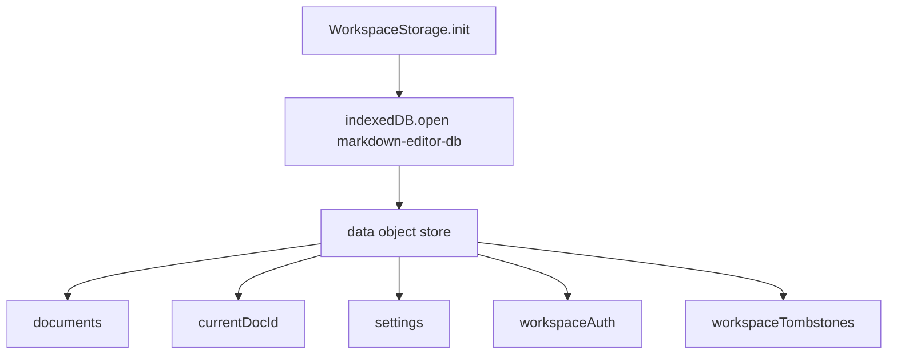
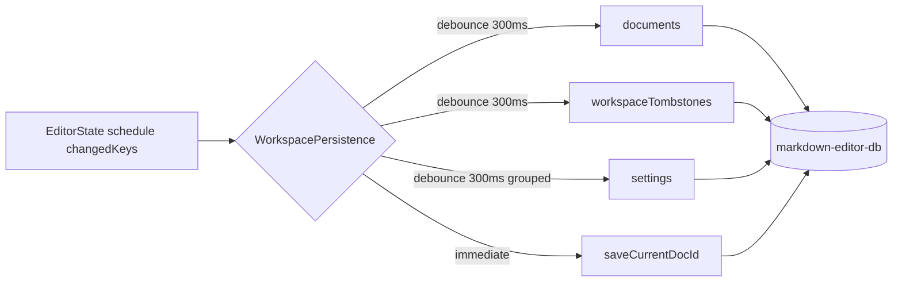
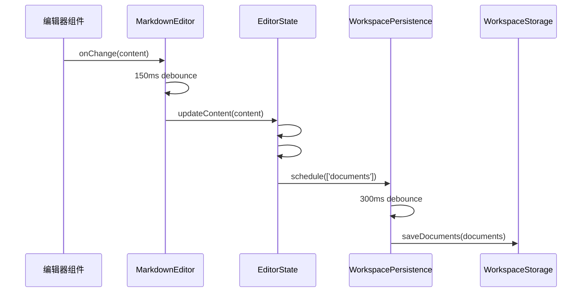
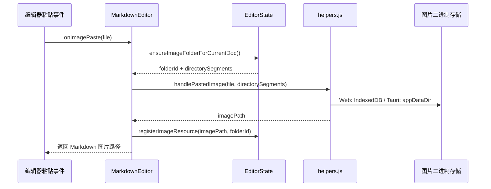
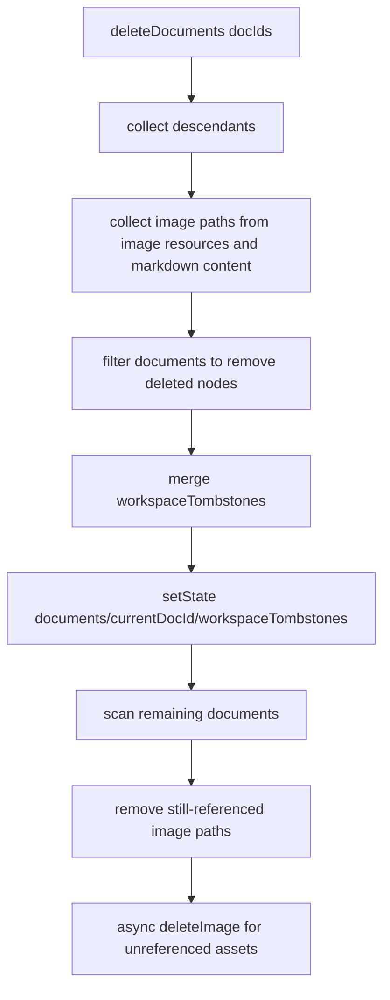
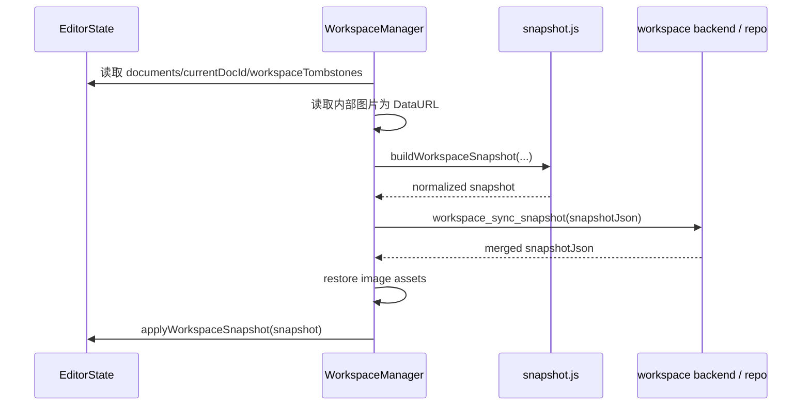

# 数据存储设计文档

## 概述

当前项目的数据存储设计，已经不再是早期那种“单纯把文档内容写进 IndexedDB”的简单模型，而是演进成了一个以 `EditorState` 为状态中心、以 `WorkspaceStorage` 为本地持久化实现、以 `WorkspacePersistence` 为调度层、以 `WorkspaceManager` 为远端同步入口的分层体系。要理解现在的存储逻辑，不能只看某一个文件，而要把 [src/MarkdownEditor.js](/e:/TOOLS/markdown/src/MarkdownEditor.js)、[src/EditorState.js](/e:/TOOLS/markdown/src/EditorState.js)、[src/workspace/WorkspaceStorage.js](/e:/TOOLS/markdown/src/workspace/WorkspaceStorage.js)、[src/workspace/WorkspacePersistence.js](/e:/TOOLS/markdown/src/workspace/WorkspacePersistence.js)、[src/workspace/WorkspaceManager.js](/e:/TOOLS/markdown/src/workspace/WorkspaceManager.js) 以及 [src/utils/helpers.js](/e:/TOOLS/markdown/src/utils/helpers.js) 一起看。它们分别负责“接收用户输入”“维护内存状态”“执行本地落盘”“合并持久化任务”“构建远端快照”和“处理图片二进制”，共同组成当前项目的完整存储路径。

从实现角度看，这个系统可以概括为三条并行但相互协作的链路。第一条是文档与设置的本地持久化链路，它使用 `markdown-editor-db` 这个 IndexedDB 数据库保存资源树、当前文档、设置和工作空间元数据。第二条是图片二进制链路，它在 Web 环境下使用独立的 `markdown-editor-images` 数据库，在 Tauri 环境下直接写入 `appDataDir()/imgs/...` 对应的文件系统路径。第三条是工作空间同步链路，它会从内存状态中构建一个包含文档、墓碑和图片 Data URL 的快照，并借助后端桥接同步到 GitHub 或 Gitee 仓库。也就是说，当前项目里的“store”已经不是单个模块，而是一整套状态到存储再到同步的协作机制。

下面这张图可以先帮助建立整体认知。它展示的不是某个类图，而是当前源码里的实际责任分层。



## 架构分层

在当前代码里，数据存储的职责划分是明确的，而且这种划分直接体现在类和模块边界上。`MarkdownEditor` 只负责接收编辑器组件的变更、做输入防抖，以及在适当的时候把变化交给状态层；`EditorState` 是整个系统唯一可信的内存状态源，所有文档、设置、选中状态、当前内容、工作空间状态都集中在这里；`WorkspacePersistence` 则不拥有状态本身，它只接收“哪些键发生了变化”这个信息，并根据配置决定哪些键立即持久化、哪些键需要防抖合并；真正和 IndexedDB 打交道的是 `WorkspaceStorage`；而 `WorkspaceManager` 负责把 `EditorState` 当前状态投影成一个可同步的快照，再交给后端桥接去和远端仓库交互。

这套设计最重要的优点，是把“状态变化”“本地落盘”“远端同步”三个动作解耦开了。比如 `EditorState.updateContent()` 并不需要关心 IndexedDB 事务如何开启，也不需要知道远端仓库是什么结构，它只需要维护好内存中的 `documents` 和 `content`。类似地，`WorkspacePersistence` 并不修改状态，它只做调度；`WorkspaceStorage` 也不决策何时保存，它只负责执行保存。这种分层方式让代码的行为更加可预测，也让文档能够按层级逐层展开分析，而不是把所有逻辑混在一起。

从源码角度来看，这种分层关系可以概括为下图所示的调用路径。这里用的是运行时调用方向，而不是静态依赖方向。



## 状态中心：EditorState

如果只从“store”这个角度选一个最核心的文件，那一定是 [src/EditorState.js](/e:/TOOLS/markdown/src/EditorState.js)。这个类不仅保存数据，还定义了什么才算“应用状态”，以及哪些状态变化应该通知 UI，哪些状态变化应该进入持久化队列。它的 `#state` 私有字段中已经包含了当前项目几乎所有关键数据，包括资源树、当前文档、当前编辑器内容、编辑器配置、界面配置、导出配置、工作空间配置、墓碑列表、标题信息和通知状态。换句话说，IndexedDB 中看到的数据，只是 `EditorState` 当前状态的一部分投影，而不是独立的数据真相来源。

`EditorState` 里最值得注意的设计点，是它把 `content` 和 `documents` 同时保留了下来。`content` 是“当前打开文件在 UI 中的即时内容镜像”，用于让编辑器和预览快速响应；而真正被持久化、被同步、被导出的文档内容，则在 `documents` 数组里对应的 `file` 资源节点上。这也是为什么 `updateContent()` 不是简单地改一个字段，而是先 `#setState({ content }, { skipPersist: true })` 更新 UI，再调用 `#updateDocumentContent()` 去同步修改 `documents`。也就是说，`content` 是显示态，`documents[*].content` 才是存储态。

当前 `EditorState` 的核心状态字段如下。这个结构并不是抽象推测，而是直接对应 `#state` 初始值和初始化逻辑。

| 键名 | 类型概念 | 说明 |
|------|----------|------|
| `documents` | `Resource[]` | 资源树扁平表，包含文件、文件夹和图片资源 |
| `currentDocId` | `string \| null` | 当前打开的资源 ID |
| `selectedDocIds` | `string[]` | 多选资源列表 |
| `lastClickedDocId` | `string \| null` | 用于 Shift 范围选择 |
| `content` | `string` | 当前文件内容的内存镜像 |
| `editor` | `object` | 编辑器配置 |
| `interface` | `object` | 界面配置 |
| `export` | `object` | 导出配置 |
| `workspace` | `object` | 工作空间同步配置和状态 |
| `workspaceTombstones` | `Array<{id, deletedAt}>` | 已删除资源的墓碑记录 |
| `headings` | `Array` | 解析出的标题信息 |
| `notification` | `object \| null` | UI 通知消息 |

### 资源模型

和旧版文档相比，当前项目最大的结构性变化之一，就是 `documents` 已经不是“文档列表”这么简单，而是统一的资源树。`EditorState.RESOURCE_TYPES` 明确定义了 `FILE`、`FOLDER` 和 `IMAGE` 三种资源类型，并且多个方法都已经围绕这个模型设计，例如 `getDocumentTree()`、`moveDocument()`、`ensureImageFolderForCurrentDoc()`、`registerImageResource()` 和 `deleteImageAsset()`。这意味着现在的左侧树不只是“文档目录”，也是图片资源和特殊文件夹的组织结构。

从源码行为推断，当前资源模型可以用下面的 TypeScript 形态来描述。这里不是项目内真实声明文件，而是对实际对象结构的贴近总结。

```typescript
interface BaseResource {
    id: string;
    name: string;
    type: 'file' | 'folder' | 'image';
    parentId: string | null;
    createdAt: string;
    updatedAt: string;
}

interface FileResource extends BaseResource {
    type: 'file';
    content: string;
}

interface FolderResource extends BaseResource {
    type: 'folder';
    folderKind?: 'images';
}

interface ImageResource extends BaseResource {
    type: 'image';
    imagePath: string;
}
```

特别需要注意的是 `folderKind === 'images'` 这一点。`EditorState.#sortDocumentNodes()` 会把这种图片文件夹优先排序到前面，而 `ensureImageFolderForCurrentDoc()` 会在当前文档所在层级自动创建或复用这样的文件夹。这说明图片资源并不是随机散落的，而是被有意识地挂载在资源树中。

### 观察者与状态更新

`EditorState` 使用了一个很轻量但非常关键的观察者模型。`subscribe()` 用于监听整个状态变化，`subscribeTo()` 则允许监听特定键。内部的 `#setState()` 会计算哪些键真正发生了变化，只对这些变化做通知，并在非 `skipPersist` 的情况下把变更键交给 `WorkspacePersistence.schedule()`。这种设计让 UI 层、同步层和持久化层都能基于同一份状态变化消息工作，而不需要互相调用。

这套机制的一个直接影响是：并不是所有状态更新都会持久化。比如 `updateActiveHeading()` 就使用 `{ skipPersist: true }`，因为目录高亮是纯 UI 状态；`updateContent()` 则先跳过 `content` 自身的持久化，再把修改转移到 `documents` 上。这种“让状态字段自己决定是否需要持久化”的设计，比传统的“每次 setState 都全量保存”更加精细，也更符合当前项目的性能目标。

## 本地存储实现：WorkspaceStorage

在本地持久化这一层，当前项目已经把旧版 `StoreManager` 收敛成了 [src/workspace/WorkspaceStorage.js](/e:/TOOLS/markdown/src/workspace/WorkspaceStorage.js) 里的 `WorkspaceStorage`。它的职责很纯粹，就是打开 IndexedDB、建立对象仓库，并通过统一的 `setData(key, value)` / `getData(key)` 读写状态投影。这个模块本身并不理解 UI、图片路径或同步策略，它只负责把明确的 key-value 数据稳定地写进本地数据库。因此，如果要回答“本地 store 究竟长什么样”，真正的答案应该从这里出发，而不是从 UI 组件出发。

代码里定义的数据库名是 `markdown-editor-db`，版本号是 `1`，对象仓库只有一个，即 `data`。这说明当前实现没有把不同类别的状态拆成多个 object store，而是统一通过 `{ key, value }` 这种 KV 结构维护。这样的结构实现简单，迁移成本低，也很适合当前项目这种“少量高层状态对象”模型。

本地数据库中当前会使用到的 key 如下表所示，这些常量全部来自 `KEYS` 定义。

| 键名 | 来源常量 | 说明 |
|------|----------|------|
| `documents` | `KEYS.DOCUMENTS` | 资源树 |
| `currentDocId` | `KEYS.CURRENT_DOC_ID` | 当前打开资源 ID |
| `settings` | `KEYS.SETTINGS` | 编辑器、界面、导出和工作空间可持久化配置 |
| `workspaceAuth` | `KEYS.WORKSPACE_AUTH` | 已连接工作空间的鉴权信息 |
| `workspaceTombstones` | `KEYS.WORKSPACE_TOMBSTONES` | 删除墓碑 |

### 存储结构与读取行为

虽然 `WorkspaceStorage` 采用的是简单 KV 结构，但每个 key 的读取行为并不完全一样。`loadDocuments()` 在数据缺失时返回空数组，并且如果读出的值不是数组会打印警告并重置为空数组；`loadCurrentDocId()` 在无值时返回 `null`；`loadWorkspaceTombstones()` 则保证返回数组；`loadSettings()` 原样返回对象或 `null`。这种“按语义兜底”的实现让 `EditorState.init()` 可以在初始化阶段做更简单的合并逻辑，而不需要到处防御 `undefined` 和错误结构。

`loadLocalWorkspaceSnapshot()` 也是这里的一个关键方法。它并不是远端同步快照，而是“本地工作空间快照”，一次性并行读取 `documents`、`currentDocId`、`settings` 和 `workspaceTombstones`，供 `EditorState.init()` 恢复当前状态使用。这个方法的存在，说明当前项目已经把“从本地恢复应用状态”视为一个整体动作，而不是若干零散的读取。

下面的 Mermaid 图展示了本地数据库层的结构关系。



## 持久化调度：WorkspacePersistence

真正决定“什么时候写数据库”的模块，不是 `WorkspaceStorage`，而是 [src/workspace/WorkspacePersistence.js](/e:/TOOLS/markdown/src/workspace/WorkspacePersistence.js) 里的 `WorkspacePersistence`。这个类的核心作用，是把高频、细粒度的状态变化压缩成更少、更合理的本地写操作。它通过 `DEFAULT_CONFIG` 定义每个状态键的持久化策略，然后在 `schedule(changedKeys)` 时把变化分成“立即写入”和“防抖写入”两类。这个设计是当前项目本地存储性能表现的关键，因为编辑器输入和 UI 配置变更都可能非常频繁，如果每次变化都立刻写 IndexedDB，会带来明显的 I/O 噪音。

目前的默认配置里，`currentDocId` 是唯一标记为 `immediate: true` 的键，而 `documents`、`editor`、`interface`、`export`、`workspace`、`workspaceTombstones` 都使用 300ms 防抖。这样设计很合理，因为文档切换属于用户明确操作，立即保存当前打开文档有助于刷新后恢复正确上下文；而内容输入、设置调整和删除墓碑更新都可能短时间连续发生，更适合批量合并后再落盘。

当前默认配置如下，和源码保持一致：

```javascript
{
    documents: { debounce: 300 },
    currentDocId: { immediate: true },
    editor: { debounce: 300 },
    interface: { debounce: 300 },
    export: { debounce: 300 },
    workspace: { debounce: 300 },
    workspaceTombstones: { debounce: 300 }
}
```

### 分组写入策略

`WorkspacePersistence` 还有一个很重要但很容易被忽略的实现细节，就是它不是“一个键对应一次落盘”，而是“多个键可能共用一个持久化处理器”。具体来说，`editor`、`interface`、`export` 和 `workspace` 这几个键，最终都会被归并到 `settings` 这一个 handler 上，然后通过 `WorkspaceStorage.saveSettings()` 一次性写入。这样可以避免用户在设置面板里连续调整多个选项时触发多次独立写操作。

这种分组逻辑体现在 `#persistKeys()` 中：它先把变化键映射为 handlerKey，再按 handler 分组顺序执行持久化。对应的 handler 定义在 `PERSIST_HANDLERS` 里，包括 `documents`、`currentDocId`、`workspaceTombstones` 和 `settings` 四个逻辑出口。也就是说，当前本地存储层真正发生的写入类型，其实比状态键数量更少。

这一层的运行逻辑可以用下图表示。



## 初始化与恢复流程

项目启动时的恢复逻辑，几乎全部集中在 `EditorState.init()` 中。这段代码很值得认真看，因为它直接定义了“刷新页面后系统如何回到上次状态”。首先它会调用 `WorkspaceStorage.init()` 打开数据库，然后通过 `WorkspaceStorage.loadLocalWorkspaceSnapshot()` 加载本地资源树、当前文档 ID、设置和墓碑，再额外读取 `workspaceAuth`。之后，它会基于 `EditorState.createDefaultSettings()` 和 `mergeWorkspaceSettings()` 对设置做深度合并，保证即使某些配置是旧版本写入的，系统也能用默认值补齐缺失字段。

恢复当前文档时，逻辑也不是机械地取 `currentDocId`。代码会先检查保存的文档 ID 是否仍然对应一个存在的 `file` 资源；如果不存在，就退回到第一个 `file` 类型资源；如果整个工作空间里根本没有文件，则会创建一个默认的“欢迎使用”文档，并立刻调用 `WorkspaceStorage.saveDocuments()` 和 `WorkspaceStorage.saveCurrentDocId()` 持久化。这个“初始化时直接落盘默认文档”的动作很关键，因为它避免了刷新后反复创建新默认文档的问题。

另外，`workspaceAuth` 的恢复策略也说明了当前架构对连接态和配置态做了区分。`settings.workspace` 只存可配置项，而 `workspaceAuth` 负责保存 `provider`、`accessToken`、`accountName`、`owner`、`repoUrl` 等连接恢复所需信息。`EditorState.init()` 在检测到 `workspaceAuth.connected` 且凭证完整时，会把这些值重新注入到 `workspace` 状态中。这意味着“用户是否连过远端工作空间”并不是纯 UI 状态，而是本地存储恢复的一部分。

## 编辑器输入与文档保存

编辑器内容的保存链路，是当前项目最典型的一条“状态先行、持久化滞后”的路径。入口位于 [src/MarkdownEditor.js](/e:/TOOLS/markdown/src/MarkdownEditor.js) 中的 `#handleEditorChange(content)`。这段代码先通过 `this.#editorInputTimer` 做 150ms 防抖，防止每次按键都立刻触发状态更新；等防抖时间到之后，才调用 `this.state.updateContent(content)`。因此，源码里已经明确存在第一层输入缓冲。

进入 `EditorState.updateContent()` 后，逻辑会分成两步。第一步调用 `#setState({ content }, { skipPersist: true })`，只更新当前内容镜像，立即通知 UI，但不持久化；第二步定位当前文档，如果当前资源确实是 `file`，就调用 `#updateDocumentContent()` 去更新 `documents` 数组中的对应项，同时刷新其 `updatedAt`。这里有一个细节很重要：`#updateDocumentContent()` 并没有再走一次常规 `#setState()`，而是直接 `Object.assign(this.#state, { documents })` 修改内存，再手动触发 `this.#persistence.schedule(['documents'])`。这样做是为了避免一次内容编辑同时对 `content` 和 `documents` 触发重复订阅通知。

这条链路的实际时序如下图所示。这里展示的是代码真实路径，而不是概念化简化版。



从体验角度看，这种设计带来了三个明显结果。第一，用户输入后编辑器和预览可以立即响应，因为 `content` 先更新了。第二，真正的本地写入会稍后合并发生，减少 IndexedDB 压力。第三，远端同步如果在输入防抖期间发生，还需要额外的补偿机制，这也是 `WorkspaceManager.setBeforeSyncHook(this.#flushEditorContent.bind(this))` 存在的原因。它专门用来在同步前强制冲刷编辑器中尚未提交到 `EditorState` 的内容，防止快照漏掉最后几次输入。

## 图片存储与资源注册

图片存储是当前项目里另一条独立但与文档强相关的存储路径。和文本不同，图片内容不会塞进 `documents` 或 `markdown-editor-db`，而是通过 [src/utils/helpers.js](/e:/TOOLS/markdown/src/utils/helpers.js) 中的专门函数处理。`handlePastedImage()` 会先检查文件大小是否超过 10MB，然后通过 `generateImagePath()` 生成内部路径，再根据运行环境决定写入 Web IndexedDB 还是 Tauri 文件系统。这个模块本身只处理“二进制如何保存、读取和删除”，并不负责把图片纳入资源树。

真正把图片变成工作空间资源的，是 `MarkdownEditor.#handleImagePaste()` 和 `EditorState.registerImageResource()` 这对组合。前者先调用 `state.ensureImageFolderForCurrentDoc()` 获取或创建图片文件夹，再把生成出的 `directorySegments` 传给 `handlePastedImage()`，从而保证图片路径和当前文档所在目录结构对齐；后者则基于保存后的 `imagePath` 在 `documents` 数组里注册一个 `type === 'image'` 的资源节点。这说明当前系统里的图片有双重身份：一方面是实际落盘的二进制文件，另一方面是资源树中的一个可管理节点。

### 图片路径规则

当前路径生成逻辑并不是旧版文档里那种基于日期目录的 `/imgs/YYYY-MM-DD/random.ext`，而是由 `generateImagePath(ext, directorySegments)` 决定的层级结构。`sanitizePathSegment()` 会把目录片段做清洗，然后拼成 `/imgs/<segments>/<random16>.<ext>`。在粘贴场景里，这些 segments 来自 `EditorState.getDocumentFolderPathSegments()` 再加上一个末尾的 `images`。因此，图片路径实际上会跟随文档所在文件夹层级，而不是仅按日期分类。

例如，如果当前文档位于 `project-a/chapter-1` 这个目录层级，粘贴图片后可能得到这样的内部路径：

```text
/imgs/project-a/chapter-1/images/AbCDef1234567890.png
```

这和源码里的“在当前文档同级或近邻创建图片资源目录”的思路是一致的，也说明左侧资源树和图片物理路径之间是存在映射关系的。

### Web 与 Tauri 的差异

图片二进制的存储实现根据运行环境分成两套。Web 环境下，图片会写入 `markdown-editor-images` 这个独立 IndexedDB 数据库，其对象仓库名为 `images`，记录结构是 `{ path, blob, timestamp }`。Tauri 环境下，则通过 `resolveTauriImageFilePath()` 把内部图片路径映射到 `appDataDir()` 下的真实磁盘路径，再调用 `window.__TAURI__.fs.writeFile()` 写入。旧文档里提到的 `resourceDir` 已经不符合当前实现，这一点必须以源码为准。

图片读取也有类似分歧。`getImageUrl(path)` 在 Web 下会从 IndexedDB 读出 Blob 并生成 Blob URL，在 Tauri 下会先读文件字节、根据扩展名推断 MIME，再生成 Blob URL。无论哪种环境，结果都会放入 `blobUrlCache`，并且缓存的是 `Promise<string|null>` 而不是最终字符串，这样可以避免并发请求对同一路径重复读存储和重复创建 URL。

下面这张图展示了粘贴图片时的完整路径。



## 删除流程与墓碑机制

如果说“图片注册”为资源树带来了新增路径，那么 `EditorState.deleteDocuments()` 则代表了当前项目删除逻辑的复杂度。这个方法已经不是简单地从数组里 `filter` 掉几个节点，而是一个包含“递归删除子项”“提取内部图片引用”“生成墓碑”“异步清理图片二进制”的复合流程。代码先把输入统一成数组，然后通过 `#collectDescendants()` 收集所有后代资源，形成一个完整的 `toDelete` 集合。接着，它会遍历这些待删资源，既检查 `type === 'image'` 的节点是否有 `imagePath`，也会解析 `content` 里的 Markdown 图片引用，把所有内部图片路径收集出来。

删除真正执行时，代码会先构造一个新的 `documents` 数组，然后用当前时间生成 `deletedAt`，再调用 `mergeWorkspaceTombstones()` 把待删资源 ID 写入 `workspaceTombstones`。这意味着删除在当前架构里并不是“本地数组少了几个元素”这么简单，而是一个需要在未来同步中保留历史语义的事件。因为如果远端仍然存在这些资源，单靠“本地没有它了”还不足以表达删除意图，必须靠 tombstone 说明“这个 ID 已被显式删除”。

最后，代码会异步清理图片二进制，但清理前会再次扫描存活文档，删除仍被其他文档引用的图片路径，防止共享图片被误删。这个逻辑虽然还比较直接，但已经体现出“图片路径可能被多个资源共享”的设计假设。因此，删除图片不是和删除文档一一对应，而是基于剩余引用关系决定。

删除链路可以用下面这张图总结：



## 设置存储与工作空间配置

除了文档和图片之外，设置也是当前 store 体系中的重要组成部分。`EditorState.DEFAULT_SETTINGS` 里定义了 `editor`、`interface`、`export` 和 `workspace` 四大配置块，而 `WorkspacePersistence` 会把这些配置中的前三者加上 `workspace` 一起归并到 `settings` 键里持久化。不过，`workspace` 并不是原样全量保存的，它在落盘前会经过 [src/workspace/defaults.js](/e:/TOOLS/markdown/src/workspace/defaults.js) 里的 `sanitizeWorkspaceSettingsForPersistence()` 过滤，只保留真正应该长久保存在本地的配置项。

这段逻辑很关键，因为它说明当前项目已经明确区分了“可配置的工作空间参数”和“会变化的连接态信息”。例如 `provider`、`autoSync`、`repoName`、`repoDescription`、`repoPrivate`、`workspaceDir`、`branch` 这些值属于设置，应该保存；但 `accessToken`、`accountName`、`owner`、`repoUrl`、`lastSyncStatus` 等则更接近运行时连接状态，不适合直接混进一般设置对象。因此连接相关数据被放到了单独的 `workspaceAuth` 中，初始化时再注入回 `workspace`。

从当前源码可以归纳出如下两层数据：

| 数据层 | 保存位置 | 示例字段 |
|--------|----------|----------|
| 工作空间设置 | `settings.workspace` | `provider`、`autoSync`、`repoName`、`branch` |
| 工作空间连接态 | `workspaceAuth` | `accessToken`、`accountName`、`owner`、`repoUrl` |

这种拆分使得本地配置恢复和远端连接恢复都更加可控。即使未来清空 token，也不必丢掉仓库命名、分支和自动同步偏好；反之，即使更换配置，也不会误污染运行中的授权态。

## 工作空间快照与远端同步

当前项目的“store”已经不只局限于本地浏览器存储，因为 [src/workspace/WorkspaceManager.js](/e:/TOOLS/markdown/src/workspace/WorkspaceManager.js) 和 [src/workspace/snapshot.js](/e:/TOOLS/markdown/src/workspace/snapshot.js) 定义了一套完整的工作空间快照模型。`WorkspaceManager.buildSnapshotPayload()` 会从 `EditorState` 中读取 `documents`、`currentDocId` 和 `workspaceTombstones`，然后通过 `collectWorkspaceAssetPaths()` 找出所有当前引用到的内部图片路径，再调用 `getImageAsBase64()` 把这些图片编码为 Data URL，最后交给 `buildWorkspaceSnapshot()` 构建一个标准化快照。

`buildWorkspaceSnapshot()` 做的事情比表面看起来更多。它会先规范化文档和墓碑，再通过 `applyWorkspaceTombstones()` 把已删除资源从可见文档中剔除，然后基于最终仍然被引用的图片路径过滤 `assets`。与此同时，它还会校验 `currentDocId` 是否仍然有效，如果无效就退回到快照中第一个非 `folder` 资源。也就是说，当前快照不是一份机械拷贝，而是一份经过归一化和清洗的可同步状态表达。

### 快照结构

根据当前实现，工作空间快照可以概括成下面这个结构：

```typescript
interface WorkspaceSnapshot {
    currentDocId: string | null;
    documents: Array<FileResource | FolderResource | ImageResource>;
    tombstones: Array<{ id: string; deletedAt: string }>;
    assets: Array<{ path: string; dataUrl: string }>;
}
```

这里最值得注意的是 `assets` 字段。它说明远端同步不是只同步 Markdown 文本，而是把内部图片也一并打包进快照中。这样做的好处是远端仓库可以作为完整工作空间的同步源，而不仅仅是文本文档集合。

### 同步与合并流程

`WorkspaceManager.syncNow()` 的主流程体现出当前系统对一致性的重视。同步开始时，它会先执行 `beforeSyncHook`，也就是 `MarkdownEditor.#flushEditorContent()`，确保编辑器中尚未进入 `EditorState` 的最后一段输入不会丢失；然后构建快照并序列化为 JSON，若与 `lastSyncedSnapshot` 完全相同则直接跳过重复同步；否则更新 `workspace.lastSyncStatus` 为 `syncing`，并调用后端桥接接口 `workspace_sync_snapshot`。如果远端返回了合并后的快照，`WorkspaceManager.applyMergedSnapshot()` 会先恢复其中的图片资产，再调用 `state.applyWorkspaceSnapshot()` 把合并结果应用回本地状态。

这里的合并并不是简单“远端覆盖本地”。`snapshot.js` 中提供了 `mergeWorkspaceDocuments()`、`mergeWorkspaceTombstones()` 和 `mergeWorkspaceAssets()` 等函数，它们会基于 `updatedAt` 或 `deletedAt` 做冲突解决。对于文档，更新时间较新的版本会获胜；对于 tombstone，删除时间较新的记录会获胜；对于资产，更新时间新的资源会覆盖旧资源。这个策略虽然相对朴素，但已经足够支持单用户跨设备或低冲突协作场景。

同步流程可以用下面的 Mermaid 图表示：



## 自动同步机制

除了手动触发的 `syncNow()`，当前项目还实现了自动同步轮询。`WorkspaceManager.init()` 会订阅 `documents`、`currentDocId` 和 `workspace` 这几个状态键。当文档或当前文档变化时，如果当前已连接远端工作空间且开启了 `autoSync`，就会调用 `markPendingAutoSync()` 把 `hasPendingAutoSync` 设为 `true`。之后 `startAutoSyncPolling()` 会启动一个定时器，每隔 30 秒检查一次：只要有待同步变更且当前不在同步中，就执行一次 `syncNow()`。

这套机制的设计比较保守，但很实用。它并不是每次状态变化都立即推远端，而是先做本地高频编辑与本地持久化，再按固定轮询窗口合并成一次远端同步。这样既能降低远端请求压力，也能减少频繁输入时的竞争问题。与此同时，`pendingSync` 和 `isSyncing` 这两个标记还用于避免并发同步；如果同步过程中又发生了新变更，管理器会在当前同步结束后把 `hasPendingAutoSync` 重新置为 `true`，等待下一轮继续推送。

## 测试与源码对应关系

虽然当前文档主要基于源码实现分析，但项目中已有的测试文件也能帮助确认这一套架构并不是偶然写法。比如 [tests/store.test.js](/e:/TOOLS/markdown/tests/store.test.js) 验证了 `WorkspaceStorage` 对 `documents`、`currentDocId` 和 `settings` 的读写；[tests/persistence.test.js](/e:/TOOLS/markdown/tests/persistence.test.js) 验证了 `WorkspacePersistence` 的默认配置、防抖行为、立即持久化行为以及 `editor/interface/export` 被合并成一次 `settings` 写入；[tests/state.test.js](/e:/TOOLS/markdown/tests/state.test.js) 则覆盖了 `EditorState` 的订阅机制、内容更新、文档操作、配置更新和导出通知等行为。

这些测试并没有完全覆盖图片路径生成、墓碑合并和远端同步等高级路径，但已经足以说明文档里关于“本地状态中心”“持久化调度分组”“初始化恢复”和“基本文档读写”的描述，是能在现有测试中得到佐证的。如果未来要继续完善这份文档，最值得补的测试方向会是 `WorkspaceManager` 的同步合并链路，以及 `EditorState.deleteDocuments()` 的墓碑与图片引用清理行为。

## 与旧实现描述的差异

之所以需要重写这份文档，是因为旧版 `docs/store.md` 已经与当前代码存在明显偏差，而且这些偏差不仅是命名变化，而是架构变化。最典型的几个变化包括：旧文档提到的 `StoreManager` 和 `PersistenceManager` 已经被 `WorkspaceStorage` 与 `WorkspacePersistence` 替代；图片在 Tauri 中的物理落盘目录已从旧版理解中的 `resourceDir` 迁移到 `appDataDir()`；资源树已从单纯的文档列表扩展为文件、文件夹、图片三类统一资源；删除已从本地移除演化为带 `workspaceTombstones` 的可同步删除语义；而整个系统也新增了远端工作空间快照的构建、合并和回灌能力。

因此，如果今天要从源码出发概括这个项目的存储体系，更准确的说法应该是：这是一个“以内存状态为主、本地持久化为缓存落点、图片二进制独立管理、远端工作空间快照作为同步视图”的存储架构，而不是单纯的 IndexedDB 文本保存方案。

## 相关文件

下面这些文件是理解当前存储体系最关键的入口。阅读顺序建议先看状态中心，再看本地持久化，然后再看图片和同步相关实现。

| 文件 | 作用 |
|------|------|
| [src/EditorState.js](/e:/TOOLS/markdown/src/EditorState.js) | 状态中心，负责资源树、内容、配置、墓碑、通知和订阅 |
| [src/MarkdownEditor.js](/e:/TOOLS/markdown/src/MarkdownEditor.js) | 编辑器输入防抖、同步前内容冲刷、图片粘贴入口 |
| [src/workspace/WorkspaceStorage.js](/e:/TOOLS/markdown/src/workspace/WorkspaceStorage.js) | IndexedDB 本地持久化实现 |
| [src/workspace/WorkspacePersistence.js](/e:/TOOLS/markdown/src/workspace/WorkspacePersistence.js) | 持久化调度、防抖和分组写入 |
| [src/workspace/defaults.js](/e:/TOOLS/markdown/src/workspace/defaults.js) | 工作空间默认配置与持久化过滤 |
| [src/workspace/snapshot.js](/e:/TOOLS/markdown/src/workspace/snapshot.js) | 快照构建、规范化、墓碑应用和合并 |
| [src/workspace/WorkspaceManager.js](/e:/TOOLS/markdown/src/workspace/WorkspaceManager.js) | 工作空间连接、自动同步、远端合并和回灌 |
| [src/utils/helpers.js](/e:/TOOLS/markdown/src/utils/helpers.js) | 图片二进制的保存、读取、缓存和删除 |
