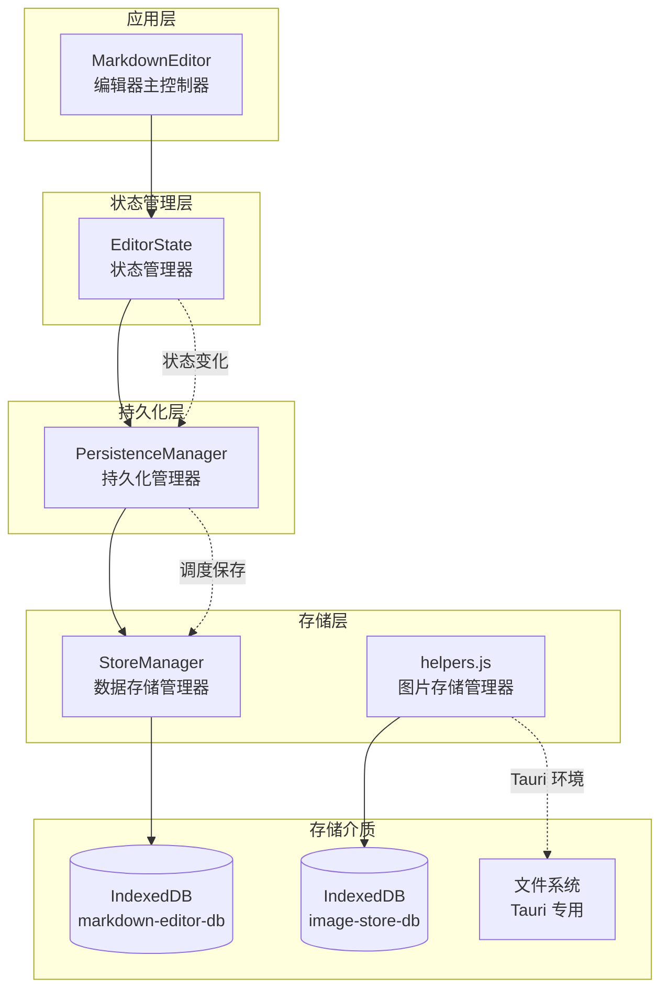
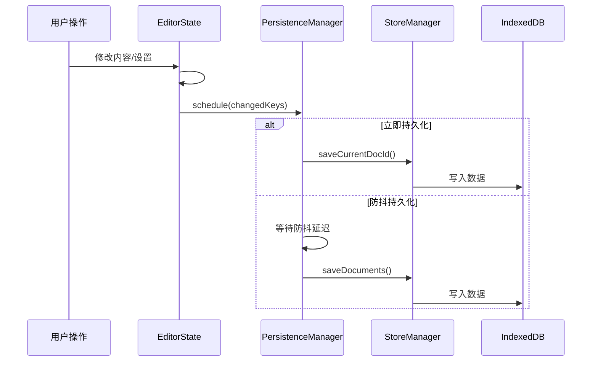

# 数据存储设计文档

## 📋 目录

- [概述](#概述)
- [存储架构](#存储架构)
- [核心模块](#核心模块)
- [数据结构](#数据结构)
- [平台差异](#平台差异)
- [使用示例](#使用示例)
- [最佳实践](#最佳实践)

---

## 概述

本项目采用分层存储架构，将数据持久化分为三层：

1. **存储层 (StoreManager)**：负责与 IndexedDB 的底层交互
2. **持久化层 (PersistenceManager)**：负责状态变化的自动持久化调度
3. **状态层 (EditorState)**：负责状态管理和持久化触发

### 设计原则

- **渐进增强**：核心数据使用 IndexedDB，图片根据平台选择最优存储
- **自动持久化**：状态变化自动触发保存，无需手动调用
- **防抖优化**：高频更新场景使用防抖，避免频繁写入
- **平台适配**：Web 和桌面版根据平台能力选择存储方式

---

## 存储架构

### 整体架构图



### 数据流



---

## 核心模块

### StoreManager - 数据存储管理器

**文件位置**：[src/StoreManager.js](../src/StoreManager.js)

负责管理所有核心数据的 IndexedDB 存储操作。

#### 数据库配置

```javascript
const DB_NAME = 'markdown-editor-db';
const DB_VERSION = 1;

const STORES = {
    DATA: 'data'  // 单一对象存储，通过键区分数据类型
};

const KEYS = {
    DOCUMENTS: 'documents',      // 文档列表
    CURRENT_DOC_ID: 'currentDocId', // 当前文档 ID
    SETTINGS: 'settings'         // 用户设置
};
```

#### 核心 API

| 方法 | 说明 | 返回值 |
|------|------|--------|
| `init()` | 初始化数据库连接 | `Promise<void>` |
| `saveDocuments(docs)` | 保存文档列表 | `Promise<{success, error?}>` |
| `loadDocuments()` | 加载文档列表 | `Promise<Array>` |
| `saveCurrentDocId(id)` | 保存当前文档 ID | `Promise<{success, error?}>` |
| `loadCurrentDocId()` | 加载当前文档 ID | `Promise<string\|null>` |
| `saveSettings(settings)` | 保存用户设置 | `Promise<{success, error?}>` |
| `loadSettings()` | 加载用户设置 | `Promise<Object\|null>` |
| `clearAll()` | 清除所有数据 | `Promise<void>` |

#### 存储结构

IndexedDB 使用单一对象存储（Object Store），通过 `key` 字段区分不同数据：

```javascript
// 存储结构
{
    key: 'documents' | 'currentDocId' | 'settings',
    value: <实际数据>
}
```

---

### PersistenceManager - 持久化管理器

**文件位置**：[src/PersistenceManager.js](../src/PersistenceManager.js)

负责状态变化的自动持久化调度，支持防抖和立即保存策略。

#### 默认配置

```javascript
static DEFAULT_CONFIG = {
    documents: { debounce: 300 },    // 300ms 防抖
    currentDocId: { immediate: true }, // 立即保存
    editor: { debounce: 300 },
    interface: { debounce: 300 },
    export: { debounce: 300 }
};
```

#### 持久化处理器

```javascript
static PERSIST_HANDLERS = {
    documents: state => StoreManager.saveDocuments(state.documents),
    currentDocId: state => StoreManager.saveCurrentDocId(state.currentDocId),
    settings: state => StoreManager.saveSettings({
        editor: state.editor,
        interface: state.interface,
        export: state.export
    })
};
```

#### 工作流程

1. **状态变化检测**：EditorState 调用 `schedule(changedKeys)`
2. **策略分离**：
   - `immediate: true` → 立即持久化
   - `debounce: N` → 延迟 N 毫秒后持久化
3. **合并写入**：多个防抖键合并为一次写入
4. **处理器映射**：`editor/interface/export` 合并为 `settings` 存储

---

### 图片存储管理器

**文件位置**：[src/utils/helpers.js](../src/utils/helpers.js)

负责图片的存储和读取，根据运行环境选择不同存储方式。

#### 数据库配置

```javascript
const DB_NAME = 'image-store-db';
const DB_VERSION = 1;
const STORE_NAME = 'images';
const MAX_IMAGE_SIZE = 10 * 1024 * 1024; // 10MB
```

#### 图片路径格式

```javascript
// 格式: /imgs/YYYY-MM-DD/随机字符串.扩展名
// 示例: /imgs/2026-03-11/a1b2c3d4e5f6g7h8.png
function generateImagePath(ext = 'png') {
    const now = new Date();
    const dateStr = `${now.getFullYear()}-${String(now.getMonth() + 1).padStart(2, '0')}-${String(now.getDate()).padStart(2, '0')}`;
    return `/imgs/${dateStr}/${randomString(16)}.${ext}`;
}
```

#### 核心 API

| 方法 | 说明 | 平台 |
|------|------|------|
| `handlePastedImage(file)` | 保存粘贴的图片 | 通用 |
| `getImageUrl(path)` | 获取图片 Blob URL | Web |
| `getImageAsBase64(path)` | 获取图片 Base64 | Web |
| `deleteImage(path)` | 删除图片 | 通用 |
| `isInternalImagePath(path)` | 检查是否为内部图片路径 | 通用 |

---

## 数据结构

### 文档数据结构

```typescript
interface Document {
    id: string;           // 唯一标识
    name: string;         // 文档名称
    type: 'file' | 'folder';  // 类型
    parentId: string | null;  // 父文件夹 ID
    content?: string;     // 文档内容（仅 file 类型）
    createdAt: string;    // 创建时间 ISO 字符串
    updatedAt: string;    // 更新时间 ISO 字符串
}
```

### 设置数据结构

```typescript
interface Settings {
    editor: {
        type: 'codemirror' | 'monaco';
        fontSize: number;
        lineHeight: number;
        autoSave: boolean;
        insertSpaces: boolean;
        tabSize: number;
        wordWrap: boolean;
        highlightActiveLine: boolean;
        codemirror: { /* CodeMirror 特有设置 */ };
        monaco: { /* Monaco 特有设置 */ };
    };
    interface: {
        theme: 'light' | 'dark';
        layout: string;
        leftRatio: number;
        leftSidebarOpen: boolean;
        rightSidebarOpen: boolean;
        syncScrollEnabled: boolean;
    };
    export: {
        includeStyle: boolean;
        codeHighlight: boolean;
    };
}
```

### 图片存储结构（Web 环境）

```typescript
interface ImageRecord {
    path: string;      // 图片路径（主键）
    blob: Blob;        // 图片二进制数据
    timestamp: number; // 保存时间戳
}
```

---

## 平台差异

### 环境检测

通过 `window.__TAURI__` 全局对象判断运行环境：

```javascript
if (window.__TAURI__) {
    // Tauri 桌面环境
} else {
    // Web 浏览器环境
}
```

### 存储策略对比

| 数据类型 | Web 环境 | 桌面环境 (Tauri) |
|----------|----------|------------------|
| 文档列表 | IndexedDB | IndexedDB |
| 当前文档 ID | IndexedDB | IndexedDB |
| 用户设置 | IndexedDB | IndexedDB |
| 图片文件 | IndexedDB | 文件系统 |

### 图片存储实现

#### Web 环境

```javascript
// src/utils/helpers.js - 保存图片
export async function saveImage(path, blob) {
    const database = await initImageDB();
    return new Promise((resolve, reject) => {
        const store = database.transaction([STORE_NAME], 'readwrite')
            .objectStore(STORE_NAME);
        const request = store.put({ path, blob, timestamp: Date.now() });
        request.onsuccess = () => resolve();
        request.onerror = () => reject(new Error('Failed to save image'));
    });
}

// 获取图片 URL
export function getImageUrl(path) {
    // 使用缓存避免重复读取 IndexedDB
    if (blobUrlCache.has(path)) return blobUrlCache.get(path);
    // ... 从 IndexedDB 读取并创建 Blob URL
}
```

#### 桌面环境 (Tauri)

```javascript
// src/utils/helpers.js - 保存图片到文件系统
export async function handlePastedImage(file) {
    // ...
    if (window.__TAURI__) {
        const { writeFile, mkdir } = window.__TAURI__.fs;
        const { join, dirname, resourceDir } = window.__TAURI__.path;

        const arrayBuffer = await file.arrayBuffer();
        const resourceDirPath = await resourceDir();
        const fullPath = await join(resourceDirPath, imagePath.slice(1));
        const dirPath = await dirname(fullPath);

        try { await mkdir(dirPath, { recursive: true }); } catch { /* ignore */ }
        await writeFile(fullPath, new Uint8Array(arrayBuffer));
        return imagePath;
    }
    // Web 环境降级到 IndexedDB
}
```

### 图片删除实现

```javascript
// src/utils/helpers.js - 删除图片
export async function deleteImage(path) {
    await revokeBlobUrl(path); // 清理 Blob URL 缓存

    if (window.__TAURI__) {
        // 桌面版：从文件系统删除
        const { remove } = window.__TAURI__.fs;
        const { join, resourceDir } = window.__TAURI__.path;
        const resourceDirPath = await resourceDir();
        const fullPath = await join(resourceDirPath, path.replace(/^\/?/, ''));
        await remove(fullPath);
    } else {
        // Web 版：从 IndexedDB 删除
        const database = await initImageDB();
        // ... 删除操作
    }
}
```

### 导出时的图片处理

```javascript
// src/components/Exporter.js - 导出时加载图片
async #loadImageAsBase64(src) {
    if (window.__TAURI__) {
        // 桌面版：从文件系统读取
        const { readFile } = window.__TAURI__.fs;
        const { join, resourceDir } = window.__TAURI__.path;
        const fullPath = await join(resourceDirPath, src.replace(/^\/?/, ''));
        const uint8Array = await readFile(fullPath);
        return `data:${mime};base64,${base64}`;
    }
    // Web 版：从 IndexedDB 读取
    return await getImageAsBase64(src);
}
```

---

## 使用示例

### 初始化存储

```javascript
// src/EditorState.js - 初始化时加载数据
async init() {
    // 初始化 IndexedDB
    await StoreManager.init();

    // 加载保存的数据
    const documents = await StoreManager.loadDocuments();
    const savedDocId = await StoreManager.loadCurrentDocId();
    const savedSettings = await StoreManager.loadSettings();

    // 合并设置
    const settings = savedSettings
        ? { ...EditorState.DEFAULT_SETTINGS, ...savedSettings }
        : EditorState.DEFAULT_SETTINGS;

    // 初始化状态...
}
```

### 状态变化自动持久化

```javascript
// 状态更新时自动触发持久化
#setState(updates, options = {}) {
    // ... 更新状态逻辑

    // 自动持久化（除非明确跳过）
    if (!options.skipPersist) {
        this.#persistence.schedule(changedKeys);
    }
}
```

### 手动保存文档

```javascript
// 直接使用 StoreManager
await StoreManager.saveDocuments(documents);
await StoreManager.saveCurrentDocId(docId);
```

### 处理粘贴图片

```javascript
import { handlePastedImage, isInternalImagePath } from '../utils/helpers.js';

// 处理粘贴的图片
const imageFile = extractImageFromClipboard(clipboardData);
if (imageFile) {
    const imagePath = await handlePastedImage(imageFile);
    // 插入 Markdown 图片语法
    editor.insertText(``);
}
```

---

## 最佳实践

### 1. 使用状态 API 而非直接存储

```javascript
// ✅ 推荐：通过 EditorState 更新，自动持久化
state.updateContent(newContent);
state.updateEditorConfig({ fontSize: 18 });

// ❌ 不推荐：直接调用存储（除非有特殊需求）
StoreManager.saveDocuments(documents);
```

### 2. 高频更新使用防抖

```javascript
// 编辑器内容变化使用防抖持久化
// PersistenceManager 默认配置已处理
documents: { debounce: 300 }
```

### 3. 关键数据立即持久化

```javascript
// 当前文档 ID 变化立即保存
currentDocId: { immediate: true }
```

### 4. 批量操作跳过中间持久化

```javascript
// 批量更新时跳过持久化
#setState({ documents, content }, { skipPersist: true });
// 最后手动保存一次
await StoreManager.saveDocuments(documents);
```

### 5. 图片路径规范

```javascript
// ✅ 使用相对路径
const imagePath = '/imgs/2026-03-11/abc123.png';

// ✅ 检查是否为内部图片
if (isInternalImagePath(src)) {
    // 处理内部图片
}
```

### 6. 清理资源

```javascript
// 删除文档时清理关联图片
for (const image of images) {
    await deleteImage(image.path);
}
```

---

## 存储容量

### IndexedDB 限制

| 浏览器 | 默认配额 | 说明 |
|--------|----------|------|
| Chrome | 可用磁盘空间的 60% | 动态分配 |
| Firefox | 可用磁盘空间的 50% | 最小 10MB |
| Safari | 约 1GB | 固定配额 |

### 图片大小限制

```javascript
const MAX_IMAGE_SIZE = 10 * 1024 * 1024; // 10MB

if (file.size > MAX_IMAGE_SIZE) {
    throw new Error(`图片大小超过限制（最大 ${MAX_IMAGE_SIZE / 1024 / 1024}MB）`);
}
```

---

## 错误处理

### 存储失败处理

```javascript
// StoreManager 返回统一格式
const result = await StoreManager.saveDocuments(documents);
if (!result.success) {
    console.error('保存失败:', result.error);
    // 显示用户友好的错误提示
}
```

### IndexedDB 降级

```javascript
// 初始化失败时的处理
try {
    await StoreManager.init();
} catch (error) {
    console.error('IndexedDB 初始化失败:', error);
    // 可考虑降级到 localStorage（容量更小）
}
```

---

## 相关文件

| 文件 | 说明 |
|------|------|
| [src/StoreManager.js](../src/StoreManager.js) | 数据存储管理器 |
| [src/PersistenceManager.js](../src/PersistenceManager.js) | 持久化管理器 |
| [src/EditorState.js](../src/EditorState.js) | 状态管理器 |
| [src/utils/helpers.js](../src/utils/helpers.js) | 图片存储管理 |
| [tests/store.test.js](../tests/store.test.js) | 存储单元测试 |
| [tests/persistence.test.js](../tests/persistence.test.js) | 持久化单元测试 |
